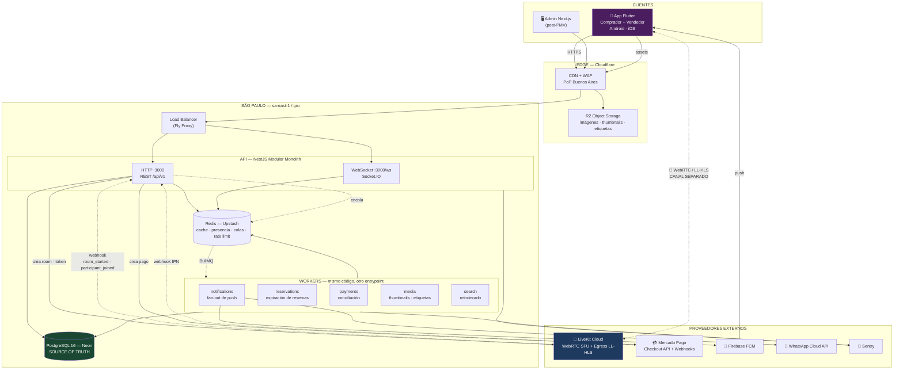

# 01 — Arquitectura general y stack

Cubre: **§1 Diagrama de arquitectura general · §2 Stack tecnológico definitivo · §31 Qué NO debemos construir**

---

## §1. Diagrama de arquitectura general



### La separación que sostiene todo el diseño (§47 de tu brief)

Mirá las dos flechas que salen de la app:

- Una va a **LiveKit** y transporta píxeles.
- La otra va a **nuestra API** y transporta dinero, stock y eventos.

**Nunca se cruzan.** No metemos metadata comercial dentro del stream de video ni video dentro del WebSocket. Consecuencias concretas:

| Si falla… | Qué pasa | Qué NO pasa |
|---|---|---|
| LiveKit | Video congelado con cartel "Reconectando". El chat, el producto destacado y la compra **siguen funcionando** | No se pierde ninguna venta en curso |
| Nuestro WebSocket | El video sigue perfecto. Los eventos se recuperan al reconectar con un `GET /live/{id}/state` | El usuario no se entera de que hubo un problema |
| Nuestra API HTTP | No se puede comprar. Video y chat siguen | Nada se corrompe: sin API no hay escritura |
| PostgreSQL | Modo lectura degradado desde cache | **Nunca se sobrevende**: sin base, no hay reserva |

---

## §2. Stack tecnológico definitivo

### Frontend móvil

| Capa | Tecnología | Versión objetivo | Por qué |
|---|---|---|---|
| Framework | **Flutter** | 3.27+ | Decidido. `PageView` nativo para el feed vertical y motor Impeller: rendimiento predecible en Android de gama media, que es el parque real argentino |
| Lenguaje | **Dart** | 3.6+ | — |
| Estado | **Riverpod** | 2.5+ | Inyección verificada en compilación. `AsyncValue` modela `loading / data / error` sin `if` anidados: exactamente lo que necesitamos con 4G inestable |
| Navegación | **go_router** | 14+ | Deep links declarativos. `app://live/{id}` desde un push es requisito §16 |
| HTTP | **dio** + interceptores | 5+ | Reintento con backoff, refresco de token y `traceId` en un único lugar |
| Realtime | **socket_io_client** | 2+ | Cliente maduro que empareja con el servidor Socket.IO |
| Video | **livekit_client** | 2+ | SDK oficial de LiveKit para Flutter |
| Video (feed) | **video_player** | 2+ | LL-HLS para las tarjetas del feed. Más liviano que abrir una sala WebRTC por tarjeta |
| Modelos | **freezed** + `json_serializable` | — | Uniones selladas para los eventos de WebSocket: el `switch` exhaustivo obliga a manejar cada evento nuevo |
| Local | **Hive** + `flutter_secure_storage` | — | Cache del feed en Hive; tokens en el keychain/keystore |
| Push | **firebase_messaging** | — | — |
| Auth social | `google_sign_in`, `sign_in_with_apple` | — | — |
| Errores | **sentry_flutter** | — | Con símbolos de depuración subidos en cada build |

### Backend

| Capa | Tecnología | Por qué |
|---|---|---|
| Runtime | **Node.js 22 LTS** | — |
| Lenguaje | **TypeScript 5.6**, `strict: true` | — |
| Framework | **NestJS 11** con adaptador **Fastify** | Nest da la estructura modular; Fastify da entre 2 y 3× el rendimiento de Express con una línea de cambio |
| ORM | **Prisma 6** + SQL crudo donde importa | Ver ADR-05. Migraciones y tipos de Prisma; concurrencia en SQL a mano |
| Validación | **Zod** + `nestjs-zod` | Un esquema genera el DTO, la validación y el OpenAPI |
| Realtime | **Socket.IO 4** + `@socket.io/redis-adapter` | Escalado horizontal resuelto |
| Colas | **BullMQ 5** | Mismo Redis, mismo lenguaje, reintentos y trabajos diferidos incluidos |
| Auth | **JWT** (`jose`) + refresh rotativo en base | — |
| Tests | **Vitest** + **Testcontainers** | Testcontainers levanta Postgres real: los tests de concurrencia de stock **no sirven** contra un mock |
| Carga | **k6** | — |
| Docs API | **Scalar** desde el OpenAPI de Zod | — |

### Datos e infraestructura

| Componente | Elección | Alternativa evaluada |
|---|---|---|
| Base de datos | **PostgreSQL 16 — Neon** (`sa-east-1`) | RDS, Supabase |
| Redis | **Upstash Redis** (`sa-east-1`, plan dedicado) | ElastiCache, Redis en Fly |
| Cómputo | **Fly.io**, región `gru` | AWS ECS Fargate `sa-east-1` |
| Objetos | **Cloudflare R2** | S3 |
| CDN / WAF | **Cloudflare** | CloudFront |
| Video | **LiveKit Cloud** | IVS, Agora, Mux |
| Pagos | **Mercado Pago** | MODO (fase 2) |
| Push | **Firebase FCM** | OneSignal |
| Buscador | **PostgreSQL FTS** → Meilisearch | Elasticsearch |
| Errores | **Sentry** | — |
| Métricas y logs | **Grafana Cloud** (Loki + Prometheus) | Datadog |
| CI/CD | **GitHub Actions** | — |
| Móvil CI | **Codemagic** | Fastlane propio |
| IaC | **Terraform** (Cloudflare, Neon, Upstash) + `fly.toml` | — |

### Justificación de las tres elecciones no obvias

**Por qué Fastify bajo NestJS y no Express.** Nest usa Express por defecto. Cambiarlo a Fastify es una línea en `main.ts` y da entre 2 y 3 veces más peticiones por segundo con la misma máquina. Con un objetivo de p95 < 300 ms, es rendimiento gratis. Única contrapartida: unos pocos paquetes de terceros asumen Express; ninguno de los nuestros.

**Por qué Vitest y no Jest.** Arranca entre 5 y 10 veces más rápido con TypeScript y usa la misma API. Con tests de integración sobre Testcontainers, cada segundo de arranque se paga en cada corrida de CI.

**Por qué Testcontainers y no una base en memoria.** Los tests críticos de este sistema son de **concurrencia sobre stock**. Un doble de prueba de Prisma nunca reproduce un `UPDATE ... WHERE` bajo contención real. Estos tests solo valen contra PostgreSQL de verdad.

---

## §31. Qué NO debemos construir nosotros

La regla: **si no es nuestra ventaja competitiva y existe un servicio maduro, se compra.** Nuestra ventaja es la experiencia de compra dentro del vivo, no la infraestructura.

### Nunca (o no en años)

| No construir | Usamos | Por qué sería un error |
|---|---|---|
| **Infraestructura de video** (SFU, encoding, CDN, ABR) | LiveKit Cloud | Es un producto entero. Equipos de 30 personas trabajan años en esto |
| **Pasarela de pagos** | Mercado Pago | Cumplimiento PCI, antifraude, relaciones bancarias. Imposible y además ilegal sin certificación |
| **Entrega de push** | FCM | Google y Apple son los únicos que pueden |
| **Autenticación social** | Google / Apple Sign-In | — |
| **CDN** | Cloudflare | — |
| **Almacenamiento de objetos** | R2 | — |
| **Geocodificación** | Google Geocoding | — |
| **Correo transaccional** | Resend o Postmark | — |
| **SMS / OTP** | Twilio Verify | — |

### Todavía no (post-PMV, con disparador definido)

> **Corregido por decisión del CTO:** el panel administrativo **sale de esta lista**. Antes del lanzamiento tiene que existir un **ADMIN LITE** funcional. El argumento es correcto: sin visibilidad de pagos, webhooks y reservas no se puede operar un incidente real, y el primer incidente ocurre siempre en la primera semana. Alcance mínimo y criterios en [14](14-roadmap-4-semanas.md) §3, Sprint 4.

| No construir ahora | Alternativa en el PMV | Se construye cuando |
|---|---|---|
| **Panel admin completo** (métricas, reportes, moderación, categorías) | **Admin Lite** (ver abajo) + SQL directo | Mes 2 |
| **Motor de búsqueda dedicado** | PostgreSQL FTS | Más de 100k productos o p95 de búsqueda > 400 ms |
| **Gateway de WebSocket propio en Go** | Socket.IO en Node | Más de 30.000 conexiones concurrentes |
| **Chat propio** | Socket.IO, mismo canal que los eventos | Más de 2.000 mensajes por segundo |
| **Motor de recomendación con ML** | Ranking heurístico con señales explícitas | Hay datos: 3 meses de eventos y más de 50k usuarios |
| **Kafka / bus de eventos** | EventEmitter interno de Nest + BullMQ | Más de 20.000 eventos por segundo, o hay microservicios de verdad |
| **Kubernetes** | Fly Machines | El equipo tiene un SRE. Antes de eso es una trampa |
| **Microservicios** | Modular Monolith | Un módulo necesita escalar 10× más que el resto de forma sostenida |
| **App de repartidor** | Web app con enlace firmado que escanea QR | Fase 3 |
| **Integración directa con Andreani / Correo** | Manifiesto CSV + etiqueta PDF propia | Más de 500 envíos por semana |
| **Motor de voz (IA)** | — | Fase 2, y será **otro cliente de la misma API** |

### Admin Lite — alcance cerrado

La regla que lo mantiene "lite": **solo lectura, salvo cuatro acciones.** Todo lo que no esté en esta lista se hace con SQL hasta el mes 2.

**Lectura (13 vistas, sin diseño elaborado — tablas y filtros):**

| Vista | Para qué sirve en un incidente |
|---|---|
| Buscar usuario | "Este cliente dice que pagó y no le llegó" |
| Buscar seller | Verificación, suspensión |
| Buscar order + timeline de estados | Reconstruir qué pasó |
| Buscar payment + estado en MP | ¿Se cobró o no? |
| **Webhooks de Mercado Pago** (crudos, con firma y `processed_at`) | **La vista más importante.** Distingue "MP no avisó" de "avisamos mal" |
| Reservas activas y vencidas | Descuadres de stock |
| Lives activos con espectadores | Estado operativo en vivo |
| `audit_logs` filtrable | Quién hizo qué |
| Errores recientes (enlace a Sentry) | — |

**Escritura (solo estas cuatro, todas con confirmación y `audit_log`):**

```
suspender seller · bloquear producto · cancelar operación (si el estado lo permite) · reintentar webhook
```

**Seguridad, no negociable pese a ser "lite":** RBAC con rol `admin`, login separado del de la app, 2FA obligatorio, IP allowlist en Cloudflare, y toda acción de escritura registrada en `audit_logs` con actor, IP y `before`/`after`.

Stack: **Next.js 15 + TypeScript**, desplegado en Cloudflare Pages, consumiendo la misma API con un JWT de rol `admin`. **No accede a la base directamente** — así reutiliza las mismas reglas de autorización y auditoría que ya existen.

Sigue habiendo un CLI para lo que no entra en las cuatro acciones:

```bash
pnpm admin:order:refund <orderId>
pnpm admin:live:kill <liveId>          # botón de pánico
pnpm admin:inventory:adjust <variantId> <delta>
```

Cada comando escribe en `audit_logs` igual que el panel.
