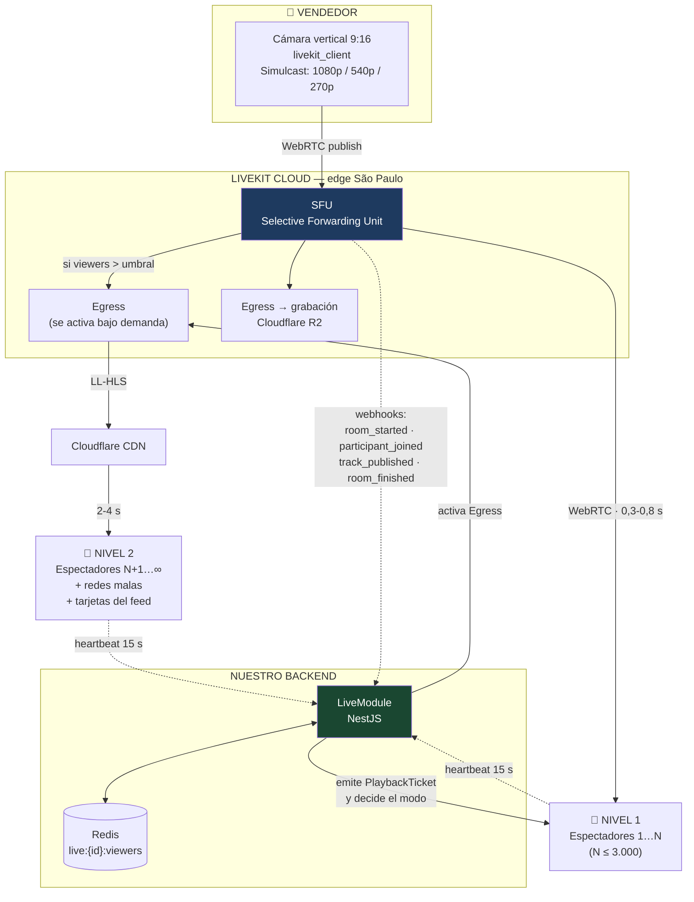
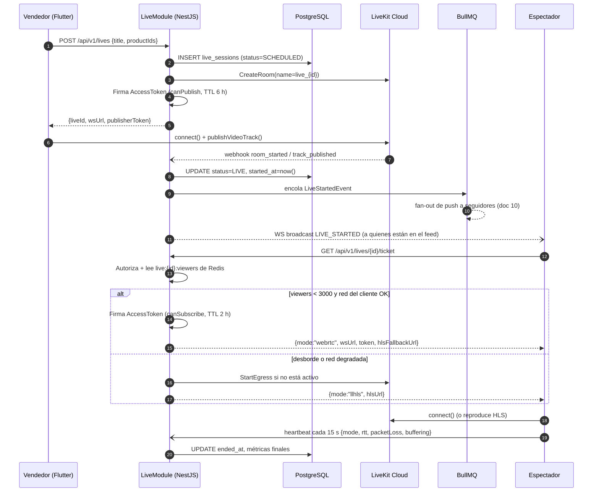

# 02 — Streaming de video

Cubre: **§3 Comparación y elección del proveedor · §4 Arquitectura específica del streaming**

---

## §3. Comparación y elección de proveedor

### El conflicto que hay que resolver

"Menor latencia posible" y "miles de espectadores" son objetivos que tiran en direcciones opuestas:

| | WebRTC | LL-HLS | HLS clásico |
|---|---|---|---|
| Latencia | **0,2 – 0,8 s** | 2 – 5 s | 8 – 30 s |
| Costo por espectador | Alto (CPU del SFU) | Bajo (CDN) | Muy bajo |
| Escala | Miles por sala | **Ilimitada** | Ilimitada |
| Con red mala | Frágil, sin buffer | **Tolerante** | Muy tolerante |

La respuesta correcta **no** es elegir uno: es **empezar en WebRTC y desbordar a LL-HLS**, porque la latencia importa muchísimo con 300 espectadores (el vendedor te lee el nombre) e importa poco con 15.000 (nadie espera respuesta personal). Eso es exactamente la arquitectura híbrida que planteaste en tu punto 6.

### Comparativa

| Criterio | **LiveKit Cloud** | AWS IVS | Agora | Cloudflare Realtime | Mux |
|---|---|---|---|---|---|
| **SDK oficial de Flutter** | ✅ `livekit_client`, mantenido por LiveKit | ❌ **Solo comunitario** | ✅ `agora_rtc_engine` | ❌ Vía `flutter_webrtc` + WHIP/WHEP | ❌ Solo reproducción |
| Latencia WebRTC | 0,2 – 0,5 s | 0,3 s (Real-Time) | 0,4 s | 0,2 – 0,4 s | — |
| Salida a HLS para escala | ✅ Egress nativo | ✅ Nativo | ✅ Media Push | ✅ Stream Live | ✅ Excelente (4–6 s) |
| Emisión desde celular | ✅ SDK nativo | ✅ | ✅ | ⚠️ WHIP manual | ⚠️ RTMP |
| ABR / simulcast | ✅ Simulcast nativo de WebRTC | ✅ | ✅ | ✅ | ✅ |
| Grabación | ✅ Egress a S3/R2 | ✅ | ✅ | ✅ | ✅ |
| **Presencia en Sudamérica** | ✅ Edge en São Paulo | ⚠️ **Verificar `sa-east-1`** | ✅ | ✅ **PoP en Buenos Aires** | ✅ |
| Reconexión / tolerancia a red | ✅ ICE restart, adaptive stream | ✅ | ✅ | ⚠️ manual | ✅ |
| Observabilidad | ✅ Webhooks + analytics + `getStats` | ✅ CloudWatch | ✅ | ⚠️ Básica | ✅ |
| Modelo de precio | Por minuto de participante + ancho de banda | Por hora de entrada + espectador | Por minuto de participante | Por minuto + ancho de banda | Por minuto |
| **Riesgo de lock-in** | ✅ **Bajo — núcleo open source, autohospedable** | ❌ Alto | ❌ Alto | ⚠️ Medio | ⚠️ Medio |
| Trabajo de integración | Bajo | Alto (sin SDK Flutter) | Bajo | **Alto** | Medio |

### 🏆 Elección: **LiveKit Cloud**

Cuatro razones, en orden de peso:

**1. Es el único que combina SDK oficial de Flutter con núcleo open source.** Esto no es un detalle de licencia, es una póliza de seguro concreta: si dentro de un año LiveKit Cloud sube los precios o no rinde, montamos `livekit-server` en nuestros propios servidores y **la app no cambia una línea** — mismo protocolo, mismo SDK. Con IVS o Agora, esa migración es reescribir el cliente.

**2. El SDK de Flutter descarta a IVS de entrada.** IVS era técnicamente muy bueno, pero su reproductor para Flutter es comunitario. El reproductor de vivo es la pieza que menos podemos permitirnos depurar: si aparece un fallo en Android 15 tres días antes del lanzamiento, no puede depender de un mantenedor voluntario.

**3. Egress cubre el desborde sin cambiar de proveedor.** El mismo servicio da WebRTC para los primeros miles y LL-HLS a CDN para el resto. Un contrato, un SDK, una factura.

**4. Simulcast resuelve el ABR de tu punto 6 sin trabajo extra.** El emisor publica tres capas simultáneas (1080p / 540p / 270p) y el SFU entrega a cada espectador la que su red aguanta, cambiando en el momento. No hay que construir el ladder de bitrate: es una propiedad del protocolo.

### Por qué no los otros

- **Agora** es la alternativa más seria y sería mi segunda opción sin dudarlo. Pierde solo por el lock-in: es propietario de punta a punta.
- **Cloudflare** tiene el argumento más fuerte para Argentina —**PoP en Buenos Aires**, que es latencia física real— pero exige integrar WHIP/WHEP a mano con `flutter_webrtc`, sin gestión de salas, sin tokens, sin observabilidad. Es entre 2 y 3 semanas de trabajo que no tenemos. **Vale la pena reevaluarlo en el mes 6, cuando el costo importe más que la velocidad.**
- **Mux** es excelente para VOD y LL-HLS, pero no compite en sub-segundo.
- **AWS IVS** cae por el SDK de Flutter, no por calidad.

### 🚩 Verificaciones obligatorias del Sprint 0

Antes de firmar, medir de verdad (esto es el riesgo **R2** del README):

```bash
# Latencia extremo a extremo real desde 4 conexiones argentinas distintas
# Movistar 4G · Personal 4G · Claro 4G · fibra hogareña
# Método: cronómetro en cámara vs pantalla del espectador, 20 muestras cada una.
# Criterio de aceptación: p95 < 800 ms en WebRTC.
```

Si LiveKit no baja de 800 ms desde Argentina, la decisión se revisa a favor de Cloudflare (PoP local) asumiendo el costo de integración.

### La cláusula de escape: interfaz `LiveProvider`

Ningún widget de Flutter llama al SDK de LiveKit directamente. Todo pasa por esta interfaz.

```dart
// mobile/packages/live_core/lib/src/live_provider.dart

enum PlaybackMode { webrtc, llhls }

/// Handle de reproducción. Lo devuelve el provider, lo consume la UI.
abstract class PlaybackSession {
  PlaybackMode get mode;
  Stream<ConnectionState> get connectionState;
  Stream<VideoQuality> get qualityChanges;
  Stream<StreamHealth> get health;

  Future<void> play();
  Future<void> pause();
  Future<void> dispose();
}

abstract class BroadcastSession {
  Stream<BroadcastStats> get stats;      // bitrate, fps, paquetes perdidos, RTT
  Future<void> switchCamera();
  Future<void> setMuted(bool muted);
  Future<void> stop();
}

abstract class LiveProvider {
  /// El backend decide el modo. El cliente NUNCA lo elige solo:
  /// solo el servidor conoce el contador global de espectadores.
  Future<PlaybackSession> watch(PlaybackTicket ticket);
  Future<BroadcastSession> broadcast(BroadcastTicket ticket);
}

/// Implementaciones:
///   LiveKitProvider  → producción
///   FakeLiveProvider → desarrollo con Hot Reload y tests de widget,
///                      reproduce un mp4 local. Permite construir TODA la UI
///                      del live sin consumir minutos ni necesitar un vendedor emitiendo.
```

`FakeLiveProvider` no es un lujo de tests: es lo que hace que dos personas puedan trabajar en la pantalla del live al mismo tiempo, en el Sprint 2, con Hot Reload.

---

## §4. Arquitectura específica del streaming

### Vista general



### Los tres niveles y cuándo se usa cada uno

> **Actualizado por decisión del CTO.** No se fija una regla rígida de "más de N espectadores = LL-HLS". **V1 usa LiveKit Cloud WebRTC para toda la audiencia** y se miden capacidad, latencia y costo reales. El nivel 2 queda **diseñado y preparado, pero desactivado**: se activa con datos, no con una suposición.

| Nivel | Transporte | Latencia | Estado en V1 |
|---|---|---|---|
| **1** | WebRTC (LiveKit) | 0,3 – 0,8 s | ✅ **Activo. Toda la audiencia** |
| **2** | Distribución broadcast masiva (LL-HLS por CDN) | 2 – 4 s | 🔧 **Preparado, no activado.** Detrás de un feature flag |
| **3** | Solo audio | — | ✅ Activo. Último recurso antes de cortar |

**Qué significa "preparado pero no activado", en concreto:**

1. La interfaz `LiveProvider` ya contempla `PlaybackMode.llhls`; añadir el modo no cambia la firma.
2. El `PlaybackTicket` ya tiene el campo `llhlsFallback`, hoy siempre `null`.
3. El servidor ya decide el modo — el cliente nunca elige. Cambiar la política es cambiar una función en el backend, no desplegar una app nueva.
4. El umbral vive en una **variable de entorno** (`LIVE_WEBRTC_MAX_VIEWERS`), inicializada en `0` = sin límite.

**Qué dato dispara la decisión** (se recoge en producción durante el mes 1):

| Señal | Umbral de revisión |
|---|---|
| Costo por espectador-hora de LiveKit | Supera el 25 % del GMV de un live |
| p95 de latencia con más de N espectadores | Se degrada por encima de 1,5 s |
| Tasa de fallo de conexión al SFU | Supera el 3 % |
| Espectadores concurrentes en un solo live | Supera de forma sostenida lo que el plan contratado garantiza |

Hasta tener esos números, **cualquier umbral que escribamos es una invención.** El feed sigue usando LL-HLS o miniaturas estáticas por costo y batería, que es una decisión distinta e independiente de la escala.

Tres precisiones que suelen pasarse por alto:

**El feed y el live a pantalla completa no usan el mismo transporte.** Abrir una sala WebRTC por cada tarjeta que pasa en el scroll sería ruinoso en batería y en factura. El feed usa **siempre** LL-HLS a 270p. Solo al entrar al live se abre WebRTC.

**El nivel 3 es una decisión de producto, no un fallo.** Es preferible que el comprador siga oyendo al vendedor con la imagen congelada a que vea una rueda de carga. Un espectador con audio sigue comprando.

**El umbral de 3.000 es configurable y hay que calibrarlo con la factura real.** Arranca en 3.000 y se ajusta en el mes 1 según lo que cueste el minuto de participante.

### Simulcast: el ABR de tu punto 6

El emisor publica tres capas al mismo tiempo. El SFU decide cuál manda a cada espectador según su ancho de banda estimado, sin re-encodear nada.

```dart
// mobile/lib/features/broadcast/livekit_broadcast.dart
await room.localParticipant!.setCameraEnabled(
  true,
  cameraCaptureOptions: const CameraCaptureOptions(
    params: VideoParametersPresets.h1080_169,   // 1920x1080 vertical → 1080x1920
    cameraPosition: CameraPosition.back,
  ),
);

await room.localParticipant!.publishVideoTrack(
  track,
  publishOptions: const VideoPublishOptions(
    simulcast: true,
    videoEncoding: VideoEncoding(maxBitrate: 3_000_000, maxFramerate: 30),
    videoSimulcastLayers: [
      VideoParametersPresets.h540_169,   // capa media
      VideoParametersPresets.h270_169,   // capa baja
    ],
  ),
);
```

| Capa | Resolución | Bitrate | Destino típico |
|---|---|---|---|
| Alta | 1080×1920 | 3,0 Mbps | WiFi, 5G |
| Media | 540×960 | 1,0 Mbps | 4G normal — **capa por defecto del feed** |
| Baja | 270×480 | 350 kbps | 4G congestionado, 3G |
| Audio | — | 48 kbps | Último recurso |

En el lado del espectador, `adaptiveStream: true` hace que LiveKit ajuste la capa recibida automáticamente según el tamaño del widget en pantalla y el ancho de banda medido. No hay que programar el ABR: hay que activarlo y no estorbarlo.

### Ciclo de vida de un live



**El cliente nunca elige su propio modo.** Solo el servidor conoce el contador global. Si 3.000 clientes decidieran por su cuenta, entrarían todos al SFU a la vez.

### El PlaybackTicket

```jsonc
{
  "liveId": "01JBQ8X7ZVJ2K9M4NPQRST",
  "mode": "webrtc",
  "issuedAt": "2026-08-11T19:04:12Z",
  "expiresAt": "2026-08-11T21:04:12Z",

  "webrtc": {
    "wsUrl": "wss://livesell-xxxx.livekit.cloud",
    "token": "eyJhbGciOiJIUzI1NiIs…",   // canSubscribe: true, canPublish: false
    "roomName": "live_01JBQ8X7ZVJ2K9M4NPQRST"
  },

  // SIEMPRE presente, aunque el modo sea webrtc:
  // si el WebRTC falla, el cliente conmuta en <500 ms sin ida y vuelta al servidor.
  "llhlsFallback": {
    "url": "https://cdn.livesell.ar/hls/01JBQ8X7ZVJ2K9M4NPQRST/index.m3u8",
    "ready": true
  },

  "policy": {
    "heartbeatIntervalMs": 15000,
    "degradeIfPacketLossPct": 8,
    "degradeIfRttMs": 400,
    "reconnectGraceMs": 90000
  }
}
```

El `llhlsFallback` viaja siempre. Es un viaje de red menos en el peor momento posible.

### Manejo de picos (§6 de tu brief, "no sacrifiques estabilidad")

Cuando un vendedor pasa de 200 a 5.000 espectadores en 90 segundos, lo primero que se rompe **no es el video**. El orden real es:

| Orden | Componente | Por qué revienta primero |
|---|---|---|
| 1º | Emisión de tickets | 5.000 autorizaciones en segundos, cada una tocando Postgres |
| 2º | Fan-out de WebSocket | 2.000 eventos/s × 5.000 destinatarios |
| 3º | Contador de espectadores | Fila caliente si se cuenta en Postgres |
| 4º | Reserva de stock | Todos quieren la misma unidad |
| 5º | SFU de WebRTC | Recién acá |
| 6º | El video por CDN | Prácticamente nunca |

Nos defendemos **en ese orden**:

```typescript
// backend/src/modules/lives/live-surge.service.ts
export type SurgeLevel = 'normal' | 'watch' | 'surge' | 'critical';

const THRESHOLDS = {
  watch:    { joinRatePerSec: 20 },
  surge:    { viewers: 1_500, growth30s: 1.5 },
  critical: { viewers: 3_000, growth30s: 2.0 },
} as const;

async function onSurgeLevelChange(liveId: string, level: SurgeLevel) {
  switch (level) {
    case 'watch':
      // Especulativo: el Egress tarda 5-15 s en estar listo. Si esperás
      // a necesitarlo, son 15 s de espectadores rechazados. Cuesta centavos.
      await livekit.startEgress(liveId);
      await ticketCache.setTtl(liveId, 120);          // menos golpes a Postgres
      break;

    case 'surge':
      await livePolicy.set(liveId, { newViewersMode: 'llhls' });
      await wsPolicy.set(liveId, { batchWindowMs: 500 });
      break;

    case 'critical':
      await wsPolicy.set(liveId, { batchWindowMs: 1000, sampleChat: 0.3 });
      await metricsPolicy.set(liveId, { pushIntervalMs: 5000 });
      await budgetGuard.check(liveId);
      await alerts.page('viral-live', { liveId });
      break;
  }
}
```

**Regla de oro: nunca se degrada a quien ya está adentro.** Los 1.500 espectadores que estaban en WebRTC se quedan en WebRTC; los nuevos entran por LL-HLS. Degradar a los presentes produce un parpadeo visible y una avalancha de reconexiones justo en el peor momento.

### Estampida de conexión

Cuando el push de `LIVE_STARTED` llega a 200.000 seguidores, una fracción abre la app en el mismo segundo. Tres defensas:

1. **Jitter en el fan-out del push**: el worker reparte los envíos en una ventana de 45 s, por tramos de afinidad (documento 10).
2. **Jitter en el cliente**: al abrir desde una notificación, la app espera `random(0, 800) ms` antes de pedir el ticket. Invisible para la persona, decisivo para el servidor.
3. **Backoff exponencial con jitter completo** en todo reintento. Nunca reintento a intervalo fijo: sincroniza a los clientes y crea olas.

### Tolerancia a red mala (§40 de tu brief)

Argentina tiene 4G irregular. La app tiene que sobrevivir a WiFi→4G, 4G→WiFi y cortes breves **sin matar el live**.

```dart
// mobile/lib/features/live/connection_supervisor.dart
class ConnectionSupervisor {
  static const graceWindow = Duration(seconds: 90);

  void onDisconnected(DisconnectReason reason) {
    switch (reason) {
      case DisconnectReason.signalingConnectionFailure:
      case DisconnectReason.peerConnectionFailure:
        // NO se destruye la sesión. Se congela el último frame y se muestra
        // "Reconectando…". El chat y la compra SIGUEN funcionando: viven en
        // otro canal (WebSocket) que reconecta por su cuenta.
        _state.value = LiveConnState.reconnecting;
        _startBackoff();
        break;
      case DisconnectReason.roomClosed:
        _state.value = LiveConnState.ended;   // acá sí, se terminó
        break;
      default:
        _startBackoff();
    }
  }

  // 0,5s → 1s → 2s → 4s → 8s → 15s (tope), con jitter completo
  Duration _nextDelay(int attempt) {
    final base = math.min(15000, 500 * math.pow(2, attempt).toInt());
    return Duration(milliseconds: _rng.nextInt(base));
  }
}
```

Estados visibles para el usuario, exactamente como pediste:

| Estado interno | Qué ve la persona | Qué sigue funcionando |
|---|---|---|
| `connected` | Nada | Todo |
| `unstable` (pérdida > 5 %) | Chip discreto "Conexión inestable" | Todo |
| `reconnecting` | Último frame + "Reconectando…" | **Chat, producto destacado y compra** |
| `degraded` (pasó a LL-HLS) | Nada — es transparente | Todo |
| `audioOnly` | "Modo audio · tu conexión es lenta" | Todo |
| `ended` | "La transmisión terminó" + productos del vivo | Compra del catálogo |

**Del lado del vendedor:** si se le corta la red, el live **no** pasa a `ENDED` de inmediato. Pasa a `RECONNECTING` con 90 segundos de gracia. Los espectadores ven el frame congelado y **el chat sigue vivo** — eso es lo que evita que se vayan. Si vuelve dentro de la ventana, se reanuda sin enviar un segundo push.

#### El supervisor de arriba NO alcanza: hay que mirar los cuadros

> Corregido el 11/08/2026 con datos del Sprint 0A. Ver
> [RESULTS](../docs/sprint-0/RESULTS.md#-hallazgo-principal-la-app-está-ciega-durante-17-segundos).

`ConnectionSupervisor` reacciona a los eventos de la sala **propia**. Cuando al
que se le corta la red es al **vendedor**, el espectador no se desconecta de
nada: sigue pegado al SFU, feliz, mirando una imagen que ya no cambia.

Medido en campo con dos teléfonos reales:

| | |
|---|---|
| Corte de red del emisor | 13 s |
| Imagen congelada para el espectador | **20 s** |
| Demora del SFU en avisar (`TRACK_UNSUBSCRIBED`) | **13,7 – 20,1 s** |

Es el *participant timeout* de LiveKit: espera ~15 s sin paquetes antes de dar
por caído a alguien. Durante esa ventana **ningún evento se dispara** y la app,
si sólo escucha eventos, muestra "todo bien" sobre una foto.

La única señal confiable es el contador de cuadros decodificados:

```dart
// mobile/lib/features/live/frame_watchdog.dart
//
// Espejo en el cliente de backend/src/modules/spike/freeze.ts.
// Umbral de 2 s: por debajo se dispara con la variación normal de fps;
// por encima, la persona ya percibió que "se trabó" antes que la app.
class FrameWatchdog {
  static const stallThreshold = Duration(seconds: 2);

  int? _lastFrames;
  DateTime _lastAdvance = DateTime.now();

  /// Se llama con cada muestra de stats del track remoto (~1 Hz).
  bool onStats(int framesDecoded, DateTime now) {
    // El contador REINICIA cuando se re-suscribe el track: eso es video
    // nuevo, no un estancamiento. Comparar con != y no con >.
    if (_lastFrames == null || framesDecoded != _lastFrames) {
      _lastFrames = framesDecoded;
      _lastAdvance = now;
      return false;
    }
    return now.difference(_lastAdvance) >= stallThreshold;
  }
}
```

Regla, entonces:

| Origen del corte | Qué lo detecta | En cuánto |
|---|---|---|
| Se cae **mi** conexión | `ConnectionSupervisor` (eventos de sala) | inmediato |
| Se cae la del **vendedor** | `FrameWatchdog` (cuadros) | ~2 s |

Y el estado `reconnecting` de la tabla de arriba se alcanza por **cualquiera de
los dos** caminos. Sin el segundo, el cartel llega 15 segundos tarde y para
entonces la audiencia ya se fue.

### Control de costos

El video va a ser entre el 50 % y el 70 % de la factura de infraestructura. Dos palancas:

**Palanca automática (invisible):** por encima de 1.000 espectadores concurrentes, la capa máxima ofrecida baja de 1080p a 540p. En un teléfono vertical la diferencia es imperceptible; en la factura es cerca del 40 %.

**Tope duro (requiere decisión humana):** presupuesto en pesos por live. Al 80 % se avisa al vendedor y al equipo. Al 100 % la política por defecto es **seguir emitiendo y alertar** — cortar un live que está facturando es peor que la factura. El corte automático solo aplica a cuentas sin historial de ventas, como defensa antiabuso.

### Observabilidad del stream

Métricas que la app reporta en cada heartbeat y que alimentan Grafana:

```typescript
interface StreamHealthReport {
  liveId: string; userId: string; role: 'publisher' | 'viewer';
  mode: 'webrtc' | 'llhls';
  rttMs: number;
  packetLossPct: number;
  jitterMs: number;
  bitrateKbps: number;
  fps: number;
  currentLayer: 'high' | 'medium' | 'low' | 'audio';
  bufferingEvents: number;
  freezeCountLast60s: number;
  networkType: 'wifi' | '4g' | '5g' | '3g' | 'unknown';
  carrier?: string;        // permite detectar "solo falla en Personal 4G"
}
```

`carrier` importa de verdad: la mitad de los problemas de streaming en Argentina son de una operadora concreta, y sin este campo se investiga a ciegas.

**Alertas:** tasa de fallo del reproductor > 5 % · p95 de latencia > 1,5 s · tasa de conmutación a LL-HLS > 30 % · desconexiones del emisor > 3 en un live.
