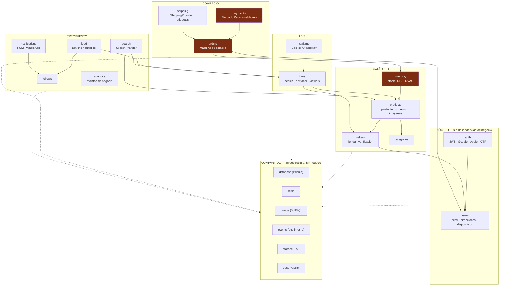

# 03 — Arquitectura backend

Cubre: **§5 Arquitectura backend · §26 Estructura completa de carpetas · §30 Arquitectura event-driven**

---

## §5. Arquitectura backend

### Decisión: NestJS + TypeScript, Modular Monolith sobre Fastify

Confirmo tu propuesta. Las razones por las que es la elección correcta acá, y no solo una preferencia:

1. **Los módulos de Nest son fronteras reales, no carpetas.** Un módulo declara explícitamente qué exporta y qué importa. Eso es lo que permite, dentro de un año, sacar `payments` a un servicio aparte cambiando el transporte y no la lógica. Con Express y carpetas, esa frontera es una convención que se erosiona en tres meses.
2. **La inyección de dependencias hace testeable el dominio.** `InventoryService` recibe su repositorio por constructor: los tests de concurrencia se escriben sin levantar HTTP.
3. **Un solo despliegue, una sola transacción.** Reservar stock y crear la orden ocurren en la misma transacción de PostgreSQL. Con microservicios eso sería una saga distribuida en la semana 1, que es exactamente el overengineering que prohibiste en tu punto 43.

**Adaptador Fastify en lugar de Express:** una línea en `main.ts`, entre 2 y 3× más peticiones por segundo. Rendimiento gratis para el objetivo de p95 < 300 ms.

### Las tres reglas de la modularidad

Sin estas reglas, un modular monolith degenera en un monolito con carpetas bonitas en seis meses. Se verifican en CI con `dependency-cruiser`.

> **Regla 1 — Un módulo nunca importa el repositorio de otro módulo.**
> `OrdersService` no toca `prisma.inventory`. Le pide a `InventoryService`.
>
> **Regla 2 — Comunicación entre módulos: llamada directa si necesitás el resultado en la misma transacción; evento de dominio si no.**
> Reservar stock ocurre dentro de la transacción de la orden → llamada directa.
> Enviar el push de `LIVE_STARTED` no → evento.
>
> **Regla 3 — Ningún módulo importa a `orders` salvo `payments` y `shipping`.**
> Si `lives` necesita saber de órdenes, es señal de que la responsabilidad está mal ubicada.

```typescript
// backend/.dependency-cruiser.cjs — la regla vive en CI, no en la buena voluntad
module.exports = {
  forbidden: [
    {
      name: 'no-cross-module-repositories',
      severity: 'error',
      comment: 'Un módulo no accede al repositorio de otro. Usá su Service.',
      from: { path: '^src/modules/([^/]+)/' },
      to:   { path: '^src/modules/(?!$1)([^/]+)/.*\\.repository\\.ts$' },
    },
    {
      name: 'domain-is-pure',
      severity: 'error',
      comment: 'La capa domain no conoce Prisma, Nest ni HTTP.',
      from: { path: '/domain/' },
      to:   { path: 'node_modules/(@prisma|@nestjs|axios|ioredis)' },
    },
  ],
};
```

### Mapa de módulos



Los tres módulos en rojo son los que tocan dinero y stock. Tienen la barra de calidad más alta: cobertura de tests obligatoria, revisión de código por dos personas, sin excepciones.

### Anatomía de un módulo

Cada módulo sigue la misma estructura de cuatro capas. Que sean todos iguales es lo que hace que cualquiera pueda entrar a cualquier módulo.

```
src/modules/orders/
├── orders.module.ts              # composición: qué provee, qué importa, qué exporta
├── api/                          # ← capa de entrega (HTTP / WS). Delgada.
│   ├── orders.controller.ts
│   ├── dto/
│   │   ├── create-order.dto.ts   # esquema Zod → DTO + validación + OpenAPI
│   │   └── order-response.dto.ts
│   └── orders.mapper.ts          # dominio → DTO. El dominio nunca se serializa directo.
├── application/                  # ← casos de uso. Orquestan, no deciden reglas.
│   ├── create-order.usecase.ts
│   ├── cancel-order.usecase.ts
│   ├── expire-orders.usecase.ts
│   └── handlers/                 # reaccionan a eventos de otros módulos
│       └── on-payment-confirmed.handler.ts
├── domain/                       # ← reglas de negocio. TypeScript puro.
│   ├── order.entity.ts           # invariantes y transiciones
│   ├── order-status.ts           # la máquina de estados vive acá
│   ├── order.errors.ts
│   └── events/
│       └── order-created.event.ts
├── infrastructure/               # ← detalles reemplazables
│   ├── orders.repository.ts      # Prisma
│   └── orders.queue.ts           # BullMQ
└── __tests__/
    ├── create-order.usecase.spec.ts
    └── order-concurrency.integration.spec.ts
```

**La regla que hace valer esta estructura:** `domain/` no importa Prisma, ni Nest, ni Zod, ni nada de `node_modules` salvo utilidades puras. Se puede testear sin base de datos y sobrevive a que cambiemos de ORM.

```typescript
// backend/src/modules/orders/domain/order-status.ts
// Dominio puro: sin decoradores, sin Prisma, sin HTTP.

export const ORDER_STATUS = [
  'DRAFT', 'RESERVED', 'PAYMENT_PENDING', 'PAID', 'CONFIRMED',
  'PREPARING', 'READY_TO_SHIP', 'SHIPPED', 'DELIVERED',
  'CANCELLED', 'REFUNDED', 'EXPIRED',
] as const;

export type OrderStatus = (typeof ORDER_STATUS)[number];

/** Única fuente de verdad de las transiciones válidas. Ver documento 06. */
const TRANSITIONS: Record<OrderStatus, readonly OrderStatus[]> = {
  DRAFT:           ['RESERVED', 'CANCELLED', 'EXPIRED'],
  RESERVED:        ['PAYMENT_PENDING', 'CANCELLED', 'EXPIRED'],
  PAYMENT_PENDING: ['PAID', 'CANCELLED', 'EXPIRED'],
  PAID:            ['CONFIRMED', 'REFUNDED'],
  CONFIRMED:       ['PREPARING', 'CANCELLED', 'REFUNDED'],
  PREPARING:       ['READY_TO_SHIP', 'CANCELLED', 'REFUNDED'],
  READY_TO_SHIP:   ['SHIPPED', 'CANCELLED', 'REFUNDED'],
  SHIPPED:         ['DELIVERED', 'REFUNDED'],
  DELIVERED:       ['REFUNDED'],
  CANCELLED:       [],
  REFUNDED:        [],
  EXPIRED:         [],
};

export function canTransition(from: OrderStatus, to: OrderStatus): boolean {
  return TRANSITIONS[from].includes(to);
}

export function assertTransition(from: OrderStatus, to: OrderStatus): void {
  if (!canTransition(from, to)) {
    throw new InvalidOrderTransitionError(from, to);
  }
}
```

Esa tabla es la máquina de estados **ejecutable**, no un diagrama en un documento que se desactualiza. Cualquier cambio de estado pasa por `assertTransition`.

### Un solo código, tres entrypoints

El mismo artefacto de Docker se despliega en tres roles distintos. Esto es lo que evita mantener repositorios separados y permite escalar API y workers por separado desde el día 1.

```typescript
// backend/src/main.ts
async function bootstrap() {
  const role = process.env.APP_ROLE ?? 'api';   // api | worker | scheduler

  const app = await NestFactory.create<NestFastifyApplication>(
    AppModule.forRole(role),
    new FastifyAdapter({ trustProxy: true, bodyLimit: 2 * 1024 * 1024 }),
  );

  if (role === 'api') {
    app.setGlobalPrefix('api/v1', { exclude: ['health', 'ready', 'metrics'] });
    app.useWebSocketAdapter(new RedisIoAdapter(app));
    app.enableCors({ origin: env.CORS_ORIGINS, credentials: true });
    await app.listen(env.PORT, '0.0.0.0');
  } else {
    // Workers y scheduler no exponen HTTP salvo /health, para el healthcheck de Fly.
    await app.listen(env.PORT, '0.0.0.0');
  }
}
```

```toml
# backend/fly.toml — procesos separados, escalado independiente
[processes]
  api       = "node dist/main.js"
  worker    = "node dist/main.js"     # APP_ROLE=worker
  scheduler = "node dist/main.js"     # APP_ROLE=scheduler, 1 sola instancia
```

`scheduler` corre siempre con **una única instancia** porque emite los trabajos periódicos. Duplicarlo duplicaría los barridos.

### Manejo de errores

Un único filtro traduce errores de dominio a HTTP. Los controladores nunca escriben `throw new HttpException`.

```typescript
// backend/src/shared/errors/domain-exception.filter.ts
const HTTP_BY_CODE: Record<string, number> = {
  INSUFFICIENT_STOCK:          409,
  RESERVATION_EXPIRED:         410,
  INVALID_ORDER_TRANSITION:    409,
  IDEMPOTENCY_CONFLICT:        409,
  LIVE_NOT_ACTIVE:             409,
  PAYMENT_REJECTED:            402,
  SHIPPING_ADDRESS_REQUIRED:   428,   // Precondition Required: falta la dirección
  FORBIDDEN:                   403,
  NOT_FOUND:                   404,
  RATE_LIMITED:                429,
};

// Respuesta uniforme. La app Flutter mapea `code`, nunca el texto.
{
  "error": {
    "code": "INSUFFICIENT_STOCK",
    "message": "Quedan 2 unidades disponibles",
    "details": { "variantId": "…", "requested": 3, "available": 2 },
    "traceId": "01JBQ8X7ZVJ2K9M4NPQRST"
  }
}
```

`details.available` no es decorativo: permite que la app diga *"Quedan 2 — ¿llevás 2?"* en lugar de un error genérico. Es una recuperación de venta escrita en el contrato de la API.

---

## §30. Arquitectura event-driven

Aunque sea un monolito, los módulos se comunican por eventos de dominio siempre que no necesiten el resultado en la misma transacción. Esto es lo que permite extraer microservicios después sin reescribir.

### Los dos buses

| Bus | Tecnología | Cuándo | Garantía |
|---|---|---|---|
| **En proceso** | `EventEmitter2` de Nest | Efectos secundarios inmediatos y baratos (invalidar cache, emitir por WS) | En el mismo proceso, sin persistencia |
| **Persistente** | **BullMQ** sobre Redis | Todo lo que tenga efectos externos (push, WhatsApp, email, reindexado) | Al menos una vez, con reintentos |

**Cuándo usar cuál:** si perder el evento no duele, `EventEmitter2`. Si perderlo significa que 200.000 personas no se enteran de un live, **BullMQ**.

### Transactional outbox: el patrón que evita el peor bug del sistema

Si emitimos `LiveStarted` después del `COMMIT` y el proceso muere en el medio, el vendedor queda en vivo y **nadie se entera**. Es el fallo más caro posible. Solución: el evento se inserta en la misma transacción.

```typescript
// backend/src/modules/lives/application/start-live.usecase.ts
async execute(cmd: StartLiveCommand): Promise<Live> {
  const live = await this.prisma.$transaction(async (tx) => {
    const updated = await tx.liveSession.update({
      where: { id: cmd.liveId, status: 'SCHEDULED' },
      data:  { status: 'LIVE', startedAt: new Date() },
    });

    // MISMA transacción. O se commitean los dos, o ninguno.
    await tx.outbox.create({
      data: {
        aggregateType: 'live_session',
        aggregateId:   updated.id,
        eventType:     'LiveStarted',
        payload:       { liveId: updated.id, sellerId: updated.sellerId },
      },
    });

    return updated;
  });

  return live;
}
```

```typescript
// backend/src/shared/events/outbox.publisher.ts
// Corre en el scheduler, cada 200 ms. Entrega AL MENOS UNA VEZ:
// la deduplicación se hace aguas abajo con notification_log.
@Interval(200)
async publishPending() {
  const batch = await this.prisma.$queryRaw<OutboxRow[]>`
    SELECT * FROM outbox
    WHERE published_at IS NULL
    ORDER BY id
    LIMIT 100
    FOR UPDATE SKIP LOCKED          -- varios publishers no se pisan
  `;

  for (const row of batch) {
    await this.queues[row.eventType].add(row.eventType, row.payload, {
      jobId: `outbox-${row.id}`,     // idempotencia en BullMQ
      attempts: 5,
      backoff: { type: 'exponential', delay: 1000 },
    });
    await this.prisma.outbox.update({
      where: { id: row.id },
      data:  { publishedAt: new Date() },
    });
  }
}
```

`FOR UPDATE SKIP LOCKED` es lo que permite correr varios publishers sin duplicar trabajo.

### Catálogo de eventos de dominio

```typescript
// backend/src/shared/events/domain-events.ts
export type DomainEvent =
  // Identidad
  | { type: 'UserRegistered';        userId: string; provider: 'google' | 'apple' | 'phone' }
  | { type: 'UserAddressAdded';      userId: string; addressId: string; isFirst: boolean }
  // Social
  | { type: 'SellerFollowed';        userId: string; sellerId: string }
  | { type: 'SellerUnfollowed';      userId: string; sellerId: string }
  // Live
  | { type: 'LiveScheduled';         liveId: string; sellerId: string; scheduledFor: string }
  | { type: 'LiveStarted';           liveId: string; sellerId: string }
  | { type: 'LiveEnded';             liveId: string; sellerId: string; durationSec: number }
  | { type: 'ProductFeatured';       liveId: string; productId: string; variantId?: string }
  | { type: 'ProductUnfeatured';     liveId: string; productId: string }
  // Inventario
  | { type: 'InventoryReserved';     reservationId: string; variantId: string; qty: number; expiresAt: string }
  | { type: 'InventoryReservationExpired'; reservationId: string; variantId: string; qty: number }
  | { type: 'InventoryReservationCommitted'; reservationId: string; orderId: string }
  | { type: 'StockLow';              variantId: string; remaining: number }
  | { type: 'ProductSoldOut';        variantId: string; liveId?: string }
  // Comercio
  | { type: 'OrderCreated';          orderId: string; userId: string; sellerId: string; liveId?: string }
  | { type: 'OrderExpired';          orderId: string }
  | { type: 'OrderCancelled';        orderId: string; reason: string }
  | { type: 'PaymentPending';        paymentId: string; orderId: string }
  | { type: 'PaymentConfirmed';      paymentId: string; orderId: string; amountCents: number }
  | { type: 'PaymentRejected';       paymentId: string; orderId: string; reason: string }
  | { type: 'OrderConfirmed';        orderId: string }
  // Logística
  | { type: 'ShipmentCreated';       shipmentId: string; orderId: string; provider: string }
  | { type: 'ShipmentDispatched';    shipmentId: string; trackingCode: string }
  | { type: 'ShipmentDelivered';     shipmentId: string };
```

### Quién escucha qué

| Evento | Suscriptores | Efecto |
|---|---|---|
| `LiveStarted` | `notifications` · `realtime` · `search` · `feed` | Fan-out de push · broadcast WS · indexar · refrescar ranking |
| `ProductFeatured` | `realtime` · `analytics` | Broadcast `PRODUCT_FEATURED` · registrar impresión |
| `InventoryReserved` | `realtime` · `queue` | Broadcast `STOCK_UPDATED` · programar expiración a 5 min |
| `InventoryReservationExpired` | `orders` · `realtime` | Expirar la orden asociada · broadcast de stock recuperado |
| `PaymentConfirmed` | `orders` · `realtime` · `notifications` · `shipping` · `analytics` | Confirmar orden · avisar al comprador · avisar al vendedor · crear envío |
| `OrderConfirmed` | `notifications` · `analytics` | WhatsApp al vendedor (agregado) · métrica de conversión |
| `SellerFollowed` | `feed` · `analytics` | Invalidar cache del feed personalizado |

### Camino de extracción a microservicio

Cuando un módulo necesite escalar 10× más que el resto, el camino ya está trazado:

1. El módulo ya expone su API por su `Service`, no por su repositorio.
2. Ya se comunica por eventos con lo que no es transaccional.
3. Se reemplaza el `EventEmitter2` por BullMQ o HTTP en ese borde.
4. Se separa el esquema de base de datos por `schema` de Postgres.

**Candidatos por orden de probabilidad:** `notifications` (picos de fan-out), `realtime` (conexiones concurrentes), `search` (CPU de indexado). `orders`, `payments` e `inventory` **se quedan juntos siempre**: comparten transacción.

---

## §26. Estructura completa de carpetas del backend

```
backend/
├── src/
│   ├── main.ts                          # bootstrap por APP_ROLE
│   ├── app.module.ts
│   │
│   ├── config/
│   │   ├── env.schema.ts                # Zod: la app NO ARRANCA si falta una variable
│   │   ├── config.module.ts
│   │   └── constants.ts                 # TTLs, umbrales, límites
│   │
│   ├── shared/
│   │   ├── database/
│   │   │   ├── prisma.service.ts
│   │   │   ├── transaction.helper.ts    # withTransaction()
│   │   │   └── database.module.ts
│   │   ├── redis/
│   │   │   ├── redis.service.ts
│   │   │   ├── redis.keys.ts            # ÚNICO lugar donde se arman claves de Redis
│   │   │   └── redis.module.ts
│   │   ├── queue/
│   │   │   ├── queue.module.ts
│   │   │   ├── queue.names.ts
│   │   │   └── base.processor.ts
│   │   ├── events/
│   │   │   ├── domain-events.ts
│   │   │   ├── event-bus.service.ts
│   │   │   ├── outbox.publisher.ts
│   │   │   └── events.module.ts
│   │   ├── storage/
│   │   │   ├── storage.interface.ts     # StorageProvider
│   │   │   ├── r2.storage.ts
│   │   │   └── storage.module.ts
│   │   ├── idempotency/
│   │   │   ├── idempotency.interceptor.ts
│   │   │   └── idempotency.service.ts
│   │   ├── errors/
│   │   │   ├── domain.error.ts
│   │   │   ├── domain-exception.filter.ts
│   │   │   └── error-codes.ts
│   │   ├── observability/
│   │   │   ├── logger.service.ts        # Pino estructurado + traceId
│   │   │   ├── metrics.service.ts       # Prometheus
│   │   │   ├── tracing.ts               # OpenTelemetry
│   │   │   └── observability.module.ts
│   │   ├── security/
│   │   │   ├── guards/                  # jwt · roles · seller-owns-resource
│   │   │   ├── decorators/              # @CurrentUser() @Roles() @Public()
│   │   │   └── rate-limit/
│   │   └── utils/                       # ulid · ars · phone-ar · cuil · postal-ar
│   │
│   ├── modules/
│   │   ├── auth/                        # Google · Apple · OTP · refresh rotation
│   │   ├── users/                       # perfil · direcciones · dispositivos
│   │   ├── sellers/                     # tienda · verificación · panel
│   │   ├── categories/
│   │   ├── products/                    # producto · variantes · imágenes
│   │   ├── inventory/                   # 🔴 stock + RESERVAS (documento 07)
│   │   ├── lives/                       # sesión · destacar · viewers · LiveKit
│   │   ├── realtime/                    # 🔴 gateway Socket.IO (documento 08)
│   │   ├── orders/                      # 🔴 máquina de estados (documento 06)
│   │   ├── payments/                    # 🔴 Mercado Pago (documento 09)
│   │   ├── shipping/                    # ShippingProvider · etiquetas · zonas
│   │   ├── follows/
│   │   ├── notifications/               # FCM · WhatsApp · plantillas
│   │   ├── search/                      # SearchProvider
│   │   ├── feed/                        # ranking heurístico
│   │   ├── analytics/                   # eventos de negocio
│   │   └── health/                      # /health · /ready · /metrics
│   │
│   └── workers/
│       ├── worker.module.ts
│       └── processors/
│           ├── live-started.processor.ts
│           ├── push-fanout.processor.ts
│           ├── reservation-expiry.processor.ts
│           ├── payment-reconciliation.processor.ts
│           ├── media-processing.processor.ts
│           ├── search-index.processor.ts
│           └── whatsapp-digest.processor.ts
│
├── prisma/
│   ├── schema.prisma
│   ├── migrations/
│   └── seed.ts                          # datos de desarrollo: 5 vendedores, 40 productos
│
├── test/
│   ├── setup.ts                         # Testcontainers: Postgres + Redis reales
│   ├── fixtures/
│   └── integration/
│       ├── inventory-concurrency.spec.ts    # 🔴 el test más importante del repo
│       ├── order-lifecycle.spec.ts
│       ├── payment-webhook.spec.ts          # 🔴 duplicados y fuera de orden
│       └── idempotency.spec.ts
│
├── scripts/
│   ├── admin-cli.ts                     # sustituye al panel admin durante el PMV
│   └── load/                            # k6
│       ├── live-viewers.js
│       └── concurrent-purchase.js
│
├── Dockerfile                           # multi-stage, distroless, no-root
├── fly.toml
├── .dependency-cruiser.cjs
├── vitest.config.ts
└── package.json
```

### Los cuatro archivos que hay que escribir bien la primera vez

| Archivo | Por qué es crítico |
|---|---|
| `config/env.schema.ts` | Si una variable falta, **la app no arranca**. Nada de `process.env.X!` desperdigado ni fallos a las 3 de la mañana por un secreto vacío |
| `shared/redis/redis.keys.ts` | Único lugar donde se construyen claves. Sin esto, en dos meses hay tres formatos distintos de `live:*` y nadie sabe cuál expira |
| `modules/inventory/` | Es el módulo donde un bug se traduce directamente en sobreventa y en un vendedor perdido |
| `shared/idempotency/` | Sin esto, un reintento de red cobra dos veces. Se escribe antes que `orders`, no después |

```typescript
// backend/src/config/env.schema.ts (extracto)
export const envSchema = z.object({
  NODE_ENV: z.enum(['development', 'staging', 'production']),
  APP_ROLE: z.enum(['api', 'worker', 'scheduler']).default('api'),
  PORT: z.coerce.number().default(3000),

  DATABASE_URL: z.string().url(),
  REDIS_URL: z.string().url(),

  JWT_ACCESS_SECRET:  z.string().min(32),
  JWT_REFRESH_SECRET: z.string().min(32),

  LIVEKIT_API_KEY:    z.string(),
  LIVEKIT_API_SECRET: z.string(),
  LIVEKIT_WS_URL:     z.string().url(),

  MP_ACCESS_TOKEN:    z.string(),
  MP_WEBHOOK_SECRET:  z.string(),

  // …lista completa en el documento 13
});

// Se valida UNA vez, al arrancar. Si falla, el proceso muere con un mensaje claro.
export const env = envSchema.parse(process.env);
```
