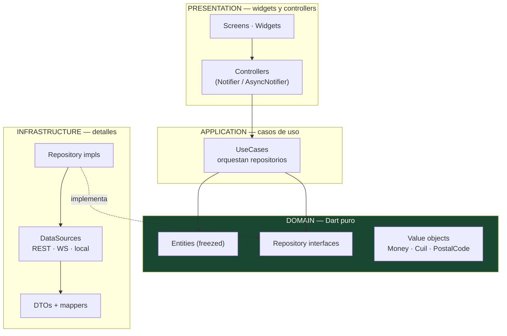

# 04 — Arquitectura Flutter

Cubre: **§6 Arquitectura Flutter · §27 Estructura completa de carpetas**

---

## §6. Arquitectura Flutter

### Decisión: Clean Architecture **por feature**, con Riverpod 2

Confirmo Riverpod. La razón concreta, más allá de la preferencia:

**`AsyncValue<T>` modela exactamente el problema argentino.** Toda pantalla de esta app tiene cuatro estados reales: cargando, con datos, con datos pero reconectando, y con error recuperable. Con `AsyncValue` eso es un `switch` exhaustivo que el compilador te obliga a cubrir. Con `setState` o con BLoC son booleanos sueltos que alguien olvida.

```dart
// Esto es lo que Riverpod te da gratis y lo que hace que la app no
// muestre pantallas en blanco cuando el 4G se cae:
liveState.when(
  data:    (live) => LiveView(live: live),
  loading: () => const LiveSkeleton(),
  error:   (e, _) => LiveErrorView(error: e, onRetry: ref.invalidateSelf),
);
```

Además: inyección verificada en compilación (sin registro en runtime que falle en producción), `ref.invalidate()` para reintentos, `autoDispose` que libera el estado del live al salir de la pantalla, y testeabilidad con `ProviderContainer` sin necesidad de `WidgetTester`.

**Por qué no BLoC:** más ceremonia (evento + estado + bloc por caso de uso) para el mismo resultado. Con un equipo chico y 4 semanas, esa ceremonia se paga en velocidad.
**Por qué no GetX:** service locator global, poca separación de capas y una comunidad con prácticas discutibles. No para un producto que maneja dinero.

### La regla de oro (§ tu punto 3)

> **El backend es la única fuente de verdad. Flutter nunca decide si hay stock, cuánto cuesta algo, ni si un pago fue aprobado.**

En código, esto se traduce en tres prohibiciones verificables en revisión:

| Prohibido en Flutter | Por qué | Qué se hace en su lugar |
|---|---|---|
| Calcular totales, descuentos o cuotas | Manipulable, y se desincroniza | El servidor devuelve `totals` ya calculado |
| Decidir si hay stock (`if (variant.available > 0)`) | La info llega vieja por definición | Se intenta la reserva y se maneja el `409` |
| Marcar una orden como pagada por recibir `200 OK` | La red miente | Se espera el evento `PAYMENT_CONFIRMED` por WS o se hace polling de `GET /orders/{id}` |

`variant.available` **sí** se usa para pintar la UI ("Quedan 2"), pero **nunca** como condición para permitir la acción. El botón "Comprar" siempre está habilitado; el servidor decide.

### Capas



**Regla:** `domain/` no importa Flutter, ni `dio`, ni `json_serializable`. Es Dart puro y se testea sin `flutter test`, solo con `dart test`. Si un día cambiamos de framework, el dominio sobrevive.

### Flujo completo de una compra (el recorrido crítico)

```dart
// mobile/lib/features/checkout/presentation/controllers/purchase_controller.dart
@riverpod
class PurchaseController extends _$PurchaseController {
  @override
  PurchaseState build() => const PurchaseState.idle();

  Future<void> buy({
    required String liveId,
    required String variantId,
    required int quantity,
  }) async {
    // idempotencyKey se genera UNA vez por intento y se reutiliza en cada
    // reintento. Es lo que hace imposible el cobro doble.
    final idempotencyKey = const Uuid().v4();

    state = const PurchaseState.reserving();
    final reservation = await ref.read(reserveInventoryUseCaseProvider)(
      liveId: liveId, variantId: variantId, quantity: quantity,
    );

    switch (reservation) {
      case Err(:final error) when error.code == 'INSUFFICIENT_STOCK':
        // Recuperación de venta: el servidor dijo cuánto queda de verdad.
        state = PurchaseState.partialStock(available: error.details.available);
        return;
      case Err(:final error):
        state = PurchaseState.failed(error);
        return;
      case Ok(:final value):
        state = PurchaseState.reserved(value);   // arranca la cuenta atrás de 5 min
    }

    // ¿Falta la dirección? Es la PRIMERA compra de este usuario.
    final hasAddress = ref.read(currentUserProvider).valueOrNull?.hasDefaultAddress ?? false;
    if (!hasAddress) {
      state = PurchaseState.needsAddress(reservation.value);
      return;   // la UI abre el formulario SIN destruir el reproductor
    }

    await confirmPayment(reservation.value, idempotencyKey);
  }
}
```

Fijate en dos cosas:

1. **La reserva se pide antes que la dirección.** Si se pidiera después, el usuario completa nueve campos y recién ahí descubre que se agotó. Reservar primero es lo que hace que el formulario valga la pena.
2. **`needsAddress` es un estado, no una navegación.** Nunca se hace `context.push('/address')` desde el live: eso desmontaría el reproductor.

### Cómo se mantiene el video corriendo (§2 y §13 de tu brief)

Este es el requisito duro del producto. La implementación:

```dart
// mobile/lib/features/live/presentation/screens/live_screen.dart
// El reproductor vive en la RAÍZ del Stack. Las hojas se apilan ENCIMA.
// Nunca hay un Navigator.push que lo saque del árbol.

class LiveScreen extends ConsumerWidget {
  @override
  Widget build(BuildContext context, WidgetRef ref) {
    final purchase = ref.watch(purchaseControllerProvider);

    return Scaffold(
      backgroundColor: Colors.black,
      body: Stack(
        children: [
          // 1. VIDEO — se monta una vez y no se desmonta jamás
          const Positioned.fill(child: LiveVideoLayer()),

          // 2. Overlays del live
          const Positioned(top: 0, left: 0, right: 0, child: SellerHeader()),
          const Positioned(right: 8, bottom: 140, child: ReactionRail()),
          const Positioned(left: 0, right: 0, bottom: 0, child: FeaturedProductCard()),

          // 3. Hojas de compra — encima, con fondo translúcido.
          //    El video sigue visible arriba y el audio nunca se corta.
          if (purchase.showsSheet)
            _PurchaseSheet(state: purchase),
        ],
      ),
    );
  }
}
```

Regla de revisión de código: **en `features/live/` y `features/checkout/` no puede aparecer `Navigator.push` ni `context.go`.** Todo es estado del `Stack`. Se verifica con un test de lint personalizado.

### El feed vertical (§14 de tu brief)

Lo más fácil de arruinar en batería y memoria. Reglas no negociables:

| Regla | Motivo |
|---|---|
| Máximo **3 controladores de video** vivos: anterior, actual, siguiente | Cada uno consume un decodificador de hardware; la gama media tiene 4–6 |
| Solo el actual reproduce **audio** | Se rompe solo con el reciclaje si no se controla explícitamente |
| El siguiente se precarga **en pausa**, con 1 s de buffer | Da la sensación de reproducción instantánea al deslizar |
| Los no visibles se **liberan con `dispose()`**, no se ocultan | Un reproductor oculto sigue decodificando y comiendo batería |
| El feed usa **LL-HLS a 270p**, nunca WebRTC | Costo, batería y tiempo de arranque |
| Con ahorro de datos activo: primer frame estático, reproducción al tocar | Respeta el plan de datos, que en Argentina importa |

```dart
// mobile/lib/features/feed/presentation/controllers/feed_player_pool.dart
class FeedPlayerPool {
  static const _windowSize = 3;
  final _controllers = <String, VideoPlayerController>{};

  Future<void> onPageChanged(List<FeedItem> items, int index) async {
    final window = [index - 1, index, index + 1]
        .where((i) => i >= 0 && i < items.length);

    for (final i in window) {
      final item = items.elementAt(i);
      final c = await _acquire(item.id, item.hlsUrl);
      if (i == index) {
        await c.setVolume(1.0);
        await c.play();
      } else {
        await c.setVolume(0);
        await c.pause();          // precargado, listo para el swipe
      }
    }

    // Liberar TODO lo que quedó fuera de la ventana. Olvidar esto es
    // la fuga nº 1 del feed: se manifiesta como caída de fps
    // recién después de 30-40 deslizamientos.
    final keep = window.map((i) => items.elementAt(i).id).toSet();
    for (final id in _controllers.keys.toList()) {
      if (!keep.contains(id)) {
        await _controllers.remove(id)!.dispose();
      }
    }
  }
}
```

El ciclo de vida de la app también cuenta: con `AppLifecycleState.paused` (llamada entrante, cambio de app) se pausa todo y se libera el decodificador. Sin esto, la app se cae al volver.

### Manejo de conectividad

```dart
// mobile/lib/core/network/connectivity_supervisor.dart
// Un único supervisor global. Cada feature reacciona, no cada feature detecta.

@riverpod
Stream<AppConnectivity> appConnectivity(Ref ref) async* {
  await for (final r in Connectivity().onConnectivityChanged) {
    // Cambio de red (WiFi ⇄ 4G): NO se destruyen las sesiones.
    // Se fuerza reconexión de WS y renegociación de ICE en LiveKit.
    ref.read(socketClientProvider).reconnectIfNeeded();
    ref.read(liveSessionProvider.notifier).renegotiate();
    yield AppConnectivity.fromResult(r);
  }
}
```

Un banner global de estado, no uno por pantalla:

| Estado | Banner |
|---|---|
| `online` | (nada) |
| `unstable` | "Conexión inestable" — chip discreto, no modal |
| `offline` | "Sin conexión — reintentando" — persistente |
| `reconnecting` | Barra de progreso indeterminada en el borde superior |

**Nunca un diálogo modal por pérdida de conexión.** Bloquea la pantalla justo cuando el usuario quiere seguir viendo el video, que sigue funcionando.

### Diseño y accesibilidad (§37 y §38 de tu brief)

Filosofía: botones grandes, pocas opciones, una acción principal por pantalla.

```dart
// mobile/lib/design/tokens.dart
abstract final class AppSizes {
  /// Mínimo táctil: 48dp es la guía de Material. Acá subimos a 56
  /// porque el usuario objetivo puede tener poca destreza con el celular.
  static const minTouchTarget = 56.0;
  static const primaryButtonHeight = 60.0;
  static const bottomSheetRadius = 28.0;
}

abstract final class AppText {
  /// Mínimo 16sp para texto de contenido: por debajo de eso, una persona
  /// de más de 50 años no lo lee al sol, y en un vivo la luz nunca es ideal.
  static const bodyMin = 16.0;
  static const priceLarge = 28.0;
}
```

Reglas de UI que se verifican en revisión de diseño:

- **Una sola acción primaria por pantalla.** En el live, esa acción es "Comprar". Todo lo demás es secundario y visualmente subordinado.
- **El precio siempre visible sin scroll**, junto con las cuotas: `$24.990 · 6 cuotas de $4.165`. Las cuotas convierten en Argentina más que el precio final.
- **Nunca tapar la cara del vendedor.** La tarjeta de producto ocupa como máximo el 22 % inferior. Ahí está la venta.
- **Texto de error accionable**, nunca códigos: "Quedan 2 unidades — ¿llevás 2?" en vez de "Error 409".
- **Haptics en las acciones de dinero.** `HapticFeedback.mediumImpact()` al confirmar un pago: confirma físicamente que algo pasó, incluso antes de que la red responda.

---

## §27. Estructura completa de carpetas Flutter

```
mobile/
├── lib/
│   ├── main.dart
│   ├── bootstrap.dart                        # Sentry, Firebase, Hive, orientación
│   │
│   ├── app/
│   │   ├── app.dart                          # MaterialApp.router
│   │   ├── router/
│   │   │   ├── app_router.dart               # go_router
│   │   │   ├── routes.dart
│   │   │   └── deep_link_handler.dart        # app://live/{id} desde el push
│   │   └── observers/
│   │       ├── provider_logger.dart
│   │       └── route_observer.dart           # analytics de pantallas
│   │
│   ├── core/
│   │   ├── network/
│   │   │   ├── api_client.dart               # dio configurado
│   │   │   ├── interceptors/
│   │   │   │   ├── auth_interceptor.dart     # bearer + refresh transparente
│   │   │   │   ├── retry_interceptor.dart    # backoff exponencial con jitter
│   │   │   │   ├── idempotency_interceptor.dart
│   │   │   │   └── trace_interceptor.dart    # traceId de punta a punta
│   │   │   ├── api_exception.dart            # mapea `code`, no el mensaje
│   │   │   └── connectivity_supervisor.dart
│   │   ├── realtime/
│   │   │   ├── socket_client.dart            # Socket.IO + reconexión
│   │   │   ├── live_event.dart               # union sellada freezed
│   │   │   └── event_dispatcher.dart
│   │   ├── storage/
│   │   │   ├── secure_storage.dart           # tokens
│   │   │   └── cache_store.dart              # Hive
│   │   ├── analytics/
│   │   │   ├── analytics_service.dart
│   │   │   └── events.dart                   # catálogo tipado (§49)
│   │   ├── errors/
│   │   └── utils/
│   │       ├── money_ars.dart                # formateo $ 24.990
│   │       ├── phone_ar.dart                 # +54 9 11 …
│   │       ├── cuil_validator.dart           # dígito verificador módulo 11
│   │       └── result.dart                   # Result<T, E> sellado
│   │
│   ├── design/
│   │   ├── theme.dart
│   │   ├── tokens.dart                       # colores, tamaños, espaciado
│   │   ├── typography.dart
│   │   └── components/                       # botones, sheets, skeletons, empty states
│   │
│   ├── features/
│   │   ├── auth/
│   │   │   ├── domain/                       # entities · repositories · usecases
│   │   │   ├── application/
│   │   │   ├── infrastructure/
│   │   │   └── presentation/
│   │   │       ├── screens/                  # welcome · phone · otp
│   │   │       └── controllers/
│   │   │
│   │   ├── feed/                             # 🔴 PageView vertical + pool de players
│   │   ├── live/                             # 🔴 visor, overlays, chat, reacciones
│   │   │   └── presentation/
│   │   │       ├── screens/live_screen.dart
│   │   │       ├── widgets/
│   │   │       │   ├── live_video_layer.dart
│   │   │       │   ├── seller_header.dart
│   │   │       │   ├── featured_product_card.dart
│   │   │       │   ├── comments_layer.dart
│   │   │       │   ├── reaction_rail.dart
│   │   │       │   └── connection_banner.dart
│   │   │       └── controllers/
│   │   ├── checkout/                         # 🔴 variantes · dirección · pago
│   │   │   └── presentation/widgets/
│   │   │       ├── variant_sheet.dart
│   │   │       ├── address_form_sheet.dart   # SOLO en la primera compra
│   │   │       ├── payment_sheet.dart
│   │   │       └── success_chip.dart         # confirmación in-stream, 3 s
│   │   ├── orders/                           # mis compras · seguimiento
│   │   ├── search/
│   │   ├── profile/                          # perfil · direcciones · notificaciones
│   │   ├── follows/
│   │   └── seller/                           # 🔴 panel del vendedor
│   │       └── presentation/screens/
│   │           ├── seller_dashboard_screen.dart
│   │           ├── product_editor_screen.dart
│   │           ├── go_live_screen.dart
│   │           ├── live_control_screen.dart  # BOTONES GRANDES para destacar
│   │           └── orders_screen.dart
│   │
│   └── shared/
│       ├── providers/                        # currentUser, connectivity, socket
│       └── widgets/
│
├── packages/
│   └── live_core/                            # LiveProvider + LiveKit + Fake
│       └── lib/src/
│           ├── live_provider.dart
│           ├── livekit_provider.dart
│           └── fake_live_provider.dart       # desarrollo con Hot Reload
│
├── test/
│   ├── unit/                                 # dominio puro, sin Flutter
│   ├── widget/
│   └── integration/
│       └── purchase_flow_test.dart           # 🔴 recorrido crítico completo
│
├── integration_test/                         # en dispositivo real
├── android/                                  # canal de notificaciones live_alerts
├── ios/                                      # sonido custom · entitlements
├── assets/
│   ├── sounds/live_alert.caf                 # ≤ 30 s o iOS lo ignora en silencio
│   └── dev/sample_vertical.mp4               # para FakeLiveProvider
├── analysis_options.yaml                     # very_good_analysis + reglas propias
└── pubspec.yaml
```

### Convención dentro de cada feature

```
features/<feature>/
├── domain/
│   ├── entities/          # freezed, Dart puro
│   ├── repositories/      # interfaces abstractas
│   └── usecases/          # una clase, un método call()
├── application/           # providers de Riverpod que orquestan usecases
├── infrastructure/
│   ├── dtos/              # json_serializable
│   ├── mappers/           # DTO ⇄ entidad. El DTO NUNCA sale de esta capa
│   └── repositories/      # implementaciones
└── presentation/
    ├── screens/
    ├── widgets/
    └── controllers/       # Notifier / AsyncNotifier
```

**Por qué el mapper es obligatorio:** si el DTO llega hasta el widget, un cambio de nombre de campo en el backend rompe la UI directamente. Con mapper, rompe en un solo archivo y el compilador te lleva ahí.

### Testing en Flutter

| Nivel | Qué se testea | Herramienta |
|---|---|---|
| Unit | Value objects (`Cuil`, `Money`), máquinas de estado de controllers, mappers | `dart test` |
| Widget | Que la hoja de compra no desmonte el video · estados de error · skeletons | `flutter_test` + `ProviderScope` con overrides |
| Integration | Recorrido completo de compra contra un backend de staging | `integration_test` en dispositivo real |

```dart
// test/widget/live_screen_test.dart
testWidgets('la hoja de compra NO desmonta el reproductor', (tester) async {
  await tester.pumpWidget(ProviderScope(
    overrides: [liveProviderProvider.overrideWithValue(FakeLiveProvider())],
    child: const LiveScreen(liveId: 'test'),
  ));

  final playerBefore = tester.widget<LiveVideoLayer>(find.byType(LiveVideoLayer));
  await tester.tap(find.byKey(const Key('buy_button')));
  await tester.pumpAndSettle();

  expect(find.byType(VariantSheet), findsOneWidget);
  // La MISMA instancia: no se recreó el reproductor.
  expect(tester.widget<LiveVideoLayer>(find.byType(LiveVideoLayer)), same(playerBefore));
});
```

Ese test es la garantía automatizada del requisito de producto más importante del PMV.
