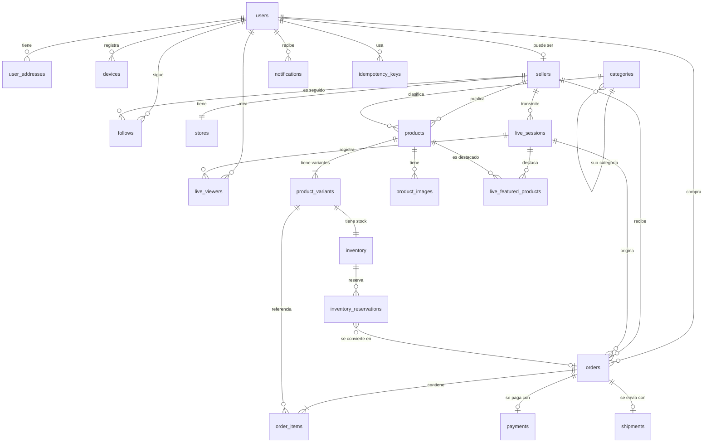

# 05 — Diseño de PostgreSQL

Cubre: **§7 Diseño PostgreSQL · §8 Entidades y relaciones**

DDL ejecutable: [../db/migrations/0001_init.sql](../db/migrations/0001_init.sql) · Esquema Prisma: [../db/schema.prisma](../db/schema.prisma)

---

## §7. Principios de diseño

### 1. Las invariantes viven en la base, no en el código

Es la decisión más importante de este documento. El código tiene bugs; una restricción de PostgreSQL no.

| Invariante | Cómo se garantiza | Qué previene |
|---|---|---|
| El stock nunca es negativo | `CHECK (on_hand >= 0 AND reserved >= 0 AND reserved <= on_hand)` | Sobreventa aunque el código falle |
| Un solo producto destacado por live | `UNIQUE INDEX … WHERE unfeatured_at IS NULL` | Doble destacado por doble toque o carrera |
| Una sola dirección predeterminada por usuario | `UNIQUE INDEX … WHERE is_default` | Ambigüedad en el checkout |
| Un follow no se duplica | `PRIMARY KEY (follower_id, seller_id)` | Contadores inflados |
| Una orden por clave de idempotencia | `UNIQUE (user_id, idempotency_key)` | **Cobro doble** |
| Un webhook se procesa una vez | `UNIQUE (provider, external_event_id)` | Doble acreditación |
| Un usuario canjea un cupón una vez | `UNIQUE (coupon_id, user_id)` | Abuso de cupón |
| Un solo live activo por vendedor | `UNIQUE INDEX … WHERE status = 'LIVE'` | Dos transmisiones simultáneas |

Si mañana escribimos un endpoint nuevo y nos olvidamos de una validación, la base rechaza la escritura. Esa es la red de seguridad.

### 2. IDs: ULID en columnas `TEXT`, no UUID v4

| | ULID | UUID v4 |
|---|---|---|
| Ordenable por tiempo | ✅ | ❌ |
| Fragmentación del índice B-tree | Mínima | **Alta** |
| Legible en logs | `ord_01JBQ8X7ZV…` | `f47ac10b-58cc-…` |
| Prefijo por tipo | ✅ | ❌ |

El prefijo (`usr_`, `ord_`, `var_`) evita una clase entera de bugs: pasar un `productId` donde va un `variantId` es imposible de no ver en un log o en un test. Y como el ULID es monótono en el tiempo, los índices no se fragmentan como con UUID v4 aleatorio.

```sql
-- Generación en la aplicación, no en la base: así el ID existe antes del INSERT
-- y se puede usar para armar eventos dentro de la misma transacción.
id TEXT PRIMARY KEY   -- 'ord_' || ulid()
```

### 3. Dinero: `BIGINT` en centavos. Nunca `FLOAT`, nunca `NUMERIC` para operar

```sql
price_cents BIGINT NOT NULL CHECK (price_cents >= 0)
currency    CHAR(3) NOT NULL DEFAULT 'ARS'
```

`$24.990,00` se guarda como `2499000`. Con `FLOAT`, `0.1 + 0.2 != 0.3` y en algún momento un total sale con un centavo de diferencia que nadie puede explicar. En Argentina, además, los montos son grandes: `BIGINT` da margen de sobra para inflación.

`currency` está desde el día 1 aunque solo usemos ARS: agregarla después obliga a migrar cada tabla de dinero.

### 4. Timestamps: siempre `TIMESTAMPTZ`, siempre UTC

La base guarda UTC. La conversión a `America/Argentina/Buenos_Aires` ocurre **solo en la capa de presentación**. Guardar hora local es el bug que aparece cuando abrís el segundo país.

```sql
created_at TIMESTAMPTZ NOT NULL DEFAULT now()
updated_at TIMESTAMPTZ NOT NULL DEFAULT now()   -- mantenido por trigger
deleted_at TIMESTAMPTZ                          -- borrado lógico donde importa
```

### 5. Snapshot vs referencia: la regla del pedido

Las órdenes guardan **copias**, no referencias, de todo lo que puede cambiar:

```sql
-- ❌ MAL: si el vendedor cambia el precio mañana, el histórico miente
order_items (variant_id) -- y se hace JOIN para leer el precio

-- ✅ BIEN: el pedido conserva lo que realmente se vendió
order_items (
  variant_id,           -- referencia, para trazar
  sku,                  -- copia
  product_title,        -- copia
  variant_label,        -- copia
  unit_price_cents,     -- copia
  image_url             -- copia
)
```

Lo mismo con la dirección de envío: `orders.shipping_snapshot JSONB` es una copia de la dirección al momento de la compra. Si el comprador se muda, el pedido ya despachado conserva a dónde fue.

### 6. Índices: pocos, parciales y pensados

Cada índice tiene un costo de escritura. Solo se crean los que sirven a una consulta real y se documenta cuál.

```sql
-- Feed: lives activos ordenados por espectadores. Índice parcial: solo indexa
-- ~50 filas de las millones históricas.
CREATE INDEX ix_lives_active ON live_sessions (viewer_count DESC, started_at DESC)
  WHERE status = 'LIVE';

-- Fan-out de push: index-only scan. INCLUDE evita tocar la tabla.
CREATE INDEX ix_follows_notify ON follows (seller_id) INCLUDE (follower_id)
  WHERE notify_live = true AND muted_until IS NULL;

-- Barrido de reservas vencidas: cada segundo, sobre las pocas activas.
CREATE INDEX ix_reservations_expiring ON inventory_reservations (expires_at)
  WHERE status = 'ACTIVE';
```

### 7. Auditoría

```sql
CREATE TABLE audit_logs (
  id           BIGSERIAL PRIMARY KEY,
  actor_type   TEXT NOT NULL,        -- user | seller | admin | system
  actor_id     TEXT,
  action       TEXT NOT NULL,        -- order.refunded, seller.suspended
  entity_type  TEXT NOT NULL,
  entity_id    TEXT NOT NULL,
  before       JSONB,
  after        JSONB,
  ip           INET,
  user_agent   TEXT,
  trace_id     TEXT,
  created_at   TIMESTAMPTZ NOT NULL DEFAULT now()
);
```

Se registra **toda** acción administrativa, todo reembolso, toda suspensión y todo acceso a datos personales. Sin excepciones — el CLI de administración del PMV escribe acá igual que lo hará el panel web.

---

## §8. Entidades y relaciones

### Diagrama ER



### Tabla por tabla

#### Identidad

**`users`** — Onboarding de 5 campos (§11 de tu brief). Sin DNI ni dirección.

| Campo | Tipo | Notas |
|---|---|---|
| `id` | TEXT PK | `usr_<ulid>` |
| `first_name`, `last_name` | TEXT NOT NULL | Del proveedor social o del formulario |
| `email` | CITEXT UNIQUE | `CITEXT` para que `Juan@x.com` = `juan@x.com` |
| `phone_e164` | TEXT UNIQUE | `+5491168889999`. Identificador operativo real en Argentina |
| `phone_verified` | BOOLEAN | **Requisito para comprar**, no para registrarse |
| `whatsapp_opt_in` | BOOLEAN | Canal de respaldo si rechaza el push |
| `auth_provider` | ENUM | `google` \| `apple` \| `phone` |
| `provider_sub` | TEXT | `sub` del token OIDC |
| `has_default_address` | BOOLEAN | **Desnormalizado**: se lee en cada apertura de la hoja de compra. Un JOIN ahí es inaceptable |
| `role` | ENUM | `buyer` \| `seller` \| `moderator` \| `admin` |
| `status` | ENUM | `active` \| `suspended` \| `deleted` |

**`user_addresses`** — Se crea en la **primera compra** (§12 de tu brief).

Dirección **desglosada**, nunca texto libre. Sin el desglose no se puede agrupar por zona ni geocodificar, y agrupar por CP es un requisito explícito (§19).

| Campo | Notas |
|---|---|
| `doc_type`, `doc_number` | `dni` \| `cuil` \| `cuit`. **Cifrado a nivel de columna** |
| `recipient_name` | Puede diferir del titular de la cuenta |
| `street`, `street_number` | `street_number` es TEXT: existe "s/n" |
| `floor`, `apartment` | Opcionales |
| `between_streets` | En Argentina el repartidor lo usa más que las coordenadas |
| `city`, `province`, `postal_code` | `province` en ISO 3166-2:AR (`AR-C`, `AR-B`, `AR-X`) |
| `postal_code_core` | 4 dígitos derivados. **Unidad de agrupación logística** |
| `lat`, `lng`, `geocode_status` | Geocodificación **asíncrona**: la compra nunca espera |
| `is_default` | `UNIQUE WHERE is_default` |

El campo `postal_code_core` es el que habilita todo el §19 de tu brief. Se calcula al guardar, tanto desde el formato clásico (`1414`) como desde el CPA (`C1414AAJ`).

**`devices`** — Tokens de push. Un usuario, varios dispositivos.

| Campo | Notas |
|---|---|
| `push_token` | UNIQUE. Un token `UNREGISTERED` se borra en el momento |
| `platform`, `app_version`, `os_version` | Para segmentar fallos |
| `timezone` | Para horarios de silencio |
| `failure_count` | 5 fallos consecutivos → se desactiva |

#### Vendedores y catálogo

**`sellers`** / **`stores`** — Separadas porque un vendedor podría tener varias tiendas en el futuro; en el PMV es 1:1. `sellers` tiene los datos fiscales y de verificación; `stores` la identidad pública (handle, logo, banner, descripción).

**`products`** → **`product_variants`** → **`inventory`**

La cadena de tres niveles es deliberada:

- `products`: título, descripción, categoría, marca, imágenes.
- `product_variants`: la combinación comprable (talle M / color negro), con su SKU, su precio y su **peso**.
- `inventory`: el stock, en una tabla aparte.

**Por qué el stock va en su propia tabla:** es la fila con más contención del sistema. Separarla evita que un `UPDATE` de stock bloquee la lectura del precio y el título, que ocurre miles de veces por segundo durante un live.

```sql
CREATE TABLE inventory (
  variant_id TEXT PRIMARY KEY REFERENCES product_variants(id) ON DELETE CASCADE,
  on_hand    INTEGER NOT NULL DEFAULT 0,
  reserved   INTEGER NOT NULL DEFAULT 0,
  version    INTEGER NOT NULL DEFAULT 0,
  updated_at TIMESTAMPTZ NOT NULL DEFAULT now(),

  -- LA restricción que hace imposible la sobreventa, pase lo que pase en el código
  CONSTRAINT chk_inventory_non_negative CHECK (on_hand >= 0 AND reserved >= 0),
  CONSTRAINT chk_inventory_reserved_lte CHECK (reserved <= on_hand)
);

-- available = on_hand - reserved  (columna generada, siempre coherente)
ALTER TABLE inventory
  ADD COLUMN available INTEGER GENERATED ALWAYS AS (on_hand - reserved) STORED;
```

**`product_variants.weight_gr` es obligatorio.** Sin peso no hay cotización de envío posible. Se pone un valor por defecto por categoría para no frenar la carga del catálogo, pero la columna no acepta `NULL`.

#### Live

**`live_sessions`** — Una transmisión.

| Campo | Notas |
|---|---|
| `status` | Máquina de estados del documento 06 |
| `livekit_room_name` | Nombre de la sala en el proveedor |
| `hls_url` | Se completa cuando se activa el Egress |
| `viewer_count`, `peak_viewers`, `unique_viewers` | Denormalizados desde Redis cada 10 s |
| `gmv_cents`, `orders_count` | Calculados al terminar; durante el live viven en Redis |
| `recording_url` | VOD |

`UNIQUE INDEX ON live_sessions (seller_id) WHERE status = 'LIVE'` — un vendedor no puede tener dos transmisiones activas.

**`live_featured_products`** — El producto destacado (§13 de tu brief).

```sql
-- Invariante: UN SOLO producto destacado a la vez, garantizado por la base.
CREATE UNIQUE INDEX uq_one_featured_per_live
  ON live_featured_products (live_id) WHERE unfeatured_at IS NULL;
```

Guarda `offset_ms` (desplazamiento desde el inicio del live), que permite reconstruir los destacados en la reproducción grabada.

También guarda el embudo desnormalizado: `impressions`, `taps`, `orders`, `revenue_cents`. Eso es lo que le dice al vendedor si el producto no se mira o se mira y no se compra — dos problemas con soluciones opuestas.

**`live_viewers`** — Sesiones de visualización, para analítica. Se escribe al salir, no al entrar, para no generar una escritura por cada persona que pasa.

#### Comercio

**`orders`** — Cabecera. Estados en el documento 06.

| Campo | Notas |
|---|---|
| `idempotency_key` | `UNIQUE (user_id, idempotency_key)`. **Lo que impide el cobro doble** |
| `live_id`, `featured_product_id` | Atribución: sin esto no hay métricas de conversión del live |
| `subtotal_cents`, `discount_cents`, `shipping_cents`, `total_cents` | Todo calculado en el servidor |
| `shipping_snapshot` | JSONB. Copia de la dirección al momento de comprar |
| `expires_at` | Si no se paga, expira y libera el stock |

**`order_items`** — Con snapshot de título, precio, SKU e imagen.

**`payments`** — Dominio separado (§9 de tu brief). Una orden puede tener varios intentos de pago.

| Campo | Notas |
|---|---|
| `provider` | `mercadopago` \| `modo` |
| `external_id` | ID del pago en el proveedor |
| `external_status`, `external_status_detail` | Crudo del proveedor, para depurar |
| `installments` | Cuotas. Importa en Argentina |
| `idempotency_key` | Enviada al proveedor |

**`payment_webhook_events`** — La tabla que evita la doble acreditación.

```sql
CREATE TABLE payment_webhook_events (
  id                 TEXT PRIMARY KEY,
  provider           TEXT NOT NULL,
  external_event_id  TEXT NOT NULL,
  payload            JSONB NOT NULL,
  signature_valid    BOOLEAN NOT NULL,
  processed_at       TIMESTAMPTZ,
  error              TEXT,
  received_at        TIMESTAMPTZ NOT NULL DEFAULT now(),
  CONSTRAINT uq_webhook_event UNIQUE (provider, external_event_id)
);
```

El `UNIQUE` hace que un webhook reenviado por Mercado Pago —cosa que ocurre todo el tiempo— se descarte con un simple conflicto de inserción.

**`shipments`** — Dominio separado del pedido.

| Campo | Notas |
|---|---|
| `provider` | `own_flex` \| `andreani` \| `correo_argentino` \| `mercado_envios` |
| `external_id`, `tracking_code`, `label_url` | Lo que devuelve el `ShippingProvider` |
| `zone`, `zone_cluster` | Calculados al confirmar el pago y **persistidos** |
| `weight_gr`, `declared_value_cents` | Para cotizar |

`zone_cluster` se persiste y no se recalcula: si mañana cambia el algoritmo de zonificación, los envíos ya agrupados conservan su agrupación.

#### Crecimiento

**`follows`** — Clave primaria compuesta `(follower_id, seller_id)`: el duplicado es imposible y el `INSERT … ON CONFLICT DO NOTHING` es idempotente.

Preferencias por vendedor: `notify_live`, `notify_content`, `is_favorite`, `muted_until`. Y señales de afinidad (`engagement_score`, `total_watch_sec`, `orders_count`) que ordenan el fan-out por tramos y personalizan el feed.

**`seller_counters`** — Contadores **fragmentados**.

```sql
CREATE TABLE seller_counters (
  seller_id TEXT NOT NULL REFERENCES sellers(id) ON DELETE CASCADE,
  shard     SMALLINT NOT NULL,          -- 0..15
  followers BIGINT NOT NULL DEFAULT 0,
  PRIMARY KEY (seller_id, shard)
);
```

Un `UPDATE sellers SET follower_count = follower_count + 1` parece inofensivo hasta que 3.000 personas siguen al mismo vendedor durante un live viral: la fila se convierte en un cuello de botella y todas las escrituras se serializan. Con 16 fragmentos, la contención se divide por 16 y la lectura es un `SUM` sobre 16 filas, cacheado 30 segundos.

**`notifications`**, **`outbox`**, **`idempotency_keys`**, **`audit_logs`** — Infraestructura, descritas en los documentos 03, 08 y 10.

### Cifrado de datos sensibles

`user_addresses.doc_number` (DNI/CUIL) se cifra a nivel de columna con `pgcrypto`. Un volcado de esa tabla expone el documento y el domicilio de toda la base: es el activo más sensible del sistema.

```sql
CREATE EXTENSION IF NOT EXISTS pgcrypto;

-- Escritura:  pgp_sym_encrypt($1, current_setting('app.doc_key'))
-- Lectura:    pgp_sym_decrypt(doc_number_enc, current_setting('app.doc_key'))
-- La clave se inyecta por sesión desde Secrets Manager, nunca vive en la base.
```

Se registra en `audit_logs` toda lectura masiva de esta tabla, y hay alerta si una consulta devuelve más de 100 filas.

### Estrategia de migraciones

**Prisma Migrate** para el ciclo normal. Reglas:

1. **Toda migración es hacia adelante.** No hay `down` en producción; se corrige con una migración nueva.
2. **Compatible en ambos sentidos.** Se despliega el código nuevo con el esquema viejo funcionando, se migra, y recién después se borra lo viejo. Esto es lo que permite desplegar sin ventana de mantenimiento.
3. **Nada de `DROP COLUMN` en la misma migración que deja de usarla.** Se deja de escribir, se despliega, se espera una semana, se borra.
4. **Índices con `CONCURRENTLY`** en tablas grandes. Un `CREATE INDEX` normal bloquea escrituras.

```sql
-- ✅ No bloquea. Requiere estar fuera de transacción, así que va en su propia migración.
CREATE INDEX CONCURRENTLY ix_orders_seller_created ON orders (seller_id, created_at DESC);
```

### Conexiones

Con Fly.io escalando a N máquinas y Neon con un límite de conexiones, hace falta pooling:

```
App (N instancias) → PgBouncer (modo transaction) → PostgreSQL
```

Neon incluye pooling gestionado. Configuración: `connection_limit=10` por instancia de aplicación, PgBouncer en modo `transaction`.

**Consecuencia a tener presente:** el modo `transaction` no soporta *prepared statements* de sesión. Con Prisma hay que usar `?pgbouncer=true` en la URL. Es una línea que, si falta, produce errores intermitentes imposibles de reproducir en desarrollo.
