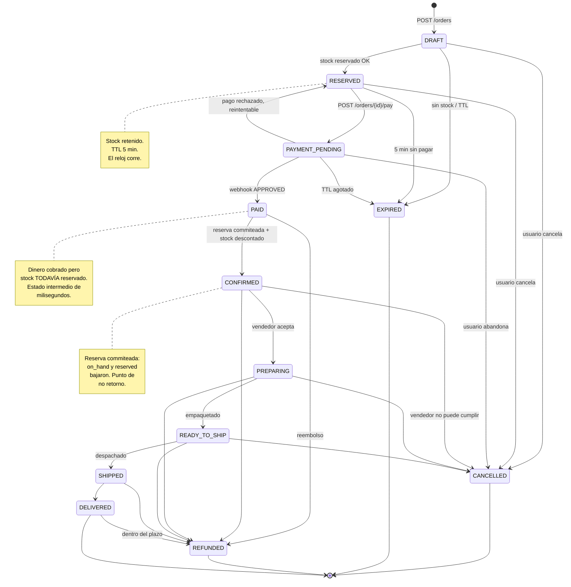
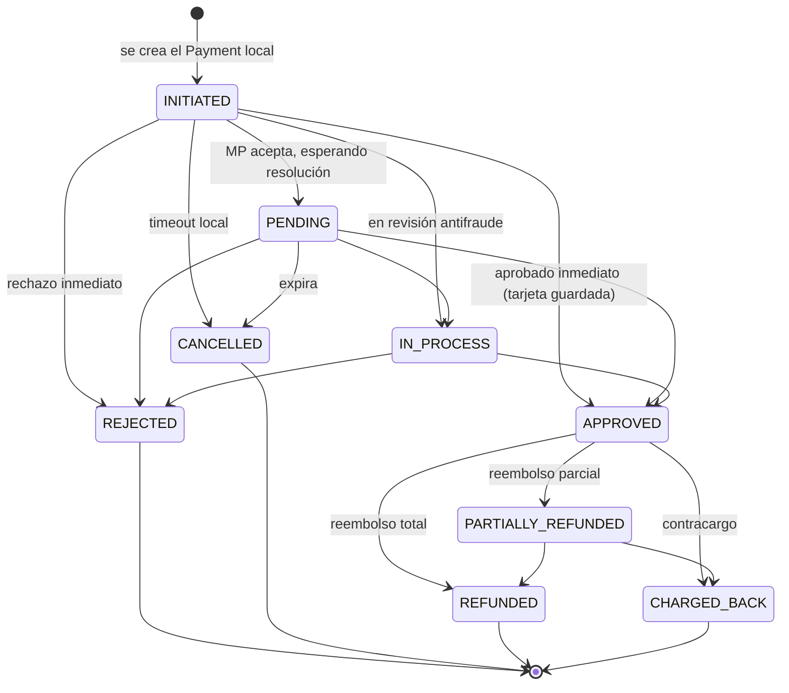
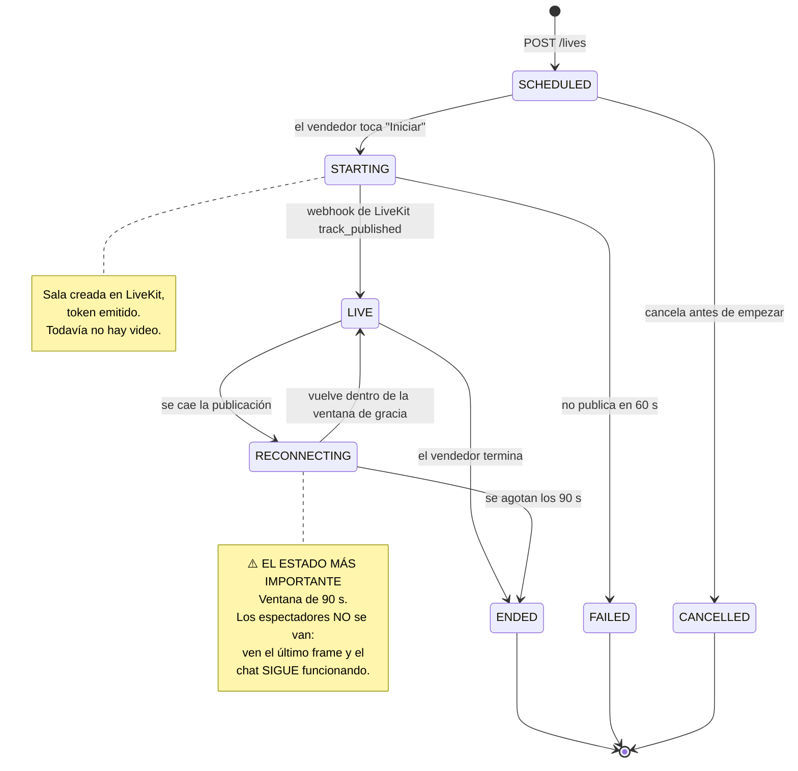

# 06 — Máquinas de estado

Cubre: **§9 Órdenes · §10 Pagos · §11 Live**

---

## Principio común

Las tres máquinas comparten las mismas cuatro reglas. Si alguna se rompe, el sistema pierde consistencia de una forma que no se detecta hasta que hay dinero de por medio.

1. **La tabla de transiciones vive en el código de dominio, no en un diagrama.** `assertTransition(from, to)` se llama en cada cambio. Un estado imposible tira excepción, no se escribe.
2. **Toda transición es idempotente.** Pasar de `PAID` a `PAID` no es un error: es un no-op. Los webhooks llegan repetidos por definición.
3. **Toda transición se registra.** Tabla `audit_logs` con `before` y `after`. Cuando un vendedor reclame, hay que poder reconstruir qué pasó.
4. **Los estados terminales no salen nunca.** `DELIVERED`, `CANCELLED`, `EXPIRED` y `REFUNDED` no tienen transiciones de salida. Cualquier intento es un bug.

---

## §9. Máquina de estados de ÓRDENES



### Los tres estados que suelen confundirse

| Estado | Dinero | Stock | Quién actúa |
|---|---|---|---|
| `RESERVED` | Sin cobrar | **Retenido** (`reserved +1`) | El comprador tiene 5 minutos |
| `PAID` | **Cobrado** | Todavía retenido | El sistema, en milisegundos |
| `CONFIRMED` | Cobrado | **Descontado** (`on_hand −1`, `reserved −1`) | El sistema |

`PAID` → `CONFIRMED` ocurre en la misma transacción, inmediatamente. **Existen como estados separados a propósito**: si el commit de la reserva falla (por ejemplo, la reserva expiró un segundo antes de que llegara el webhook), el pedido queda en `PAID` y salta una alerta operativa. Ese caso hay que resolverlo con una persona —devolver el dinero o conseguir la unidad—, no con un reintento automático.

Fusionar ambos estados escondería ese caso, y aparecería como "un cliente pagó y no recibió nada" tres días después.

### Quién dispara cada transición

| Transición | Disparador | Efectos secundarios |
|---|---|---|
| `→ DRAFT` | `POST /orders` | — |
| `DRAFT → RESERVED` | `InventoryService.reserve()` OK | Evento `InventoryReserved` · WS `STOCK_UPDATED` · job de expiración a 5 min |
| `RESERVED → PAYMENT_PENDING` | `POST /orders/{id}/pay` | Se crea `Payment` · llamada a Mercado Pago |
| `PAYMENT_PENDING → PAID` | Webhook `approved` verificado | Evento `PaymentConfirmed` |
| `PAID → CONFIRMED` | Commit de la reserva | Stock descontado · WS `PAYMENT_CONFIRMED` · push al comprador · WhatsApp al vendedor · crear `Shipment` |
| `* → EXPIRED` | Job de expiración | **Liberar la reserva** · WS `STOCK_UPDATED` |
| `* → CANCELLED` | Usuario, vendedor o admin | Liberar reserva si sigue activa · reembolsar si estaba pago |

### El TTL y su relación con el pago

```
t=0     POST /orders            → RESERVED, expires_at = t+5min
t=0     BullMQ: job diferido a t+5min
t=30s   POST /orders/{id}/pay   → PAYMENT_PENDING
t=45s   webhook approved        → PAID → CONFIRMED
                                → la reserva pasa a COMMITTED
t=5min  el job se ejecuta       → la reserva ya no está ACTIVE → no-op
```

**El job de expiración siempre corre**, incluso si la compra salió bien. Es un no-op en ese caso. Esto es intencional: no hay que cancelar jobs, y un job cancelado que igual se ejecuta no rompe nada.

**Caso borde crítico:** el pago se aprueba **después** de que la reserva expiró. Ocurre con métodos lentos o webhooks demorados. Manejo:

```typescript
// backend/src/modules/orders/application/handlers/on-payment-confirmed.handler.ts
async handle(evt: PaymentConfirmedEvent) {
  const result = await this.inventory.commitReservation(evt.orderId);

  if (result.isErr() && result.error.code === 'RESERVATION_EXPIRED') {
    // Reintento oportunista: puede que otro haya liberado stock mientras tanto.
    const retry = await this.inventory.reserveAndCommitDirect(evt.orderId);

    if (retry.isErr()) {
      // No hay stock. El cliente PAGÓ. No se puede resolver solo.
      await this.orders.flagForManualReview(evt.orderId, 'PAID_WITHOUT_STOCK');
      await this.alerts.page('paid-without-stock', { orderId: evt.orderId });
      return;   // El pedido queda en PAID. NO se confirma.
    }
  }
  await this.orders.transition(evt.orderId, 'CONFIRMED');
}
```

Nunca se confirma un pedido sin stock, y nunca se descarta silenciosamente un pago recibido. El caso escala a una persona.

---

## §10. Máquina de estados de PAGOS

Dominio **separado** del pedido, como pediste. Una orden puede tener varios intentos de pago; un pago pertenece a una sola orden.



### Mapeo desde Mercado Pago

MP devuelve sus propios estados. La traducción está en un solo lugar y guarda **siempre el valor crudo** en `external_status` y `external_status_detail`, porque sin eso es imposible depurar un rechazo.

```typescript
// backend/src/modules/payments/infrastructure/mercadopago.mapper.ts
const MP_TO_INTERNAL: Record<string, PaymentStatus> = {
  pending:     'PENDING',
  in_process:  'IN_PROCESS',
  in_mediation:'IN_PROCESS',
  approved:    'APPROVED',
  authorized:  'IN_PROCESS',
  rejected:    'REJECTED',
  cancelled:   'CANCELLED',
  refunded:    'REFUNDED',
  charged_back:'CHARGED_BACK',
};

/// Los detalles importan MÁS que el estado: determinan qué le decimos al
/// usuario y si tiene sentido reintentar.
const RETRYABLE_DETAILS = new Set([
  'cc_rejected_insufficient_amount',      // "Sin saldo — probá otra tarjeta"
  'cc_rejected_bad_filled_security_code', // "Revisá el código de seguridad"
  'cc_rejected_bad_filled_date',
  'cc_rejected_call_for_authorize',       // "Llamá a tu banco para autorizar"
]);

const TERMINAL_DETAILS = new Set([
  'cc_rejected_high_risk',                // no reintentar: empeora el score
  'cc_rejected_blacklist',
  'cc_rejected_duplicated_payment',
]);
```

Un `cc_rejected_call_for_authorize` con el mensaje correcto recupera una fracción alta de las ventas rechazadas. Mostrar "Pago rechazado" a secas las pierde todas. Es de las mejoras de conversión más baratas del sistema.

### La regla del webhook

> **El webhook es la verdad. La respuesta HTTP es una pista.**

Nunca se marca un pago como aprobado por la respuesta de la llamada de creación. La red móvil pierde respuestas; el webhook llega igual. Y el webhook tampoco se cree por sí solo: al recibirlo, se consulta `GET /v1/payments/{id}` contra la API de MP. El cuerpo del webhook puede estar falsificado o desactualizado.

Detalle completo en el documento [09](09-pagos-mercadopago.md).

### Conciliación

Todo PSP pierde webhooks alguna vez. Un job cada 5 minutos:

```sql
SELECT id, external_id FROM payments
WHERE status IN ('INITIATED', 'PENDING', 'IN_PROCESS')
  AND created_at < now() - interval '10 minutes'
ORDER BY created_at
LIMIT 200;
```

Por cada uno, se consulta el estado real en MP y se aplica la transición. **Sin este job, un pago con webhook perdido deja al cliente sin producto y el stock retenido para siempre.**

---

## §11. Máquina de estados de LIVE



### Por qué `RECONNECTING` existe

Es la diferencia entre perder una audiencia y no perderla.

Sin este estado, un corte de 15 segundos en el 4G del vendedor termina el live, dispara `LIVE_ENDED`, saca a 2.000 personas de la sala y obliga a empezar de nuevo — con un segundo push que la gente ya ignora.

Con `RECONNECTING`:

| Actor | Qué ve / hace |
|---|---|
| Vendedor | "Reconectando…" con contador. El SDK reintenta con backoff |
| Espectadores | Último frame congelado, banner discreto. **El chat sigue vivo. La compra sigue funcionando** |
| Sistema | La sala de LiveKit sigue abierta. Nada de `LIVE_ENDED`. Nada de un segundo push |
| Si vuelve | Se reanuda de forma transparente. Ninguna notificación |
| Si expira | `ENDED`, se cierra la sala, se publica el VOD |

Mantener el chat vivo durante la reconexión es lo que evita que la sala se vacíe. La gente espera si ve que hay otros esperando.

### Transiciones y efectos

| Transición | Disparador | Efectos |
|---|---|---|
| `→ SCHEDULED` | `POST /lives` | Se crea la sala en LiveKit · se emite el token de publicador |
| `SCHEDULED → STARTING` | `POST /lives/{id}/start` | Temporizador de 60 s para publicar |
| `STARTING → LIVE` | Webhook `track_published` | **Outbox `LiveStarted`** → fan-out de push · WS `LIVE_STARTED` · indexar en el buscador · aparece en el feed |
| `LIVE → RECONNECTING` | Webhook `participant_disconnected` del publicador | `reconnect_until = now() + 90s` · WS `LIVE_RECONNECTING` |
| `RECONNECTING → LIVE` | Vuelve a publicar | WS `LIVE_RESUMED`. **Sin push** |
| `RECONNECTING → ENDED` | Job a los 90 s | Igual que abajo |
| `LIVE → ENDED` | `POST /lives/{id}/end` o webhook `room_finished` | Cerrar sala · detener Egress · **desdestacar el producto activo** · consolidar métricas desde Redis a Postgres · WS `LIVE_ENDED` · publicar VOD |
| `STARTING → FAILED` | Timeout de 60 s | Se libera la sala · se avisa al vendedor con diagnóstico de red |

### El invariante del vendedor

```sql
CREATE UNIQUE INDEX uq_one_live_per_seller ON live_sessions (seller_id)
  WHERE status IN ('STARTING', 'LIVE', 'RECONNECTING');
```

Un vendedor no puede tener dos transmisiones activas. Sin esto, un doble toque en "Iniciar" crea dos salas, divide la audiencia y duplica el costo de video. La base lo impide; el código no tiene que acordarse.

### Al terminar: consolidación de métricas

Durante el live, `viewer_count`, `gmv_cents` y los contadores del embudo viven en Redis por velocidad. Al pasar a `ENDED` se vuelcan a Postgres en una transacción, y Redis se limpia con TTL.

```typescript
async onLiveEnded(liveId: string) {
  const m = await this.redis.hgetall(`live:${liveId}:metrics`);

  await this.prisma.$transaction([
    this.prisma.liveSession.update({
      where: { id: liveId },
      data: {
        status: 'ENDED',
        endedAt: new Date(),
        peakViewers:   Number(m.peak_viewers ?? 0),
        uniqueViewers: Number(m.unique_viewers ?? 0),
        ordersCount:   Number(m.orders ?? 0),
        gmvCents:      BigInt(m.gmv_cents ?? 0),
      },
    }),
    // Desdestacar lo que quedó activo: si no, el índice único parcial
    // bloquea el próximo live de ese vendedor.
    this.prisma.liveFeaturedProduct.updateMany({
      where: { liveId, unfeaturedAt: null },
      data:  { unfeaturedAt: new Date() },
    }),
  ]);

  await this.redis.expire(`live:${liveId}:metrics`, 86400);   // 24 h para depurar
}
```

Ese `updateMany` es el tipo de detalle que, olvidado, produce un bug reportado como *"no puedo iniciar el vivo"* una semana después, y que cuesta medio día encontrar.

---

## Implementación compartida

```typescript
// backend/src/shared/state-machine/state-machine.ts
export class StateMachine<S extends string> {
  constructor(
    private readonly transitions: Readonly<Record<S, readonly S[]>>,
    private readonly name: string,
  ) {}

  can(from: S, to: S): boolean {
    return from === to || this.transitions[from].includes(to);   // idempotente
  }

  assert(from: S, to: S): void {
    if (!this.can(from, to)) {
      throw new InvalidTransitionError(this.name, from, to);
    }
  }

  isTerminal(s: S): boolean {
    return this.transitions[s].length === 0;
  }
}
```

Y el helper transaccional que registra la auditoría, para que nadie tenga que acordarse:

```typescript
// backend/src/shared/state-machine/transition.helper.ts
export async function transition<T extends { id: string; status: S }, S extends string>(
  tx: PrismaTx,
  opts: {
    machine: StateMachine<S>;
    entity: T;
    to: S;
    table: string;
    actorId?: string;
    reason?: string;
  },
): Promise<T> {
  opts.machine.assert(opts.entity.status, opts.to);
  if (opts.entity.status === opts.to) return opts.entity;   // no-op idempotente

  const updated = await tx[opts.table].update({
    where: { id: opts.entity.id, status: opts.entity.status },   // guarda contra carreras
    data:  { status: opts.to },
  });

  await tx.auditLog.create({
    data: {
      actorType:  opts.actorId ? 'user' : 'system',
      actorId:    opts.actorId,
      action:     `${opts.table}.${opts.entity.status}_to_${opts.to}`,
      entityType: opts.table,
      entityId:   opts.entity.id,
      before:     { status: opts.entity.status },
      after:      { status: opts.to, reason: opts.reason },
    },
  });

  return updated as T;
}
```

El `where: { id, status }` es la parte no obvia: si otro proceso cambió el estado entre la lectura y la escritura, el `UPDATE` afecta cero filas y Prisma tira error en lugar de sobrescribir. Es bloqueo optimista sin columna de versión.
