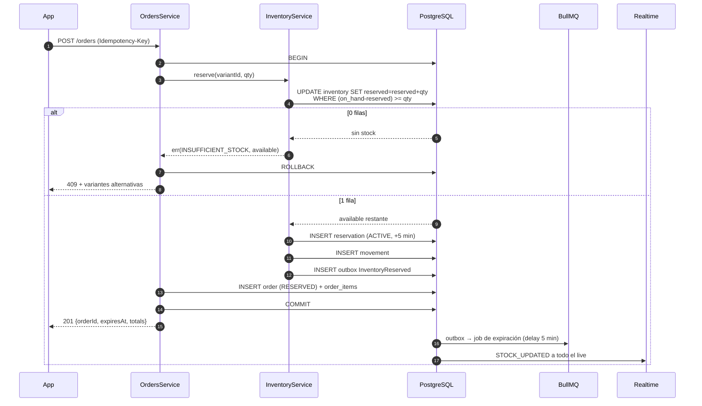

# 07 — Sistema de Inventory Reservation

Cubre: **§12 Sistema de reservas de inventario**

> Este es el módulo donde un bug se traduce directamente en un vendedor perdido. Cobertura de tests obligatoria, revisión por dos personas, sin excepciones.

---

## 1. El escenario que hay que resolver

Quedan 2 unidades. Un live con 3.000 personas. El vendedor dice "quedan dos". Trescientas personas tocan "Comprar" **en el mismo segundo**.

Resultado correcto:

```
Usuario A  → reservado    ✅
Usuario B  → reservado    ✅
Usuarios C…CCC → 409 INSUFFICIENT_STOCK, con available: 0
```

Resultado inaceptable: se venden 47 unidades de 2. El vendedor tiene que cancelar 45 pedidos, se lleva 45 reclamos, y se va de la plataforma.

## 2. Decisión: PostgreSQL, no Redis

Es la decisión técnica más importante de este documento y va contra el instinto de "Redis es más rápido".

| | **PostgreSQL** ✅ | Redis + Lua |
|---|---|---|
| Atomicidad | Nativa (MVCC) | Vía script Lua |
| Latencia por operación | 2–5 ms | 0,5–1 ms |
| **Invariante garantizada** | ✅ **`CHECK` a nivel de tabla** | ❌ Solo si el código es correcto |
| Sobrevive a un reinicio | ✅ | ⚠️ Depende de la persistencia |
| Consistencia con la orden | ✅ **Misma transacción** | ❌ Dos sistemas que pueden divergir |
| Necesita reconciliación | No | **Sí, un job permanente** |

**Redis es 3 ms más rápido. PostgreSQL es correcto por construcción.** Con un presupuesto de 400 ms para `POST /orders`, esos 3 ms no existen; la corrección sí.

El argumento decisivo: con Redis, la reserva y la creación de la orden son **dos sistemas distintos**. Si el proceso muere entre ambas, hay stock reservado sin orden que lo reclame, y hace falta un job de reconciliación permanente comparando Redis contra Postgres. Con PostgreSQL, reservar y crear la orden ocurren en **la misma transacción**: o pasan las dos cosas o ninguna.

Y por encima de todo:

```sql
CONSTRAINT chk_inv_non_negative CHECK (on_hand >= 0 AND reserved >= 0),
CONSTRAINT chk_inv_reserved_lte CHECK (reserved <= on_hand)
```

Aunque escribamos un endpoint nuevo el mes que viene y nos olvidemos de una validación, **la base rechaza la escritura**. Redis no tiene equivalente a eso.

**Redis sí se usa aquí**, pero solo para leer rápido el `available` que se muestra en la UI y se difunde por WebSocket. Nunca para decidir.

## 3. El modelo

```sql
CREATE TABLE inventory (
  variant_id  TEXT PRIMARY KEY REFERENCES product_variants(id) ON DELETE CASCADE,
  on_hand     INTEGER NOT NULL DEFAULT 0,   -- unidades físicas en poder del vendedor
  reserved    INTEGER NOT NULL DEFAULT 0,   -- retenidas por reservas ACTIVE
  available   INTEGER GENERATED ALWAYS AS (on_hand - reserved) STORED,
  version     INTEGER NOT NULL DEFAULT 0,
  updated_at  TIMESTAMPTZ NOT NULL DEFAULT now(),

  CONSTRAINT chk_inv_non_negative CHECK (on_hand >= 0 AND reserved >= 0),
  CONSTRAINT chk_inv_reserved_lte CHECK (reserved <= on_hand)
);
```

**Tres números, no uno.** `available` es una columna generada: siempre coherente, imposible de desincronizar.

Ciclo de vida completo:

| Momento | `on_hand` | `reserved` | `available` |
|---|---|---|---|
| Estado inicial | 10 | 0 | 10 |
| A reserva 2 | 10 | 2 | **8** |
| B reserva 1 | 10 | 3 | **7** |
| La reserva de A expira | 10 | 1 | **9** |
| B paga → commit | **9** | 0 | 9 |

En el commit bajan **los dos** contadores: la unidad salió del inventario y ya no está reservada.

## 4. La operación de reserva

### Un solo `UPDATE`, no `SELECT` + `UPDATE`

```sql
-- backend/src/modules/inventory/infrastructure/sql/reserve.sql
--
-- ATÓMICO POR CONSTRUCCIÓN.
-- El WHERE es el guardia: si no hay stock, afecta 0 filas y no hay que
-- comprobar nada después. PostgreSQL serializa los UPDATE concurrentes
-- sobre la misma fila, así que no hay ventana de carrera.
--
-- NO se usa SELECT ... FOR UPDATE + UPDATE: son dos viajes de red y el
-- mismo resultado. Esto es un viaje.

UPDATE inventory
SET reserved   = reserved + $2,
    version    = version + 1,
    updated_at = now()
WHERE variant_id = $1
  AND (on_hand - reserved) >= $2          -- ⛔ EL GUARDIA
RETURNING on_hand, reserved, (on_hand - reserved) AS available;
```

Cero filas devueltas ⇒ no había stock. Una fila ⇒ reservado. **No hay tercer caso.**

### El caso de uso completo

```typescript
// backend/src/modules/inventory/application/reserve-inventory.usecase.ts
@Injectable()
export class ReserveInventoryUseCase {
  constructor(
    private readonly prisma: PrismaService,
    private readonly queue: ReservationQueue,
    private readonly events: EventBus,
    private readonly redis: RedisService,
  ) {}

  async execute(cmd: ReserveCommand): Promise<Result<Reservation, DomainError>> {
    // 1) Idempotencia ANTES de tocar stock.
    //    Un reintento de red no puede reservar dos veces.
    const existing = await this.prisma.inventoryReservation.findUnique({
      where: { userId_idempotencyKey: { userId: cmd.userId, idempotencyKey: cmd.idempotencyKey } },
    });
    if (existing) return ok(existing);   // devuelve la misma reserva

    return this.prisma.$transaction(async (tx) => {
      // 2) La reserva atómica.
      const rows = await tx.$queryRaw<InventoryRow[]>`
        UPDATE inventory
        SET reserved = reserved + ${cmd.quantity},
            version = version + 1,
            updated_at = now()
        WHERE variant_id = ${cmd.variantId}
          AND (on_hand - reserved) >= ${cmd.quantity}
        RETURNING on_hand, reserved, (on_hand - reserved) AS available
      `;

      if (rows.length === 0) {
        // Sin stock. Se lee el disponible real para poder ofrecer una alternativa:
        // "Quedan 2 — ¿llevás 2?" recupera ventas que un error genérico pierde.
        const current = await tx.inventory.findUnique({ where: { variantId: cmd.variantId } });
        return err(new InsufficientStockError({
          variantId: cmd.variantId,
          requested: cmd.quantity,
          available: current?.available ?? 0,
        }));
      }

      const inv = rows[0];

      // 3) Registrar la reserva.
      const reservation = await tx.inventoryReservation.create({
        data: {
          id: ulid('rsv'),
          variantId: cmd.variantId,
          userId: cmd.userId,
          liveId: cmd.liveId,
          quantity: cmd.quantity,
          status: 'ACTIVE',
          expiresAt: new Date(Date.now() + RESERVATION_TTL_MS),   // 5 min
          idempotencyKey: cmd.idempotencyKey,
        },
      });

      // 4) Trazabilidad: permite auditar cualquier descuadre después.
      await tx.inventoryMovement.create({
        data: {
          variantId: cmd.variantId,
          deltaReserved: cmd.quantity,
          reason: 'reserve',
          refType: 'reservation',
          refId: reservation.id,
          actorId: cmd.userId,
        },
      });

      // 5) Outbox en la MISMA transacción: el evento no se pierde.
      await tx.outbox.create({
        data: {
          aggregateType: 'inventory',
          aggregateId: cmd.variantId,
          eventType: 'InventoryReserved',
          payload: {
            reservationId: reservation.id,
            variantId: cmd.variantId,
            quantity: cmd.quantity,
            available: inv.available,
            liveId: cmd.liveId,
            expiresAt: reservation.expiresAt,
          },
        },
      });

      return ok(reservation);
    }, { isolationLevel: 'ReadCommitted', timeout: 5000 });
  }
}
```

**Sobre el nivel de aislamiento:** `ReadCommitted` (el de por defecto) alcanza. No hace falta `Serializable` porque el `UPDATE ... WHERE` ya es atómico sobre la fila. Usar `Serializable` acá solo agregaría fallos por serialización bajo la contención que justamente esperamos.

### Después del commit: dos efectos

```typescript
// Handler del evento InventoryReserved (fuera de la transacción)
async onInventoryReserved(evt: InventoryReservedEvent) {
  // a) Job diferido de expiración.
  //    jobId determinista = si el evento se reprocesa, no se duplica el job.
  await this.queue.add('expire-reservation',
    { reservationId: evt.reservationId },
    { delay: RESERVATION_TTL_MS, jobId: `expire:${evt.reservationId}` },
  );

  // b) Cache de lectura + broadcast.
  //    Ver el contador bajar en vivo es el motor psicológico de la venta.
  await this.redis.set(`stock:${evt.variantId}`, evt.available, 'EX', 300);
  this.realtime.toLive(evt.liveId, 'STOCK_UPDATED', {
    variantId: evt.variantId,
    available: evt.available,
  });
}
```

## 5. Expiración

Dos mecanismos, a propósito redundantes.

### Mecanismo primario: job diferido de BullMQ

Preciso al segundo. Se programa al reservar.

```typescript
// backend/src/workers/processors/reservation-expiry.processor.ts
@Processor('reservations')
export class ReservationExpiryProcessor {
  @Process('expire-reservation')
  async handle(job: Job<{ reservationId: string }>) {
    await this.releaseReservation(job.data.reservationId, 'EXPIRED');
  }
}
```

### Red de seguridad: barrido cada 30 segundos

Los jobs se pierden: Redis se reinicia, un worker muere a mitad, un despliegue interrumpe. Sin la red de seguridad, ese stock queda retenido **para siempre** y nadie se entera hasta que el vendedor pregunta por qué figura agotado algo que tiene en la mano.

```sql
-- Barrido. El índice parcial hace que solo recorra las reservas ACTIVE.
SELECT id FROM inventory_reservations
WHERE status = 'ACTIVE' AND expires_at < now()
ORDER BY expires_at
LIMIT 500
FOR UPDATE SKIP LOCKED;    -- varios workers no se pisan
```

### La liberación

```sql
-- backend/src/modules/inventory/infrastructure/sql/release.sql
-- El WHERE status = 'ACTIVE' hace la operación IDEMPOTENTE:
-- si dos workers procesan la misma reserva, el segundo afecta 0 filas.

WITH released AS (
  UPDATE inventory_reservations
  SET status = $2, released_at = now()
  WHERE id = $1 AND status = 'ACTIVE'
  RETURNING variant_id, quantity
)
UPDATE inventory i
SET reserved   = i.reserved - r.quantity,
    version    = i.version + 1,
    updated_at = now()
FROM released r
WHERE i.variant_id = r.variant_id
RETURNING i.variant_id, (i.on_hand - i.reserved) AS available;
```

Si la reserva ya no está `ACTIVE`, el CTE devuelve cero filas y el `UPDATE` de inventario no se ejecuta. **Doble liberación imposible.**

## 6. El commit

Ocurre cuando el pago se confirma. Baja los dos contadores.

```sql
-- backend/src/modules/inventory/infrastructure/sql/commit.sql
WITH committed AS (
  UPDATE inventory_reservations
  SET status = 'COMMITTED', order_id = $2
  WHERE id = $1 AND status = 'ACTIVE'
  RETURNING variant_id, quantity
)
UPDATE inventory i
SET on_hand    = i.on_hand  - c.quantity,   -- sale del inventario
    reserved   = i.reserved - c.quantity,   -- deja de estar reservado
    version    = i.version + 1,
    updated_at = now()
FROM committed c
WHERE i.variant_id = c.variant_id
RETURNING i.variant_id, i.on_hand, (i.on_hand - i.reserved) AS available;
```

Cero filas ⇒ la reserva ya no estaba activa (expiró). Ese es el caso `PAID_WITHOUT_STOCK` del documento [06](06-maquinas-de-estado.md) §9: escala a una persona, no se resuelve solo.

## 7. Reposición y ajustes

```typescript
// El vendedor carga stock. Simple, pero se audita igual.
async restock(variantId: string, delta: number, actorId: string) {
  return this.prisma.$transaction(async (tx) => {
    const [inv] = await tx.$queryRaw<InventoryRow[]>`
      UPDATE inventory
      SET on_hand = on_hand + ${delta}, version = version + 1, updated_at = now()
      WHERE variant_id = ${variantId}
      RETURNING on_hand, reserved, (on_hand - reserved) AS available
    `;
    await tx.inventoryMovement.create({
      data: { variantId, deltaOnHand: delta, reason: 'restock', actorId },
    });
    return inv;
  });
}
```

**Un ajuste a la baja puede violar el `CHECK`** si hay más reservado que el nuevo `on_hand`. La base lo rechaza y el error se traduce a un mensaje claro: *"No podés bajar el stock a 3: hay 5 unidades reservadas por compras en curso."* Es el comportamiento correcto — no se le puede quitar a alguien una unidad que ya está pagando.

## 8. Difusión en tiempo real

Cada cambio de `available` se difunde a los espectadores del live, agrupado en ventanas de 300 ms por variante:

```typescript
// Si el stock bajó de 20 a 12 en medio segundo, se emite UN evento con
// el valor final, no ocho eventos.
this.batcher.push(`stock:${variantId}`, available, { windowMs: 300 }, (final) => {
  this.realtime.toLive(liveId, 'STOCK_UPDATED', { variantId, available: final });
  if (final === 0)  this.realtime.toLive(liveId, 'PRODUCT_SOLD_OUT', { variantId });
  if (final <= 3)   this.realtime.toLive(liveId, 'STOCK_LOW', { variantId, available: final });
});
```

**`STOCK_LOW` es una funcionalidad de venta, no un detalle técnico.** Ver "¡Quedan 3!" bajar en directo es lo que convierte un live en una venta.

## 9. Testing — el test más importante del repositorio

Estos tests corren contra **PostgreSQL real** vía Testcontainers. Un doble de prueba de Prisma no reproduce contención y daría verde con código roto.

```typescript
// backend/test/integration/inventory-concurrency.spec.ts
describe('InventoryReservation bajo concurrencia', () => {
  it('300 reservas concurrentes sobre 2 unidades → exactamente 2 éxitos', async () => {
    await seedInventory({ variantId: 'var_test', onHand: 2 });

    const results = await Promise.allSettled(
      Array.from({ length: 300 }, (_, i) =>
        reserveUseCase.execute({
          variantId: 'var_test',
          userId: `usr_${i}`,
          quantity: 1,
          idempotencyKey: `key_${i}`,
        }),
      ),
    );

    const ok = results.filter(r => r.status === 'fulfilled' && r.value.isOk());
    expect(ok).toHaveLength(2);                    // ⛔ exactamente 2

    const inv = await getInventory('var_test');
    expect(inv.reserved).toBe(2);
    expect(inv.available).toBe(0);
    expect(inv.onHand).toBe(2);                    // todavía no se commiteó
  });

  it('la misma clave de idempotencia no reserva dos veces', async () => {
    await seedInventory({ variantId: 'var_test', onHand: 10 });
    const cmd = { variantId: 'var_test', userId: 'usr_1', quantity: 1, idempotencyKey: 'same' };

    const [a, b] = await Promise.all([reserveUseCase.execute(cmd), reserveUseCase.execute(cmd)]);

    expect(a._unsafeUnwrap().id).toBe(b._unsafeUnwrap().id);
    expect((await getInventory('var_test')).reserved).toBe(1);
  });

  it('la doble liberación no infla el stock', async () => {
    const r = await reserve({ onHand: 5, qty: 2 });
    await Promise.all([releaseUseCase.execute(r.id), releaseUseCase.execute(r.id)]);
    expect((await getInventory('var_test')).reserved).toBe(0);   // no -2
  });

  it('reservar y liberar en paralelo nunca deja el stock negativo', async () => {
    await seedInventory({ variantId: 'var_test', onHand: 50 });
    const ops = Array.from({ length: 500 }, (_, i) =>
      i % 3 === 0 ? releaseRandom() : reserveOne(i),
    );
    await Promise.allSettled(ops);

    const inv = await getInventory('var_test');
    expect(inv.reserved).toBeGreaterThanOrEqual(0);
    expect(inv.reserved).toBeLessThanOrEqual(inv.onHand);       // el CHECK se sostiene
  });

  it('el commit baja on_hand y reserved a la vez', async () => {
    const r = await reserve({ onHand: 5, qty: 2 });
    await commitUseCase.execute(r.id, 'ord_1');
    const inv = await getInventory('var_test');
    expect(inv.onHand).toBe(3);
    expect(inv.reserved).toBe(0);
  });

  it('commitear una reserva expirada falla y NO altera el stock', async () => {
    const r = await reserve({ onHand: 5, qty: 2 });
    await expireReservation(r.id);
    const res = await commitUseCase.execute(r.id, 'ord_1');
    expect(res.isErr()).toBe(true);
    expect(res._unsafeUnwrapErr().code).toBe('RESERVATION_EXPIRED');
    expect((await getInventory('var_test')).onHand).toBe(5);
  });
});
```

Prueba de carga complementaria con `k6`: 1.000 usuarios virtuales comprando la misma variante con 100 unidades, verificando que se creen exactamente 100 órdenes.

## 10. Métricas y alertas

| Métrica | Alerta |
|---|---|
| `inventory_reservations_total{result}` | Ratio de rechazo > 40 % sostenido: el catálogo está mal cargado |
| `inventory_reservation_duration_ms` | p95 > 100 ms |
| `inventory_reservations_active` | — |
| `inventory_reservations_expired_total` | Tasa de expiración > 30 %: el checkout es demasiado lento o confuso |
| **`inventory_negative_available_total`** | **Cualquier valor > 0 → alerta crítica inmediata.** Nunca debería ocurrir; si ocurre, hay un bug grave |
| `inventory_paid_without_stock_total` | Cualquier valor > 0 → revisión manual |
| Antigüedad del barrido | Última ejecución > 2 min |

## 11. Resumen del flujo


