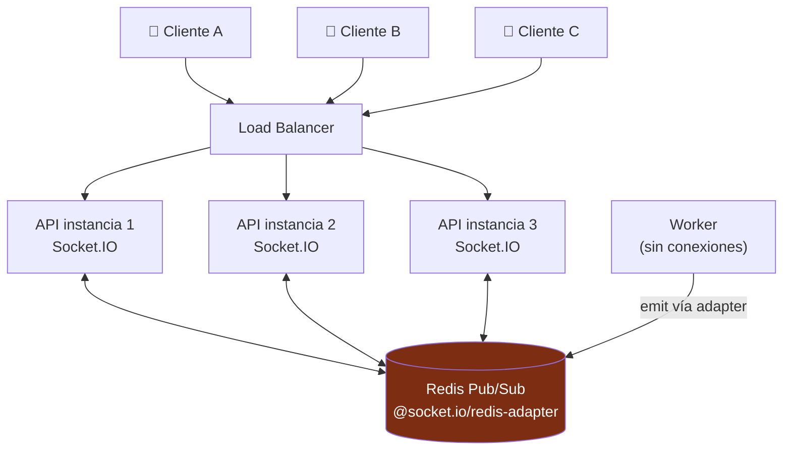

# 08 — API REST y tiempo real

Cubre: **§13 WebSockets y listado de eventos · §14 REST endpoints principales**

---

## Regla de reparto

> **HTTP para pedir y cambiar cosas. WebSocket para enterarse de cambios que hizo otro.**

Nada de "todo por WebSocket". Un `GET /products/{id}` por WS es un antipatrón: pierde el cacheo de HTTP, el reintento, los códigos de estado y la observabilidad.

| Va por HTTP | Va por WebSocket |
|---|---|
| Login, perfil, direcciones | El vendedor destacó otro producto |
| Catálogo, búsqueda, feed | Bajó el stock |
| Crear orden, pagar | Se confirmó el pago |
| Consultar estado de una orden | Empezó o terminó un live |
| Iniciar o terminar un live | Cambió el contador de espectadores |
| Destacar un producto | Llegó un comentario |

**El WebSocket nunca es la única vía de una información crítica.** Todo lo que llega por WS también se puede recuperar con `GET /lives/{id}/state`. Si el socket se cae y vuelve, el cliente resincroniza en lugar de quedarse con un estado inconsistente.

---

## §13. WebSockets

### Decisión: Socket.IO + Redis adapter

| | **Socket.IO** ✅ | `ws` puro | SSE |
|---|---|---|---|
| Reconexión automática | ✅ | Manual | ✅ |
| Rooms | ✅ | Manual | No aplica |
| Escalado horizontal | ✅ `@socket.io/redis-adapter` | Manual | Manual |
| Bidireccional | ✅ | ✅ | ❌ Solo bajada |
| Cliente Flutter maduro | ✅ `socket_io_client` | Regular | Regular |
| Acuses de recibo | ✅ | Manual | ❌ |

Se descarta SSE porque necesitamos el canal de subida (comentarios, reacciones, heartbeats). Se descarta `ws` puro porque reimplementar reconexión, rooms y adaptador de Redis es una semana de trabajo con peor resultado.

### Escalado horizontal (§35 de tu brief)



Los clientes de un mismo live pueden estar en instancias distintas. El adaptador de Redis propaga los `emit` entre instancias. **Los workers también publican** por el mismo adaptador sin tener ninguna conexión abierta: así el worker que procesa el webhook de pago puede notificar al comprador.

**Importante:** con este esquema los servidores son *stateless*. La única afinidad necesaria es de conexión, no de sesión — y Socket.IO con transporte WebSocket (sin *polling* de respaldo) no la necesita.

```typescript
// backend/src/shared/realtime/redis-io.adapter.ts
export class RedisIoAdapter extends IoAdapter {
  private adapterConstructor: ReturnType<typeof createAdapter>;

  async connectToRedis(): Promise<void> {
    const pub = new Redis(env.REDIS_URL);
    const sub = pub.duplicate();
    this.adapterConstructor = createAdapter(pub, sub);
  }

  createIOServer(port: number, options?: ServerOptions) {
    const server = super.createIOServer(port, {
      ...options,
      transports: ['websocket'],       // sin polling: menos carga, sin afinidad
      pingInterval: 25_000,
      pingTimeout: 20_000,
      maxHttpBufferSize: 64 * 1024,
    });
    server.adapter(this.adapterConstructor);
    return server;
  }
}
```

### Rooms

| Room | Quién entra | Para qué |
|---|---|---|
| `live:{liveId}` | Todo espectador del live | Eventos comerciales del live |
| `live:{liveId}:seller` | Solo el vendedor | Métricas privadas: ventas, embudo |
| `user:{userId}` | Cada usuario, en todos sus dispositivos | Sus órdenes, sus pagos |
| `seller:{sellerId}` | Vendedor en todos sus dispositivos | Ventas nuevas, pedidos |
| `feed` | Quien está en la pantalla del feed | `LIVE_STARTED` / `LIVE_ENDED` globales |

`user:{userId}` con todos los dispositivos es lo que hace que la confirmación de pago aparezca aunque la persona haya cambiado de teléfono a mitad de compra.

### Autenticación del socket

```typescript
// backend/src/modules/realtime/realtime.gateway.ts
@WebSocketGateway({ path: '/ws', namespace: '/' })
export class RealtimeGateway implements OnGatewayConnection {
  async handleConnection(client: Socket) {
    try {
      // El token va en el handshake, NUNCA en la query string
      // (las query strings quedan en logs de proxies y CDN).
      const token = client.handshake.auth?.token;
      const payload = await this.jwt.verifyAccess(token);

      client.data.userId = payload.sub;
      client.data.role   = payload.role;

      await client.join(`user:${payload.sub}`);
      if (payload.sellerId) await client.join(`seller:${payload.sellerId}`);

      // Límite de conexiones por usuario: evita el agotamiento de sockets
      // por un cliente con un bug de reconexión.
      const n = await this.redis.incr(`ws:conn:${payload.sub}`);
      await this.redis.expire(`ws:conn:${payload.sub}`, 3600);
      if (n > 5) { client.disconnect(true); return; }

    } catch {
      client.disconnect(true);
    }
  }
}
```

### Catálogo completo de eventos

Cubre exactamente los que enumeraste en tu punto 7, más los necesarios.

#### Servidor → Cliente

```typescript
// backend/src/modules/realtime/events.ts
// Sobre común a TODOS los eventos.
export interface RealtimeEvent<T = unknown> {
  type: ServerEventType;
  /// Monótono POR ROOM. Permite detectar que se perdió un evento
  /// tras una reconexión y pedir resincronización completa.
  seq: number;
  /// El cliente corrige su deriva de reloj con esto. Sin él, una cuenta
  /// atrás en un teléfono con la hora mal es una mentira.
  serverNow: string;
  data: T;
}

export type ServerEventType =
  // ── Ciclo de vida del live ──
  | 'LIVE_STARTED'          // { liveId, sellerId, title, coverUrl, sellerName }
  | 'LIVE_ENDED'            // { liveId, durationSec, vodUrl? }
  | 'LIVE_RECONNECTING'     // { liveId, graceUntil }
  | 'LIVE_RESUMED'          // { liveId }
  | 'VIEWER_COUNT'          // { liveId, count }   ← agrupado cada 2 s

  // ── Comercio ──
  | 'PRODUCT_FEATURED'      // { liveId, featuredId, product{...}, variants[] }
  | 'PRODUCT_UNFEATURED'    // { liveId, featuredId }
  | 'PRODUCT_PRICE_UPDATED' // { variantId, priceCents, compareAtCents }
  | 'STOCK_UPDATED'         // { variantId, available }   ← agrupado cada 300 ms
  | 'STOCK_LOW'             // { variantId, available }
  | 'PRODUCT_SOLD_OUT'      // { variantId }

  // ── Órdenes (room user:{id}) ──
  | 'ORDER_CREATED'         // { orderId, status, expiresAt, totals }
  | 'ORDER_EXPIRED'         // { orderId }
  | 'PAYMENT_PENDING'       // { orderId, paymentId }
  | 'PAYMENT_CONFIRMED'     // { orderId, paymentId, amountCents }
  | 'PAYMENT_REJECTED'      // { orderId, reason, retryable }
  | 'ORDER_CONFIRMED'       // { orderId, estimatedDelivery }
  | 'SHIPMENT_UPDATED'      // { orderId, status, trackingCode }

  // ── Vendedor (room live:{id}:seller y seller:{id}) ──
  | 'SELLER_SALE'           // { orderId, buyerName, items[], totalCents }
  | 'SELLER_METRICS'        // { viewers, gmvCents, orders, funnel }  ← cada 2 s

  // ── Social ──
  | 'COMMENT_POSTED'        // { liveId, commentId, userId, name, text }
  | 'REACTION_BURST'        // { liveId, counts: { heart: 340, fire: 88 } }
  | 'VIEWER_JOINED'         // { liveId, name } ← solo si viewers < 200
  | 'VIEWER_LEFT'

  // ── Control ──
  | 'POLICY_CHANGED'        // { slowModeSec, batchWindowMs, sampleRate }
  | 'FORCE_RESYNC';         // el cliente debe llamar a GET /lives/{id}/state
```

#### Cliente → Servidor

```typescript
export type ClientEventType =
  | 'live:join'        // { liveId }            → ack: LiveStateSnapshot
  | 'live:leave'       // { liveId }
  | 'live:heartbeat'   // { liveId, mode, rttMs, packetLossPct, networkType, carrier }
  | 'comment:send'     // { liveId, text }      → pasa por moderación
  | 'reaction:send'    // { liveId, type, count }  ← LOTE de 2 s, no un evento por toque
  | 'feed:subscribe'   // — entra al room `feed`
  | 'feed:unsubscribe';
```

### Las tres optimizaciones que hacen que esto escale

**1. Reacciones agregadas.** Un evento por toque es la implementación ingenua que tumba el sistema: 3.000 espectadores tocando 3 veces por segundo son 9.000 eventos de entrada que, reenviados a todos, serían 27 millones de entregas por segundo.

```
Cliente:  acumula toques 2 s → 1 petición con el total
Servidor: agrega por ventana de 500 ms → 1 broadcast con los totales
Cliente:  renderiza N partículas con posición y retardo aleatorios
```

Resultado: **2 mensajes por segundo por cliente, con 100 o con 100.000 espectadores.** Cuatro órdenes de magnitud de diferencia. Es la optimización de mayor retorno de todo el sistema.

**2. Contador de espectadores agrupado.** `VIEWER_COUNT` se emite cada 2 segundos con el valor actual, no en cada entrada y salida. Nadie distingue 12.483 de 12.500.

**3. `STOCK_UPDATED` en ventanas de 300 ms.** Si el stock bajó de 20 a 12 en medio segundo, se emite un evento con el valor final, no ocho.

```typescript
// backend/src/modules/realtime/event-batcher.ts
// Coalescing por clave: se queda con el ÚLTIMO valor de la ventana.
export class EventBatcher {
  private pending = new Map<string, { value: unknown; timer: NodeJS.Timeout }>();

  push(key: string, value: unknown, windowMs: number, flush: (v: unknown) => void) {
    const existing = this.pending.get(key);
    if (existing) { existing.value = value; return; }   // ya hay ventana abierta

    const timer = setTimeout(() => {
      const entry = this.pending.get(key)!;
      this.pending.delete(key);
      flush(entry.value);
    }, windowMs);

    this.pending.set(key, { value, timer });
  }
}
```

### Reconexión y resincronización

```dart
// mobile/lib/core/realtime/socket_client.dart
class SocketClient {
  int? _lastSeq;

  void _onEvent(RealtimeEvent e) {
    // Hueco en la secuencia: se perdieron eventos mientras estábamos caídos.
    // Mejor resincronizar que mostrar un producto destacado que ya no lo está.
    if (_lastSeq != null && e.seq > _lastSeq! + 1) {
      _resyncLiveState();
      return;
    }
    _lastSeq = e.seq;
    _dispatch(e);
  }

  Future<void> _resyncLiveState() async {
    final state = await _api.get('/lives/$_liveId/state');   // snapshot completo
    _lastSeq = state.seq;
    _store.replaceAll(state);
  }
}
```

### Degradación bajo carga

| Nivel | Reacciones | `VIEWER_COUNT` | Comentarios | Métricas del vendedor |
|---|---|---|---|---|
| normal | 500 ms | 2 s | Todos | 2 s |
| surge | 1 s | 5 s | Todos | 3 s |
| critical | 2 s | 10 s | Muestreo al 30 % | 5 s |

El servidor emite `POLICY_CHANGED` y el cliente se adapta. **Nunca se degradan las órdenes ni los pagos**: son el único flujo que no tiene modo degradado.

---

## §14. Endpoints REST principales

Todo bajo `/api/v1` (§33). Todo lo sensible acepta `Idempotency-Key` (§34).

### Autenticación

| Método | Ruta | Descripción |
|---|---|---|
| `POST` | `/auth/google` | Body `{ idToken }`. Verifica contra Google, crea o recupera el usuario |
| `POST` | `/auth/apple` | Body `{ identityToken, nonce }` |
| `POST` | `/auth/phone/request` | Envía OTP. Rate limit: 3 por hora y por número |
| `POST` | `/auth/phone/verify` | `{ phone, code }` → tokens |
| `POST` | `/auth/refresh` | Rotación de refresh token |
| `POST` | `/auth/logout` | Revoca el refresh del dispositivo actual |
| `POST` | `/auth/logout-all` | Revoca todas las sesiones |

```jsonc
// POST /api/v1/auth/google → 200
{
  "accessToken": "eyJ…",          // 15 min
  "refreshToken": "rt_…",         // 30 días, rotativo
  "user": {
    "id": "usr_01JBQ…",
    "firstName": "María", "lastName": "Gómez",
    "email": "maria@…", "phoneE164": null,
    "phoneVerified": false,
    "hasDefaultAddress": false,   // ← la app sabe si mostrar el formulario
    "hasSavedCard": false,
    "role": "buyer"
  },
  "onboarding": {
    // Faltan estos pasos, pero NO bloquean navegar ni ver lives.
    "missing": ["phone"],
    "requiredBeforePurchase": ["phone", "address", "payment_method"]
  }
}
```

`onboarding.missing` permite que la app pida lo que falta **en el momento justo** y no todo junto al registrarse, que es lo que causa el abandono.

### Usuario

| Método | Ruta | Notas |
|---|---|---|
| `GET` | `/me` | Perfil |
| `PATCH` | `/me` | Nombre, avatar, preferencias |
| `GET` | `/me/addresses` | |
| `POST` | `/me/addresses` | **Primera compra.** Valida CUIL y CP; encola geocodificación |
| `PATCH` | `/me/addresses/{id}` | |
| `POST` | `/me/devices` | Registra el token de push |
| `DELETE` | `/me/devices/{id}` | |
| `GET` | `/me/notification-settings` | |
| `PUT` | `/me/notification-settings` | |

### Feed y lives

| Método | Ruta | Notas |
|---|---|---|
| `GET` | `/feed?cursor=&limit=10` | Paginación por cursor. Lives primero |
| `GET` | `/lives?status=live&cursor=` | |
| `GET` | `/lives/{id}` | Metadatos |
| `GET` | `/lives/{id}/state` | **Snapshot completo para resincronizar** |
| `POST` | `/lives/{id}/ticket` | Devuelve el `PlaybackTicket` (documento 02) |
| `GET` | `/lives/{id}/products` | Catálogo del live |
| `POST` | `/lives/{id}/view` | Registra la visualización (analítica) |

```jsonc
// GET /api/v1/lives/{id}/state → 200
// TODO lo que el cliente necesita para pintar la pantalla desde cero.
{
  "seq": 1841,
  "serverNow": "2026-08-11T19:29:16.310Z",
  "live": { "id": "liv_01JBQ…", "status": "LIVE", "startedAt": "…", "viewerCount": 12483 },
  "seller": { "id": "sel_…", "handle": "modaluna", "displayName": "Moda Luna",
              "avatarUrl": "…", "followerCount": 48213, "isFollowing": true },
  "featured": {
    "featuredId": "ftr_01JBQ…",
    "productId": "prd_…", "title": "Campera Puffer Oversize",
    "imageUrl": "…", "priceCents": 2499000, "compareAtCents": 3499000,
    "currency": "ARS",
    "installments": { "count": 6, "amountCents": 416500, "interestFree": true },
    "variants": [
      { "id": "var_S_NEG", "label": "S / Negro", "available": 4 },
      { "id": "var_M_NEG", "label": "M / Negro", "available": 0 },
      { "id": "var_L_NEG", "label": "L / Negro", "available": 12 }
    ]
  },
  "recentComments": [ { "id": "…", "name": "Ana", "text": "¿Hacen envío a Córdoba?" } ]
}
```

Que `installments` esté en el mismo payload que el precio no es casualidad: en Argentina, las cuotas convierten más que el precio final y tienen que verse en la tarjeta, no descubrirse en el checkout.

### Compra — el recorrido crítico

| Método | Ruta | Notas |
|---|---|---|
| `POST` | `/inventory/reservations` | **Idempotente.** Reserva stock, TTL 5 min |
| `DELETE` | `/inventory/reservations/{id}` | Libera antes de tiempo |
| `POST` | `/orders` | **Idempotente.** Crea la orden (reserva incluida) |
| `GET` | `/orders/{id}` | Estado. Se usa como respaldo del WS |
| `POST` | `/orders/{id}/pay` | **Idempotente.** Dispara el pago |
| `POST` | `/orders/{id}/cancel` | |
| `GET` | `/orders?cursor=` | Mis compras |

```jsonc
// POST /api/v1/orders
// Headers: Authorization: Bearer …  ·  Idempotency-Key: 550e8400-…
{
  "items":     [{ "variantId": "var_01JBQ…", "quantity": 1 }],
  "liveId":    "liv_01JBQ…",
  "featuredId":"ftr_01JBQ…",
  "addressId": "adr_01JBQ…",       // opcional: por defecto la principal
  "channel":   "ui_button"          // SOLO telemetría. Fase 2: "voice"
}
```

**Lo que NO está en el body:** ni precio, ni total, ni descuento, ni costo de envío. **El cliente nunca envía importes.** El servidor calcula todo. Es la vulnerabilidad número uno de los checkouts móviles y se cierra por diseño de contrato.

```jsonc
// → 201 Created
{
  "orderId": "ord_01JBQ…",
  "status": "RESERVED",
  "expiresAt": "2026-08-11T19:34:16Z",     // la cuenta atrás de 5 min
  "serverNow": "2026-08-11T19:29:16Z",     // para corregir deriva de reloj
  "totals": {
    "currency": "ARS",
    "subtotalCents": 2499000, "discountCents": 0,
    "shippingCents": 150000, "totalCents": 2649000
  },
  "items": [ { "sku": "CAMP-PUF-M-NEG", "productTitle": "Campera Puffer Oversize",
               "variantLabel": "M / Negro", "unitPriceCents": 2499000, "quantity": 1 } ],
  "shipping": { "recipientName": "María Gómez", "summary": "Av. Corrientes 4521, 7º B — CABA" },
  "paymentOptions": {
    "savedCards": [ { "id": "card_…", "brand": "visa", "last4": "4242" } ],
    "installmentPlans": [
      { "count": 1, "amountCents": 2649000, "interestFree": true },
      { "count": 6, "amountCents": 441500,  "interestFree": true },
      { "count": 12, "amountCents": 264900, "interestFree": false, "totalCents": 3178800 }
    ]
  }
}
```

Todo lo necesario para pintar la pantalla de pago viene en la respuesta de crear la orden. **Cero peticiones adicionales entre "Comprar" y "Pagar"** — eso es lo que hace posibles los 2 clics.

```jsonc
// → 409 Conflict, sin stock
{
  "error": {
    "code": "INSUFFICIENT_STOCK",
    "message": "Quedan 2 unidades de M / Negro",
    "details": {
      "variantId": "var_01JBQ…", "requested": 3, "available": 2,
      // Recuperación de venta escrita en el contrato de la API:
      "alternatives": [
        { "variantId": "var_L_NEG", "label": "L / Negro", "available": 12 }
      ]
    },
    "traceId": "01JBQ8X7ZV…"
  }
}
```

### Vendedor

| Método | Ruta | Notas |
|---|---|---|
| `POST` | `/seller/onboarding` | Alta de tienda |
| `GET` | `/seller/products` | |
| `POST` | `/seller/products` | |
| `PATCH` | `/seller/products/{id}` | |
| `POST` | `/seller/products/{id}/images` | URL prefirmada de R2 |
| `PATCH` | `/seller/variants/{id}/stock` | Reposición. Se audita |
| `POST` | `/seller/lives` | Programar |
| `POST` | `/seller/lives/{id}/start` | Devuelve el `BroadcastTicket` |
| `POST` | `/seller/lives/{id}/end` | |
| `POST` | `/seller/lives/{id}/feature` | **Destacar producto.** Body `{ productId, variantId? }` |
| `DELETE` | `/seller/lives/{id}/feature` | |
| `GET` | `/seller/lives/{id}/metrics` | Respaldo del WS |
| `GET` | `/seller/orders?status=` | |
| `POST` | `/seller/orders/{id}/prepare` | → `PREPARING` |
| `POST` | `/seller/orders/{id}/ready` | → `READY_TO_SHIP` |
| `GET` | `/seller/shipments/batch` | **Agrupado por zona y CP** (§19) |
| `GET` | `/seller/shipments/labels.pdf` | Etiquetas A6 en orden de ruta |

### Social, búsqueda, webhooks

| Método | Ruta | Notas |
|---|---|---|
| `POST` | `/sellers/{id}/follow` | Idempotente |
| `DELETE` | `/sellers/{id}/follow` | |
| `PATCH` | `/sellers/{id}/follow/settings` | `notifyLive`, `isFavorite` |
| `GET` | `/me/following` | |
| `GET` | `/search?q=&type=&cursor=` | Lives primero |
| `GET` | `/search/suggest?q=` | Autocompletado, presupuesto 120 ms |
| `POST` | `/webhooks/mercadopago` | **Público.** Firma verificada |
| `POST` | `/webhooks/livekit` | **Público.** Firma verificada |
| `GET` | `/health` · `/ready` · `/metrics` | Sin auth (o solo red interna) |

### Convenciones transversales

**Paginación por cursor, nunca `offset`.** Con `offset`, insertar una fila durante la navegación duplica o saltea elementos, y en tablas grandes el rendimiento se degrada linealmente.

```
GET /api/v1/orders?cursor=eyJpZCI6Im9yZF8wMUpCUSJ9&limit=20

{ "data": [...], "nextCursor": "eyJpZCI6…", "hasMore": true }
```

**Idempotencia.** Cabecera `Idempotency-Key` con un UUID por intento.

```typescript
// backend/src/shared/idempotency/idempotency.interceptor.ts
// 1) Sin la cabecera en un endpoint que la exige → 400.
// 2) Clave nueva → se toma el lock, se ejecuta, se guarda la respuesta.
// 3) Clave repetida y completada → se devuelve la MISMA respuesta guardada.
// 4) Clave repetida y en curso → 409 IDEMPOTENCY_IN_PROGRESS (el cliente reintenta).
// 5) Clave repetida con cuerpo DISTINTO (request_hash no coincide)
//    → 422. Es un bug del cliente y hay que verlo, no tragarlo.
```

**Rate limiting.** Por usuario y por endpoint, en Redis:

| Endpoint | Límite |
|---|---|
| `POST /auth/phone/request` | 3 por hora y por número |
| `POST /orders` | 10 por minuto |
| `POST /orders/{id}/pay` | 5 por minuto |
| `POST /me/addresses` | 3 por hora |
| `GET /search` | 30 por minuto |
| Global por IP | 300 por minuto |

**Versionado.** `/api/v1` desde el día 1. Cuando exista `v2`, `v1` se mantiene 6 meses: no se puede forzar a actualizar la app a todos a la vez.
