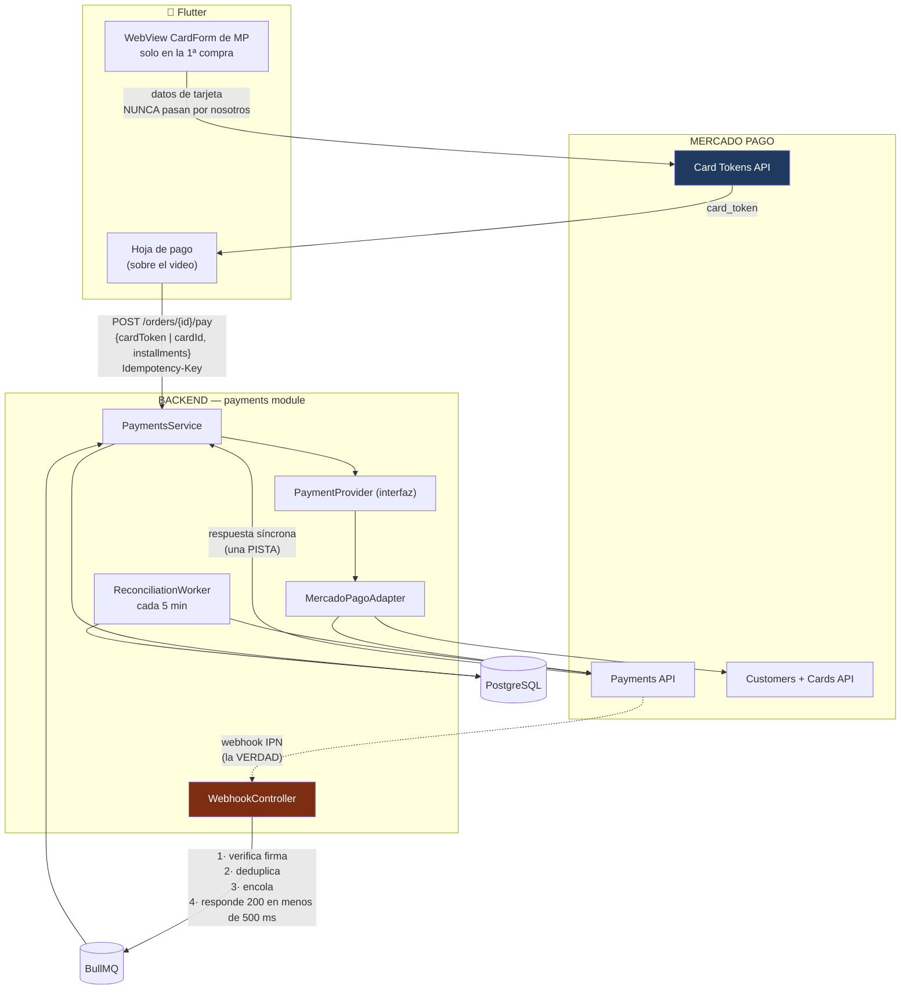

# 09 — Arquitectura de pagos: Mercado Pago

Cubre: **§15 Arquitectura de Mercado Pago**

---

## 1. La restricción que define todo

> **El usuario no puede salir del video para pagar.**

Eso descarta de entrada la integración más fácil. Mercado Pago ofrece dos caminos:

| | Checkout Pro | **Checkout API (transparente)** ✅ |
|---|---|---|
| Cómo funciona | Redirige a la web de MP | La app tokeniza y nuestro backend cobra |
| Integración | 1 día | 4–5 días |
| **Saca al usuario de la app** | **Sí** | **No** |
| Tarjeta guardada / 2 clics | Limitado | ✅ Completo |
| Control de la UI | Ninguno | Total |
| Alcance PCI | SAQ-A | SAQ-A si se usa el CardForm de MP |

**Elegimos Checkout API.** Checkout Pro es incompatible con el producto: mandar a alguien a un navegador externo en medio de un live es perder la venta y el espectador.

### 🚩 Riesgo R1: la tokenización desde Flutter

Es el mayor riesgo técnico del proyecto y hay que resolverlo el **día 1 del Sprint 0**.

Mercado Pago no tiene un SDK de Flutter de primera categoría para tokenizar tarjetas. Tres caminos, en orden de preferencia:

| Plan | Cómo | Alcance PCI | Riesgo |
|---|---|---|---|
| **A** | **CardForm / Bricks de MP dentro de un `WebView`** — el formulario es de MP, nosotros recibimos solo el token | **SAQ-A** ✅ | Bajo. Es el camino recomendado |
| **B** | Formulario nativo en Flutter → `POST` directo a `api.mercadopago.com/v1/card_tokens` desde el dispositivo | SAQ-A-EP ⚠️ | Medio: más cumplimiento, mejor UX |
| **C** | Checkout Pro con retorno por deep link | SAQ-A | **Degrada la UX.** Solo si A y B fallan |

**Con el plan A, los datos de la tarjeta nunca tocan nuestro código ni nuestros servidores.** Recibimos un token de un solo uso y un `card_id` para las compras siguientes. Es lo que mantiene el alcance en SAQ-A, que es un cuestionario y no una auditoría.

El `WebView` se abre como hoja modal **sobre el video**, no como pantalla nueva. Solo aparece en la **primera compra**, cuando se guarda la tarjeta. Después no se ve nunca más.

---

## 2. Arquitectura



### La interfaz `PaymentProvider`

MODO llega en la fase 2. Que llegue sin tocar `orders` depende de esto.

```typescript
// backend/src/modules/payments/domain/payment-provider.interface.ts
export interface PaymentProvider {
  readonly id: 'mercadopago' | 'modo';

  /** Cobra. Con cardToken en la primera compra, con cardId después. */
  charge(input: ChargeInput): Promise<ChargeResult>;

  /** LA VERDAD. Se llama SIEMPRE al recibir un webhook. */
  getPayment(externalId: string): Promise<PaymentSnapshot>;

  refund(externalId: string, amountCents?: number): Promise<RefundResult>;

  /** Verifica firma y extrae el id del evento. */
  parseWebhook(raw: Buffer, headers: IncomingHttpHeaders): WebhookEnvelope;

  /** Guarda la tarjeta para las compras de 2 clics. */
  saveCard(input: SaveCardInput): Promise<SavedCard>;

  /** Planes de cuotas. En Argentina esto convierte más que el precio. */
  getInstallmentOptions(amountCents: number, bin?: string): Promise<InstallmentPlan[]>;
}
```

---

## 3. Primera compra vs. compras siguientes

```mermaid
sequenceDiagram
    autonumber
    participant U as Comprador
    participant A as App
    participant B as Backend
    participant MP as Mercado Pago

    rect rgb(60, 40, 20)
    Note over U,MP: PRIMERA COMPRA — ~60-90 s. El peaje se paga una sola vez.
    U->>A: Tap "Comprar"
    A->>B: POST /orders (idempotency-key)
    B-->>A: 201 {orderId, totals, installmentPlans}
    A->>U: Formulario de envío (DNI, dirección, CP)
    U->>A: Completa
    A->>B: POST /me/addresses
    A->>U: WebView del CardForm de MP (SOBRE el video)
    U->>MP: Datos de la tarjeta — nunca pasan por nosotros
    MP-->>A: card_token (un solo uso)
    A->>B: POST /orders/{id}/pay {cardToken, installments, saveCard:true}
    B->>MP: POST /v1/payments
    B->>MP: POST /v1/customers/{id}/cards  (guarda para la próxima)
    MP-->>B: {status:"approved", id}
    B-->>A: 200 {status:"processing"}
    MP--)B: webhook → confirma
    B--)A: WS PAYMENT_CONFIRMED
    end

    rect rgb(20, 60, 40)
    Note over U,MP: SEGUNDA EN ADELANTE — 2 CLICS, menos de 10 s.
    U->>A: Tap "Comprar"
    A->>B: POST /orders
    B-->>A: 201 {totals, savedCards, installmentPlans}
    A->>U: "Visa ····4242 · 6 cuotas de $4.165 · Enviar a Av. Corrientes 4521"
    U->>A: Tap "Pagar"
    A->>B: POST /orders/{id}/pay {cardId, installments}
    B->>MP: POST /v1/payments (card_id)
    MP-->>B: approved
    B--)A: WS PAYMENT_CONFIRMED
    end
```



**Los 2 clics reales son:** `Comprar` → `Pagar`. Nada más. Los datos de envío, la tarjeta y las cuotas ya están resueltos y se muestran como resumen con un enlace discreto de "Cambiar".

---

## 4. El endpoint de pago

```typescript
// backend/src/modules/payments/application/charge-order.usecase.ts
@Injectable()
export class ChargeOrderUseCase {
  async execute(cmd: ChargeCommand): Promise<Result<PaymentView, DomainError>> {
    const order = await this.orders.findByIdForUser(cmd.orderId, cmd.userId);

    // 1) La orden debe estar en un estado cobrable.
    if (!['RESERVED', 'PAYMENT_PENDING'].includes(order.status)) {
      return err(new InvalidOrderStateError(order.status));
    }

    // 2) La reserva tiene que seguir viva. Si expiró, no se cobra.
    //    Cobrar sin stock es el peor error posible.
    if (order.expiresAt < new Date()) {
      return err(new ReservationExpiredError(order.id));
    }

    // 3) El importe se toma de la ORDEN, jamás del cliente.
    const amountCents = order.totalCents;

    const payment = await this.prisma.payment.create({
      data: {
        id: ulid('pay'),
        orderId: order.id,
        provider: 'mercadopago',
        status: 'INITIATED',
        idempotencyKey: cmd.idempotencyKey,
        amountCents,
        installments: cmd.installments ?? 1,
      },
    });

    await this.orders.transition(order.id, 'PAYMENT_PENDING');

    try {
      const result = await this.provider.charge({
        amountCents,
        description: `Compra en ${order.sellerName}`,
        // external_reference nos permite encontrar la orden desde el webhook.
        externalReference: order.id,
        payer: { email: order.userEmail, identification: order.payerDoc },
        cardToken: cmd.cardToken,
        cardId: cmd.cardId,
        installments: cmd.installments ?? 1,
        idempotencyKey: cmd.idempotencyKey,
        // Metadata para conciliar y depurar del lado de MP.
        metadata: { orderId: order.id, liveId: order.liveId, sellerId: order.sellerId },
      });

      await this.applyResult(payment.id, result);

      // OJO: aunque MP responda "approved", NO se confirma la orden acá.
      // La confirmación la hace el webhook. Ver §5.
      return ok(this.toView(payment, result));

    } catch (e) {
      // Fallo de red con MP: el pago PUEDE haberse creado igual.
      // Se deja en PENDING y el conciliador resuelve. Nunca se marca REJECTED
      // por un timeout: sería decirle "no pagaste" a alguien que pagó.
      await this.payments.markPending(payment.id, 'network_error');
      await this.queue.add('reconcile-payment', { paymentId: payment.id }, { delay: 30_000 });
      return ok({ status: 'processing' });
    }
  }
}
```

**El bloque `catch` es la parte que más se equivoca la gente.** Un timeout con el PSP no significa que el pago falló: significa que no sabemos. Marcarlo como rechazado produce el peor resultado posible — cobrado y sin producto.

---

## 5. Webhooks: las cinco reglas

Cubre tu punto 10 completo. Cada una previene un incidente concreto que ocurre en producción.

```typescript
// backend/src/modules/payments/api/webhook.controller.ts
@Controller('webhooks')
export class WebhookController {
  @Post('mercadopago')
  @Public()                    // sin JWT: lo llama MP
  @SkipThrottle()              // no limitar al PSP
  async mercadoPago(@Req() req: FastifyRequest, @Res() reply: FastifyReply) {

    // ── REGLA 1: verificar la firma ANTES de mirar el cuerpo ──
    // Sin esto, cualquiera puede acreditar pagos con un curl.
    const envelope = this.provider.parseWebhook(req.rawBody, req.headers);
    if (!envelope.signatureValid) {
      this.logger.warn({ ip: req.ip }, 'webhook con firma inválida');
      return reply.code(401).send();
    }

    // ── REGLA 2: deduplicar ──
    // MP reenvía webhooks de rutina. El UNIQUE de la base es la garantía.
    try {
      await this.prisma.paymentWebhookEvent.create({
        data: {
          id: ulid('whk'),
          provider: 'mercadopago',
          externalEventId: envelope.eventId,
          eventType: envelope.type,
          payload: envelope.raw,
          signatureValid: true,
        },
      });
    } catch (e) {
      if (isUniqueViolation(e)) return reply.code(200).send();   // ya lo vimos
      throw e;
    }

    // ── REGLA 3: responder RÁPIDO ──
    // MP reintenta si tardamos, y eso multiplica los eventos.
    // Se encola y se contesta; el trabajo real ocurre en el worker.
    await this.queue.add('process-payment-webhook', { eventId: envelope.eventId });
    return reply.code(200).send({ received: true });
  }
}
```

```typescript
// backend/src/workers/processors/payment-webhook.processor.ts
@Process('process-payment-webhook')
async handle(job: Job<{ eventId: string }>) {
  const evt = await this.repo.findEvent(job.data.eventId);

  // ── REGLA 4: NO confiar en el cuerpo. Consultar la API. ──
  // El cuerpo puede venir desactualizado o manipulado. La API es la verdad.
  const snapshot = await this.provider.getPayment(evt.payload.data.id);

  const payment = await this.payments.findByExternalId(snapshot.externalId)
    ?? await this.payments.findByExternalReference(snapshot.externalReference);

  if (!payment) {
    // Pago huérfano: existe en MP y no acá. NUNCA se descarta.
    await this.alerts.page('orphan-payment', { externalId: snapshot.externalId });
    return;
  }

  // ── REGLA 5: transición idempotente ──
  // Si ya está APPROVED, procesarlo de nuevo es un no-op, no un error.
  if (payment.status === 'APPROVED' && snapshot.status === 'APPROVED') return;

  await this.prisma.$transaction(async (tx) => {
    await tx.payment.update({
      where: { id: payment.id },
      data: {
        status: mapMpStatus(snapshot.status),
        externalId: snapshot.externalId,
        externalStatus: snapshot.status,               // crudo, para depurar
        externalStatusDetail: snapshot.statusDetail,
        approvedAt: snapshot.status === 'approved' ? new Date() : null,
        feeCents: snapshot.feeCents,
        netCents: snapshot.netCents,
      },
    });

    if (snapshot.status === 'approved') {
      // Toda la cadena en UNA transacción: orden pagada, stock descontado,
      // orden confirmada y evento emitido. O todo, o nada.
      await this.orders.transitionTx(tx, payment.orderId, 'PAID');
      await this.inventory.commitReservationTx(tx, payment.orderId);
      await this.orders.transitionTx(tx, payment.orderId, 'CONFIRMED');
      await tx.outbox.create({
        data: {
          aggregateType: 'payment', aggregateId: payment.id,
          eventType: 'PaymentConfirmed',
          payload: { paymentId: payment.id, orderId: payment.orderId, amountCents: payment.amountCents },
        },
      });
    }
  });

  await this.repo.markProcessed(evt.id);
}
```

---

## 6. Conciliación

Todo PSP pierde webhooks. Sin este job, un pago con webhook perdido deja al cliente sin producto, el stock retenido y al vendedor sin cobrar.

```typescript
// backend/src/workers/processors/payment-reconciliation.processor.ts
// Corre cada 5 minutos.
@Cron('*/5 * * * *')
async reconcile() {
  const stale = await this.prisma.$queryRaw<Payment[]>`
    SELECT * FROM payments
    WHERE status IN ('INITIATED', 'PENDING', 'IN_PROCESS')
      AND created_at < now() - interval '10 minutes'
    ORDER BY created_at
    LIMIT 200
  `;

  for (const p of stale) {
    const snapshot = p.externalId
      ? await this.provider.getPayment(p.externalId)
      : await this.provider.searchByExternalReference(p.orderId);

    if (!snapshot) {
      // No existe en MP tampoco. Nunca llegó a crearse.
      if (olderThan(p.createdAt, hours(1))) {
        await this.payments.markCancelled(p.id, 'never_created');
        await this.orders.transition(p.orderId, 'EXPIRED');   // libera el stock
      }
      continue;
    }
    await this.applySnapshot(p, snapshot);
  }
}
```

**Métrica clave:** `payments_reconciled_total`. Si sube de forma sostenida, los webhooks no están llegando y hay que revisar la configuración de la URL en el panel de MP, no seguir tapando con el conciliador.

---

## 7. Cuotas — no es opcional en Argentina

```jsonc
// GET /api/v1/payments/installments?amountCents=2649000&bin=450995
{
  "plans": [
    { "count": 1,  "amountCents": 2649000, "totalCents": 2649000, "interestFree": true,
      "label": "1 pago de $26.490" },
    { "count": 3,  "amountCents": 883000,  "totalCents": 2649000, "interestFree": true,
      "label": "3 cuotas sin interés de $8.830" },
    { "count": 6,  "amountCents": 441500,  "totalCents": 2649000, "interestFree": true,
      "label": "6 cuotas sin interés de $4.415", "recommended": true },
    { "count": 12, "amountCents": 264900,  "totalCents": 3178800, "interestFree": false,
      "label": "12 cuotas de $26.490", "cftea": 87.5 }
  ]
}
```

Reglas de producto:

- La opción **sin interés más larga** se marca `recommended` y viene preseleccionada.
- La cuota se muestra **en la tarjeta del producto durante el live**, no recién en el checkout. `$24.990 · 6 cuotas de $4.165` convierte mucho más que `$24.990`.
- Con interés, se muestra el CFTEA. Es obligación legal y además genera confianza.

**Quién paga el costo financiero de las cuotas sin interés** es una decisión de negocio, no técnica: plataforma, vendedor o repartido. El campo `commission_bps` de `sellers` y una tabla de configuración de planes lo resuelven. Hay que definirlo antes del lanzamiento.

---

## 8. Reembolsos y contracargos

```typescript
async refund(orderId: string, amountCents?: number, reason: string) {
  const payment = await this.payments.findApprovedByOrder(orderId);
  const result  = await this.provider.refund(payment.externalId, amountCents);

  await this.prisma.$transaction(async (tx) => {
    await tx.payment.update({
      where: { id: payment.id },
      data: {
        status: result.isPartial ? 'PARTIALLY_REFUNDED' : 'REFUNDED',
        refundedCents: payment.refundedCents + result.amountCents,
      },
    });
    await this.orders.transitionTx(tx, orderId, 'REFUNDED');

    // Devolver el stock SOLO si no se despachó. Si ya salió, es una devolución
    // física y el stock vuelve cuando el vendedor recibe el paquete.
    const shipment = await tx.shipment.findUnique({ where: { orderId } });
    if (!shipment || shipment.status === 'PENDING') {
      await this.inventory.restockFromOrderTx(tx, orderId, 'refund');
    }
    await tx.auditLog.create({ data: { action: 'order.refunded', entityId: orderId, /* … */ } });
  });
}
```

**Contracargos:** llegan como webhook `charged_back`. El pedido pasa a `CHARGED_BACK`, se congela el pago pendiente al vendedor y se notifica al equipo. En el PMV se resuelven a mano; automatizarlo sin volumen no tiene sentido.

**Retención de pagos al vendedor:** `payout_hold_days = 7` desde la entrega. Protege contra contracargos y devoluciones antes de haber girado el dinero.

---

## 9. Testing

```typescript
// backend/test/integration/payment-webhook.spec.ts
describe('Webhooks de pago', () => {
  it('rechaza una firma inválida', async () => {
    await request(app).post('/webhooks/mercadopago')
      .set('x-signature', 'basura').send(validPayload).expect(401);
  });

  it('procesa un webhook duplicado una sola vez', async () => {
    await postWebhook(payload); await postWebhook(payload); await postWebhook(payload);
    await drainQueue();
    const order = await getOrder(orderId);
    expect(order.status).toBe('CONFIRMED');
    expect(await countInventoryMovements(variantId, 'commit')).toBe(1);   // ⛔ no 3
  });

  it('maneja webhooks fuera de orden (approved llega antes que pending)', async () => {
    await postWebhook(approvedPayload);
    await postWebhook(pendingPayload);      // llega tarde
    await drainQueue();
    // El estado se toma de getPayment(), no del orden de llegada.
    expect((await getPayment(paymentId)).status).toBe('APPROVED');
  });

  it('el conciliador resuelve un webhook perdido', async () => {
    await createPaymentWithoutWebhook();
    mockMpApi.setPaymentStatus(externalId, 'approved');
    await advanceTime(minutes(11));
    await runReconciliation();
    expect((await getOrder(orderId)).status).toBe('CONFIRMED');
  });

  it('un timeout de red NO marca el pago como rechazado', async () => {
    mockMpApi.timeout();
    const res = await chargeOrder(orderId);
    expect(res.status).toBe('processing');
    expect((await getPayment()).status).toBe('PENDING');   // ⛔ nunca REJECTED
  });

  it('no cobra si la reserva expiró', async () => {
    await expireReservation(reservationId);
    const res = await chargeOrder(orderId);
    expect(res.isErr()).toBe(true);
    expect(mockMpApi.chargeCalls).toHaveLength(0);         // ni se intentó
  });
});
```

---

## 10. Variables de entorno y checklist

```bash
MP_ACCESS_TOKEN=APP_USR-...        # producción: token del vendedor por OAuth
MP_PUBLIC_KEY=APP_USR-...          # el WebView del CardForm lo usa
MP_WEBHOOK_SECRET=...              # verificación de firma
MP_CLIENT_ID=...                   # OAuth de vendedores
MP_CLIENT_SECRET=...
MP_ENVIRONMENT=sandbox|production
```

**Antes de lanzar:**

- [ ] PoC de tokenización desde Flutter resuelta (plan A, B o C decidido).
- [ ] Cuenta de producción de MP aprobada — **el trámite tarda de 3 a 10 días hábiles**.
- [ ] URL de webhook configurada en el panel de MP y verificada con un pago real.
- [ ] Verificación de firma probada con una firma inválida.
- [ ] Webhook duplicado probado: una sola acreditación.
- [ ] Conciliador probado desactivando webhooks a propósito.
- [ ] Compra real con dinero real, de punta a punta, en producción.
- [ ] Reembolso real probado.
- [ ] Cuotas mostrando el CFTEA correcto.
- [ ] Los datos de tarjeta **nunca** aparecen en logs, en Sentry ni en la base (verificado por búsqueda).
