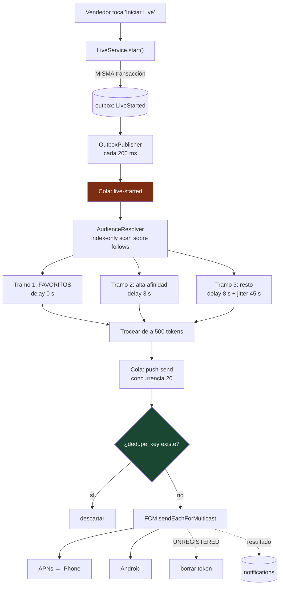

# 10 — Push, Redis y colas

Cubre: **§16 Arquitectura Firebase Push · §17 Redis + Queue**

---

## §16. Push notifications

### Por qué esto decide el negocio

El vendedor no controla cuándo hay audiencia: la audiencia aparece cuando se entera. Si el push de "estoy en vivo" llega tarde o no llega, el live se emite para nadie. **Este subsistema es el canal de distribución del producto entero.**

Y hay una asimetría que el diseño tiene que respetar:

| | **Tipo A — contenido** | **Tipo B — LIVE** |
|---|---|---|
| Valor si llega tarde | Casi el mismo | **Cero** — el live terminó |
| Tolerancia del usuario | Baja (molesta) | Alta (lo pidió) |
| Frecuencia | Varias por día | 1–3 por semana por vendedor |
| Se puede agrupar | **Sí** | **Nunca** |
| Prioridad | Media | **Máxima** |
| TTL | 24 h | **15 min** |

Tratar las dos igual es el error clásico: o saturás con contenido y la gente desactiva todo (perdiendo también los avisos de live), o entregás el live con prioridad baja y llega 20 minutos tarde.

### Arquitectura de fan-out



### Por qué el jitter (§17 de tu brief: nunca miles de pushes desde el request)

Dos problemas si se envía todo de golpe: se topa con los límites de FCM, y provoca una **estampida de conexiones** contra el backend cuando 200.000 personas abren la app en el mismo segundo.

```typescript
// backend/src/workers/processors/live-started.processor.ts
const JITTER_WINDOW_MS = 45_000;

@Process('live-started')
async handle(job: Job<LiveStartedPayload>) {
  const { liveId, sellerId } = job.data;

  // Index-only scan sobre ix_follows_notify_live: no toca la tabla.
  // Con 500k seguidores, esto son ~200 ms; sin el índice, 8 segundos.
  const audience = await this.follows.resolveLiveAudience(sellerId);

  // Los más comprometidos primero: llenan la sala en el primer minuto,
  // que es el minuto en que el vendedor decide si el live "prendió".
  const tiers = [
    { rows: audience.favorites,    baseDelayMs: 0,     jitterMs: 0      },
    { rows: audience.highAffinity, baseDelayMs: 3_000, jitterMs: 10_000 },
    { rows: audience.rest,         baseDelayMs: 8_000, jitterMs: JITTER_WINDOW_MS },
  ];

  for (const tier of tiers) {
    for (const batch of chunk(tier.rows, 500)) {      // 500 = límite de multicast
      await this.pushQueue.add('send-live-push',
        { liveId, sellerId, userIds: batch.map(r => r.followerId) },
        {
          delay: tier.baseDelayMs + Math.floor(Math.random() * tier.jitterMs),
          attempts: 3,
          backoff: { type: 'exponential', delay: 2000 },
          removeOnComplete: 1000,
        },
      );
    }
  }
}
```

Con esta distribución, el objetivo de "90 % en menos de 45 s" se cumple porque los tramos de mayor afinidad salen primero y sin retardo.

### El problema de la celebridad

| Seguidores del vendedor | Estrategia | Por qué |
|---|---|---|
| < 10.000 | Envío individual por lotes de 500 | La consulta tarda milisegundos y da métricas por dispositivo |
| ≥ 10.000 | **Topic de FCM** `seller_{id}_live` | Una sola llamada. Google hace el fan-out |

**Contrapartida honesta del topic:** se pierde la visibilidad por dispositivo y no se puede personalizar el mensaje. Por eso los **favoritos siempre reciben envío individual** aunque el vendedor sea grande: son pocos y son los más valiosos. Lo mejor de ambos.

### Cargas útiles

#### Tipo B — inicio de live (la crítica)

```jsonc
{
  "message": {
    "token": "<device_token>",
    "notification": {
      "title": "🔴 Moda Luna está EN VIVO",
      "body": "Liquidación de invierno · Camperas desde $18.990"
    },
    "data": {
      "type": "LIVE_STARTED",
      "liveId": "liv_01JBQ…",
      "sellerId": "sel_01JBQ…",
      "deeplink": "app://live/liv_01JBQ…",
      "notificationId": "ntf_01JBQ…"
    },
    "android": {
      "priority": "high",
      "ttl": "900s",
      "notification": {
        "channel_id": "live_alerts",
        "sound": "live_alert",
        "color": "#FF2D55",
        "image": "https://cdn.livesell.ar/s/liv_01JBQ/big.webp",
        "notification_priority": "PRIORITY_MAX",
        "visibility": "PUBLIC"
      }
    },
    "apns": {
      "headers": {
        "apns-priority": "10",
        "apns-push-type": "alert",
        "apns-expiration": "1786561800"
      },
      "payload": {
        "aps": {
          "sound": { "name": "live_alert.caf", "volume": 1.0 },
          "interruption-level": "active",
          "relevance-score": 1.0,
          "mutable-content": 1,
          "thread-id": "live_sel_01JBQ"
        }
      }
    }
  }
}
```

**`ttl: 900s` es la línea que más se olvida.** Sin ella, FCM entrega la notificación cuando el teléfono se encienda tres horas después, avisando de un live que terminó hace dos. Eso destruye la confianza en el canal más rápido que cualquier otra cosa.

### Nivel de interrupción en iOS — corregido por decisión del CTO

| Nivel | ¿Lo usamos? | Motivo |
|---|---|---|
| `critical` (Critical Alerts) | ❌ **Nunca** | Requiere autorización especial de Apple reservada para salud y seguridad. Pedirla para comercio hace que rechacen la app |
| `time-sensitive` | ❌ **No para avisos de live** | Atraviesa el modo Concentración. Apple lo reserva para lo que es genuinamente urgente para la persona: una entrega llegando, una alerta de seguridad. Un aviso comercial de "empezó un vivo" no califica, y usarlo es riesgo de rechazo en revisión |
| `active` | ✅ **Es lo que usamos** | Enciende la pantalla y suena. Alcanza de sobra |
| `passive` | Para Tipo A si hiciera falta bajar el ruido | — |

**Qué NO perdemos con `active`:** la notificación igual enciende la pantalla, igual suena con el sonido personalizado, igual muestra la imagen y igual abre el live por deep link. Lo único que no hace es romper el modo Concentración, que es exactamente lo que Apple no quiere que hagamos con contenido comercial.

**Si en el futuro se justifica `time-sensitive`**, el caso tendría que ser algo con urgencia real para el usuario —por ejemplo, "tu reserva de stock vence en 2 minutos"— y documentarse contra la política vigente de Apple antes de enviarlo a revisión. En Android, `IMPORTANCE_HIGH` en el canal `live_alerts` sigue igual: no hay restricción equivalente.

#### Tipo A — contenido

```jsonc
{
  "message": {
    "notification": { "title": "Moda Luna subió 4 productos nuevos",
                      "body": "Camperas de invierno desde $18.990" },
    "data": { "type": "CONTENT_PUBLISHED", "deeplink": "app://seller/sel_01JBQ" },
    "android": {
      "priority": "normal",
      "collapse_key": "content_sel_01JBQ",
      "notification": { "channel_id": "content_updates", "notification_priority": "PRIORITY_DEFAULT" }
    },
    "apns": {
      "headers": { "apns-priority": "5", "apns-collapse-id": "content_sel_01JBQ" },
      "payload": { "aps": { "sound": "default", "interruption-level": "active", "thread-id": "sel_01JBQ" } }
    }
  }
}
```

`collapse_key` hace que, si el teléfono estuvo apagado, se muestre solo la última del vendedor. La persona no despierta con la bandeja llena.

### Configuración nativa

**Android — el canal se crea en la primera ejecución y su sonido es inmutable después.** Si se lanza con el sonido equivocado, la única salida es crear un canal nuevo con otro ID; los usuarios existentes conservan el viejo para siempre. **Hay que acertar a la primera.**

```kotlin
// mobile/android/app/src/main/kotlin/.../NotificationChannels.kt
fun createChannels(ctx: Context) {
  val nm = ctx.getSystemService(NotificationManager::class.java)

  // Canal B — IMPORTANCE_HIGH hace que aparezca flotante (heads-up).
  val live = NotificationChannel("live_alerts", "Transmisiones en vivo",
                                 NotificationManager.IMPORTANCE_HIGH).apply {
    description = "Cuando un vendedor que seguís empieza a transmitir"
    setSound(
      Uri.parse("android.resource://${ctx.packageName}/raw/live_alert"),
      AudioAttributes.Builder()
        .setUsage(AudioAttributes.USAGE_NOTIFICATION_EVENT)
        .setContentType(AudioAttributes.CONTENT_TYPE_SONIFICATION).build()
    )
    enableVibration(true)
    vibrationPattern = longArrayOf(0, 250, 100, 250)   // patrón distintivo
    enableLights(true); lightColor = Color.RED
    lockscreenVisibility = Notification.VISIBILITY_PUBLIC
  }

  // Canal A — IMPORTANCE_DEFAULT: sin heads-up, sin vibración.
  val content = NotificationChannel("content_updates", "Novedades de vendedores",
                                    NotificationManager.IMPORTANCE_DEFAULT).apply {
    enableVibration(false)
  }

  nm.createNotificationChannels(listOf(live, content))
}
```

**iOS — el sonido `.caf` debe durar 30 segundos o menos** y estar en el bundle. Si falta o excede el límite, iOS usa el sonido por defecto **en silencio, sin error**. Es un fallo clásico que solo se detecta probando en dispositivo físico: **el simulador no reproduce sonidos de push.**

### Cuándo pedir el permiso

**Nunca en la primera pantalla.** El rechazo es del 60–70 % y en iOS es irreversible desde la app.

```
1. El usuario se registra           → no se pide nada
2. Mira su primer live
3. Toca "Seguir" a un vendedor      → "Te avisamos cuando Moda Luna esté en vivo"
                                    → recién acá se pide el permiso del sistema
```

Aceptación de ~70 % contra ~30 % pidiéndolo al arrancar. Es la diferencia entre tener canal de distribución y no tenerlo.

### Deduplicación

```sql
CREATE UNIQUE INDEX uq_notification_dedupe ON notifications (dedupe_key);
-- dedupe_key = 'LIVE_STARTED:liv_01JBQ:usr_01JBQ'
```

Un reintento de BullMQ, una reconexión del vendedor o un reprocesado del outbox **no** producen un segundo push. Recibir dos veces "está en vivo" es la forma más rápida de que alguien desactive los avisos.

### Límites de frecuencia

| Regla | Valor |
|---|---|
| Tipo B por vendedor y live | 1 |
| Tipo B global por usuario y día | 4 |
| Tipo A por vendedor y día | 2 |
| Tipo A global por usuario y día | 5 |
| Horario de silencio | 22:00–08:00 en la zona horaria **del dispositivo** |
| Excepción al silencio | Solo Tipo B **y** `is_favorite = true` |

### Métricas

| Métrica | Objetivo | Alerta |
|---|---|---|
| Tasa de entrega Tipo B | > 92 % | < 85 % |
| p90 de latencia Tipo B | < 45 s | > 90 s |
| Apertura Tipo B | > 18 % | < 10 % |
| Apertura Tipo A | > 4 % | < 2 % |
| **Desactivaciones diarias** | < 0,5 % | **> 1 %** |
| Tokens inválidos por envío | < 3 % | > 8 % |

**La tasa de desactivación es la más importante.** Si sube, estamos enviando de más y quemando el canal. Es preferible enviar menos y que la gente siga escuchando.

---

## §17. Redis y colas

### Qué va en Redis y qué NO

Tu punto 5 es explícito: Redis no reemplaza a PostgreSQL. La frontera:

| ✅ Sí va en Redis | ❌ No va en Redis |
|---|---|
| Contador de espectadores | Stock (documento 07) |
| Presencia en el live | Órdenes, pagos |
| Cache de lectura del stock | Cualquier cosa que sea dinero |
| Rate limiting | Datos de usuario |
| Colas y jobs | Direcciones |
| Pub/Sub de Socket.IO | Nada que no se pueda regenerar |
| Métricas en vivo del vendedor | |
| Cache del feed (TTL 10 s) | |

**Regla:** si perder Redis por completo obliga a algo más que recalcular, está mal usado. Un reinicio de Redis debe ser un bache de rendimiento, nunca una pérdida de datos.

### Keyspace

**Un solo archivo construye todas las claves.** Sin esto, en dos meses hay tres formatos de `live:*` y nadie sabe cuál expira.

```typescript
// backend/src/shared/redis/redis.keys.ts
export const K = {
  // ── Live: presencia y contadores ──
  liveViewers:    (id: string) => `live:${id}:viewers`,        // SET de userIds
  liveCount:      (id: string) => `live:${id}:count`,          // INTEGER
  liveUnique:     (id: string) => `live:${id}:unique`,         // HyperLogLog
  liveMetrics:    (id: string) => `live:${id}:metrics`,        // HASH
  liveFeatured:   (id: string) => `live:${id}:featured`,       // JSON del destacado
  liveSeq:        (id: string) => `live:${id}:seq`,            // secuencia de eventos WS
  liveReactions:  (id: string) => `live:${id}:reactions`,      // HASH agregado

  // ── Cache de lectura ──
  stockCache:     (v: string)  => `stock:${v}`,                // TTL 300 s
  feedPage:       (c: string)  => `feed:${c}`,                 // TTL 10 s
  sellerFollowers:(id: string) => `seller:${id}:followers`,    // TTL 30 s
  liveState:      (id: string) => `live:${id}:state`,          // TTL 5 s

  // ── Rate limiting ──
  rateLimit:      (scope: string, id: string) => `rl:${scope}:${id}`,
  wsConnections:  (u: string)  => `ws:conn:${u}`,

  // ── Idempotencia rápida (el respaldo durable está en Postgres) ──
  idem:           (u: string, k: string) => `idem:${u}:${k}`,  // TTL 24 h
  webhookSeen:    (p: string, e: string) => `whk:${p}:${e}`,   // TTL 24 h

  // ── Sesión ──
  refreshDenyList:(jti: string) => `deny:${jti}`,
} as const;
```

### Presencia de espectadores

```typescript
// Entrada: SET para unicidad + contador para lectura rápida
await redis.multi()
  .sadd(K.liveViewers(liveId), userId)
  .pfadd(K.liveUnique(liveId), userId)          // HyperLogLog: únicos con ~12 KB
  .expire(K.liveViewers(liveId), 7200)
  .exec();

// El contador se recalcula del SET, no se incrementa a mano:
// un INCR/DECR desbalanceado por un heartbeat perdido deriva sin remedio.
const count = await redis.scard(K.liveViewers(liveId));

// Barrido de fantasmas: sin heartbeat en 45 s, se saca del SET.
// El heartbeat llega cada 15 s (documento 02), así que tolera 2 pérdidas.
```

**HyperLogLog para únicos:** 12 KB de memoria para contar millones de visitantes únicos con ~0,8 % de error. Un SET con 500.000 IDs serían decenas de megabytes por live.

### Colas con BullMQ

```typescript
// backend/src/shared/queue/queue.names.ts
export const QUEUES = {
  LIVE_STARTED:      'live-started',       // fan-out de audiencia
  PUSH_SEND:         'push-send',          // envío a FCM
  WHATSAPP_SEND:     'whatsapp-send',
  RESERVATION_EXPIRY:'reservation-expiry', // 🔴 crítica
  PAYMENT_WEBHOOK:   'payment-webhook',    // 🔴 crítica
  PAYMENT_RECONCILE: 'payment-reconcile',  // 🔴 crítica
  MEDIA_PROCESS:     'media-process',      // thumbnails
  SEARCH_INDEX:      'search-index',
  ANALYTICS_INGEST:  'analytics-ingest',
  SHIPMENT_LABEL:    'shipment-label',
  GEOCODE:           'geocode',
} as const;
```

| Cola | Concurrencia | Reintentos | Backoff | Prioridad |
|---|---|---|---|---|
| `live-started` | 5 | 5 | exponencial 1 s | **alta** |
| `push-send` | 20 | 3 | exponencial 2 s | alta |
| `reservation-expiry` | 10 | 5 | fijo 5 s | **crítica** |
| `payment-webhook` | 10 | 10 | exponencial 2 s | **crítica** |
| `payment-reconcile` | 3 | 3 | exponencial 30 s | crítica |
| `media-process` | 4 | 3 | exponencial 5 s | baja |
| `search-index` | 5 | 3 | exponencial 2 s | baja |
| `analytics-ingest` | 10 | 2 | fijo 10 s | muy baja |

**Las tres colas críticas nunca comparten worker con las de baja prioridad.** Si el procesamiento de imágenes satura el proceso, no puede retrasar la expiración de una reserva ni la acreditación de un pago. En Fly.io eso son dos grupos de procesos distintos.

### Reglas de los jobs

```typescript
// 1) jobId determinista = idempotencia gratis.
//    Si el mismo evento se procesa dos veces, BullMQ descarta el duplicado.
await queue.add('expire-reservation', { reservationId },
  { jobId: `expire:${reservationId}`, delay: TTL_MS });

// 2) removeOnComplete SIEMPRE. Sin esto, Redis se llena de jobs terminados
//    y en dos semanas hay que reiniciarlo a las 3 de la mañana.
const defaultJobOptions = {
  removeOnComplete: { age: 3600, count: 1000 },
  removeOnFail:     { age: 86400 },       // los fallidos se conservan 24 h
};

// 3) Los payloads son PEQUEÑOS: IDs, no objetos.
//    ❌ { order: {...200 campos...} }
//    ✅ { orderId: 'ord_01JBQ…' }
//    El worker relee de Postgres, que además garantiza datos frescos.
```

### Dead letter queue

```typescript
// backend/src/shared/queue/base.processor.ts
@OnQueueFailed()
async onFailed(job: Job, err: Error) {
  if (job.attemptsMade >= (job.opts.attempts ?? 3)) {
    await this.dlq.add('failed-job', {
      queue: job.queueName, name: job.name, data: job.data,
      error: err.message, stack: err.stack, failedAt: new Date(),
    });

    // Un job crítico que agota reintentos despierta a alguien.
    if (CRITICAL_QUEUES.includes(job.queueName)) {
      await this.alerts.page('critical-job-failed', { queue: job.queueName, jobId: job.id });
    }
  }
}
```

Un job de `payment-webhook` en la DLQ significa que un cliente pagó y no se le acreditó. **Eso es una alerta de guardia, no una entrada de log.**

### Idempotencia en dos niveles

```
Nivel 1 — Redis (rápido):     SET idem:{userId}:{key} NX EX 86400
Nivel 2 — PostgreSQL (durable): tabla idempotency_keys
```

Redis atrapa el 99 % de los reintentos en microsegundos. PostgreSQL es la garantía cuando Redis se reinicia. **Nunca solo Redis para idempotencia de pagos**: perder esa clave significa cobrar dos veces.

### Dimensionamiento

| Carga | Memoria de Redis | Notas |
|---|---|---|
| 1.000 concurrentes | 256 MB | Sobra |
| 10.000 concurrentes | 1 GB | Cómodo |
| 100.000 concurrentes | 4 GB | Evaluar separar el Redis de colas del de cache |

**Política de expulsión: `noeviction`.** Con `allkeys-lru`, Redis podría descartar un job de BullMQ bajo presión de memoria y perder una expiración de reserva o un webhook. Preferimos que las escrituras fallen ruidosamente antes que perder trabajo en silencio.

### 🚩 Verificación del Sprint 0

**BullMQ necesita comandos bloqueantes (`BZPOPMIN`) y scripts Lua.** Hay que confirmar que el plan de Upstash elegido los soporta. Si no, el respaldo es un contenedor de Redis en Fly.io con volumen persistente. Es una verificación de 30 minutos que evita un rediseño en la semana 3.
