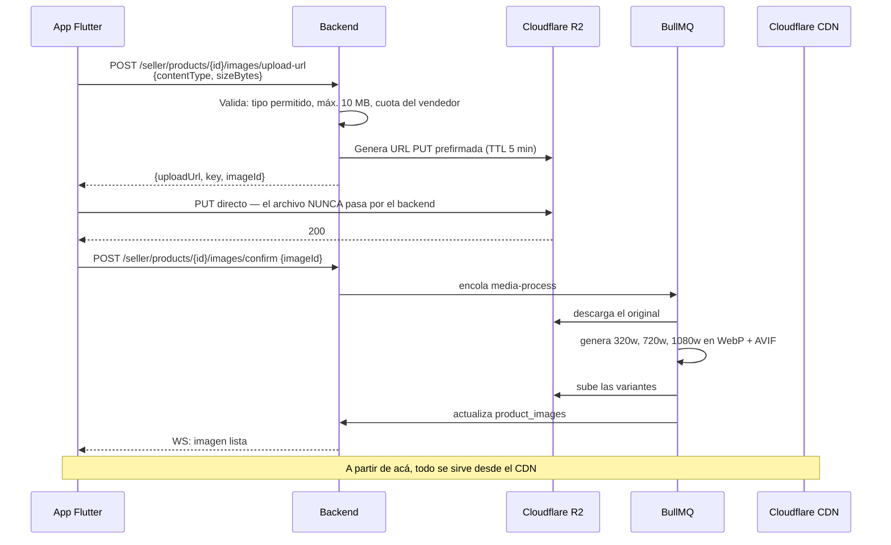

# 11 — Follow, buscador y storage

Cubre: **§18 Sistema de Follow · §19 Buscador · §20 Storage/CDN**

---

## §18. Sistema de Follow

### Modelo

```sql
CREATE TABLE follows (
  follower_id      TEXT NOT NULL REFERENCES users(id)   ON DELETE CASCADE,
  seller_id        TEXT NOT NULL REFERENCES sellers(id) ON DELETE CASCADE,
  created_at       TIMESTAMPTZ NOT NULL DEFAULT now(),

  notify_live      BOOLEAN NOT NULL DEFAULT true,
  notify_content   BOOLEAN NOT NULL DEFAULT true,
  is_favorite      BOOLEAN NOT NULL DEFAULT false,
  muted_until      TIMESTAMPTZ,

  last_watched_at  TIMESTAMPTZ,
  total_watch_sec  INTEGER NOT NULL DEFAULT 0,
  orders_count     INTEGER NOT NULL DEFAULT 0,
  engagement_score REAL NOT NULL DEFAULT 0,

  PRIMARY KEY (follower_id, seller_id)
);
```

Tres decisiones que hay que defender:

**1. Clave primaria compuesta.** Hace imposible el follow duplicado a nivel de base de datos y vuelve el `INSERT … ON CONFLICT DO NOTHING` idempotente. Un doble toque en "Seguir" no rompe nada ni infla contadores.

**2. Índices parciales con `INCLUDE`.** El fan-out de push solo necesita `follower_id`.

```sql
CREATE INDEX ix_follows_notify_live ON follows (seller_id, engagement_score DESC)
  INCLUDE (follower_id)
  WHERE notify_live = true AND muted_until IS NULL;
```

Con `INCLUDE`, PostgreSQL resuelve con *index-only scan* y no toca la tabla. Con 500.000 seguidores, la diferencia es entre **200 ms y 8 segundos**. Y como ya viene ordenado por afinidad, el worker de fan-out no tiene que ordenar nada: lee y trocea.

**3. Contadores fragmentados.** `UPDATE sellers SET follower_count = follower_count + 1` parece inofensivo hasta que 3.000 personas siguen al mismo vendedor durante un live viral: esa fila se vuelve un cuello de botella y todas las escrituras se serializan.

```sql
CREATE TABLE seller_counters (
  seller_id TEXT NOT NULL, shard SMALLINT NOT NULL, followers BIGINT NOT NULL DEFAULT 0,
  PRIMARY KEY (seller_id, shard)
);
-- Escritura: shard = hash(follower_id) % 16   → 16 filas distintas, sin contención
-- Lectura:   SELECT sum(followers) …           → cacheado 30 s en Redis
```

Nadie necesita ver el número de seguidores exacto al instante.

### Operación de seguir

```typescript
// backend/src/modules/follows/application/follow-seller.usecase.ts
async execute(userId: string, sellerId: string): Promise<void> {
  const created = await this.prisma.$transaction(async (tx) => {
    const res = await tx.$executeRaw`
      INSERT INTO follows (follower_id, seller_id)
      VALUES (${userId}, ${sellerId})
      ON CONFLICT (follower_id, seller_id) DO NOTHING
    `;
    if (res === 0) return false;   // ya lo seguía: no-op silencioso

    const shard = hashToShard(userId, 16);
    await tx.$executeRaw`
      INSERT INTO seller_counters (seller_id, shard, followers)
      VALUES (${sellerId}, ${shard}, 1)
      ON CONFLICT (seller_id, shard) DO UPDATE SET followers = seller_counters.followers + 1
    `;
    await tx.outbox.create({ data: { aggregateType: 'follow', aggregateId: `${userId}:${sellerId}`,
                                     eventType: 'SellerFollowed', payload: { userId, sellerId } } });
    return true;
  });

  if (!created) return;

  await this.redis.del(K.sellerFollowers(sellerId));   // invalida el contador cacheado

  // Vendedor grande: se suscribe al topic en vez de guardar tokens sueltos.
  if (await this.isLargeSeller(sellerId)) {
    const tokens = await this.devices.activeTokensFor(userId);
    await this.fcm.subscribeToTopic(tokens, `seller_${sellerId}_live`);
  }
}
```

### `engagement_score`

Recalculado cada noche por un job. Ordena los tramos del fan-out y personaliza el feed.

```typescript
function engagementScore(f: FollowStats): number {
  const recency = Math.exp(-daysSince(f.lastWatchedAt) / 14);   // decae en 2 semanas
  return Math.min(100,
      Math.log1p(f.totalWatchSec / 60) * 8      // tiempo mirado, con saturación
    + f.ordersCount * 12                        // comprar pesa mucho más que mirar
    + (f.isFavorite ? 20 : 0)
    + recency * 25
  );
}
```

### Qué habilita el follow

| Uso | Cómo |
|---|---|
| **Push Tipo B** | `ix_follows_notify_live` → documento 10 |
| **Feed personalizado** | `+200` de puntaje si el vendedor está seguido |
| **Ranking de búsqueda** | Realce moderado a vendedores seguidos |
| Sección "Siguiendo" | `ix_follows_by_user`, ordenado por afinidad |
| Modo "solo seguidores" en el chat | Frena las cuentas descartables |

---

## §19. Buscador

### Decisión: PostgreSQL FTS en el PMV, detrás de `SearchProvider`

| | **Postgres FTS** ✅ PMV | Meilisearch | OpenSearch | Algolia |
|---|---|---|---|---|
| Ya está desplegado | ✅ | ❌ | ❌ | ❌ |
| Coste extra | **$0** | ~USD 30/mes | ~USD 300/mes | ~USD 500+/mes |
| Latencia con menos de 100k docs | 20–80 ms | 5–20 ms | 20–80 ms | 5–30 ms |
| Tolerancia a errores de tipeo | Vía `pg_trgm` | ✅ Excelente | Buena | ✅ Excelente |
| Sinónimos | Manual | ✅ | ✅ | ✅ |
| Ranking a medida | ✅ Total (SQL) | Bueno | ✅ Total | Bueno |
| Tiempo de integración | **0,5 día** | 2 días | 5 días | 2 días |

Con menos de 100.000 productos, Postgres FTS es indistinguible de un motor dedicado y **cuesta cero**. Meter Elasticsearch en el PMV sería exactamente el overengineering que prohibiste en tu punto 43.

**Disparadores de migración a Meilisearch**, definidos por adelantado para que no sea un "ya veremos":

- Más de 100.000 productos indexados, **o**
- p95 de búsqueda > 400 ms, **o**
- Se necesitan sinónimos gestionados o corrección ortográfica seria.

Se elige Meilisearch antes que OpenSearch: para este volumen es más rápido, cuesta 10 veces menos y se despliega en un contenedor. OpenSearch recién tiene sentido con millones de documentos y necesidad de agregaciones complejas.

```typescript
// backend/src/modules/search/domain/search-provider.interface.ts
export interface SearchProvider {
  search(q: SearchQuery): Promise<SearchResults>;
  suggest(prefix: string, limit: number): Promise<Suggestion[]>;
  index(entity: IndexableEntity): Promise<void>;
  remove(type: EntityType, id: string): Promise<void>;
  reindexAll(type: EntityType): Promise<void>;
}
// Implementaciones: PostgresSearchProvider (PMV) · MeilisearchProvider (después)
// Los llamadores no cambian. Ese es el punto.
```

### Analizadores en español

Es la parte aburrida donde se gana o se pierde la calidad de la búsqueda.

```sql
search_vector tsvector GENERATED ALWAYS AS (
  setweight(to_tsvector('spanish', unaccent(coalesce(title, ''))),       'A') ||
  setweight(to_tsvector('spanish', unaccent(coalesce(brand, ''))),       'B') ||
  setweight(to_tsvector('spanish', unaccent(coalesce(description, ''))), 'C')
) STORED;
```

- **`unaccent`**: "camion" encuentra "camión". En Argentina, con teclado móvil, mucha gente no escribe tildes. Sin esto se pierde una fracción enorme de las búsquedas.
- **`spanish`**: "camperas" encuentra "campera", "zapatillas" encuentra "zapatilla".
- **Pesos A/B/C**: una coincidencia en el título vale más que una en la descripción.
- **`pg_trgm`** en paralelo para errores de tipeo: "capera" → "campera".

### El ranking: lives primero, pero no solo por `is_live`

Tu punto 18 es preciso: el ranking no debe depender únicamente de `is_live`. La fórmula:

```sql
-- backend/src/modules/search/infrastructure/sql/search.sql
WITH matched_lives AS (
  SELECT
    l.id, l.title, l.viewer_count, l.started_at,
    s.id AS seller_id, st.display_name, st.avatar_url,

    -- 1. Relevancia textual: base de todo
    ts_rank_cd(l.search_vector, websearch_to_tsquery('spanish', unaccent($1))) AS text_rank,

    -- 2. Relevancia del CATÁLOGO del live: hace que "remeras" encuentre el live
    --    donde se venden remeras, aunque el título diga "Liquidación 🔥".
    --    Es la señal más rentable del buscador.
    COALESCE((
      SELECT max(ts_rank_cd(p.search_vector, websearch_to_tsquery('spanish', unaccent($1))))
      FROM live_featured_products lfp
      JOIN products p ON p.id = lfp.product_id
      WHERE lfp.live_id = l.id
    ), 0) AS catalog_rank,

    -- 3. Popularidad con saturación: 10k espectadores no valen 10x los de 1k
    ln(1 + l.viewer_count) * 0.15 AS popularity,

    -- 4. Frescura: un live recién empezado necesita audiencia
    exp(-EXTRACT(EPOCH FROM (now() - l.started_at)) / 3600.0) * 0.4 AS freshness,

    -- 5. Reputación
    COALESCE(s.rating, 3.5) / 5.0 * 0.2 AS reputation,

    -- 6. Afinidad: ¿lo sigue?
    CASE WHEN f.follower_id IS NOT NULL THEN 0.5 ELSE 0 END AS affinity

  FROM live_sessions l
  JOIN sellers s ON s.id = l.seller_id
  JOIN stores  st ON st.seller_id = s.id
  LEFT JOIN follows f ON f.seller_id = s.id AND f.follower_id = $2
  WHERE l.status = 'LIVE'
    AND (l.search_vector @@ websearch_to_tsquery('spanish', unaccent($1))
         OR EXISTS (SELECT 1 FROM live_featured_products lfp
                    JOIN products p ON p.id = lfp.product_id
                    WHERE lfp.live_id = l.id
                      AND p.search_vector @@ websearch_to_tsquery('spanish', unaccent($1))))
)
SELECT *,
  -- El realce por estar EN VIVO multiplica la relevancia; NO la reemplaza.
  (text_rank + catalog_rank * 0.8 + popularity + freshness + reputation + affinity) * 3.0
    AS final_score
FROM matched_lives
WHERE (text_rank + catalog_rank) > 0.01        -- ⛔ el umbral de relevancia mínima
ORDER BY final_score DESC
LIMIT 10;
```

**El `WHERE (text_rank + catalog_rank) > 0.01` es la línea más importante.** Sin ese umbral, un live de gorras aparecería primero cuando alguien busca "zapatillas", solo por estar en vivo. Eso destruye la confianza en el buscador más rápido que cualquier otra cosa.

**El multiplicador `× 3.0` y no `× 100`:** un live relevante gana a un producto relevante, pero un live irrelevante **no** gana a un producto exacto. Se calibra con datos de CTR, no con intuición.

### Presentación en dos zonas

Mezclar lives, productos y vendedores en una sola lista produce resultados confusos. El diseño correcto:

```
┌──────────────────────────────────────┐
│  🔴 EN VIVO AHORA                    │  ← carrusel horizontal
│  [live] [live] [live] →              │     solo si hay lives sobre el umbral
├──────────────────────────────────────┤
│  Vendedores                          │
│  🏪 Moda Luna · 48k seguidores       │
├──────────────────────────────────────┤
│  Productos                           │
│  📦 Campera Puffer · $24.990         │
│  📦 Campera Inflable · $19.990       │
└──────────────────────────────────────┘
```

Los lives tienen prominencia visual imbatible sin romper la coherencia del resto. Y si no hay lives relevantes, el carrusel simplemente no aparece.

### Diversidad

```typescript
// Máximo 3 resultados seguidos del mismo vendedor.
// Sin esto, un vendedor con 400 productos monopoliza la primera página
// y el buscador parece roto.
function enforceDiversity(results: Result[], maxPerSeller = 3): Result[] { /* … */ }
```

### Autocompletado

Presupuesto de 120 ms. Consulta separada y mucho más simple:

```sql
SELECT 'seller' AS kind, st.display_name AS label, st.handle, s.id,
       (l.id IS NOT NULL) AS is_live
FROM stores st
JOIN sellers s ON s.id = st.seller_id
LEFT JOIN live_sessions l ON l.seller_id = s.id AND l.status = 'LIVE'
WHERE st.display_name ILIKE $1 || '%' OR st.handle ILIKE $1 || '%'
ORDER BY (l.id IS NOT NULL) DESC, s.rating DESC NULLS LAST
LIMIT 3;
```

Ver **"🔴 Moda Luna · en vivo"** mientras se escribe es una de las mecánicas de descubrimiento más efectivas del producto, y sale casi gratis.

### Analítica de búsqueda

Sin esto el buscador nunca mejora. Tres informes semanales:

1. **Búsquedas sin resultados**, por frecuencia → revelan huecos de catálogo y sinónimos que faltan. **Es el informe de mayor retorno de todo el sistema.**
2. **Búsquedas con CTR bajo pese a tener resultados** → el ranking está mal para esos términos.
3. **Posición media del primer clic** → si sube, el ranking empeoró.

### Degradación

| Fallo | Comportamiento |
|---|---|
| Búsqueda lenta (> 800 ms) | Se corta y se sirve desde cache |
| Índice desactualizado | Se busca igual, con datos algo viejos |
| Sin resultados | Sugerencias: categorías populares y lives del momento |

**Una búsqueda con resultados mediocres es infinitamente mejor que un error.**

---

## §20. Storage y CDN

### Decisión: Cloudflare R2 + Cloudflare CDN

| | **Cloudflare R2** ✅ | AWS S3 + CloudFront |
|---|---|---|
| **Costo de egreso** | **$0** | ~USD 0,085/GB |
| Almacenamiento | ~USD 0,015/GB | ~USD 0,023/GB |
| API compatible con S3 | ✅ | ✅ |
| **PoP en Buenos Aires** | ✅ | ⚠️ Sí, pero con egreso pago |
| Transformación de imágenes | ✅ Cloudflare Images | Vía Lambda@Edge |

**El egreso gratuito es el argumento decisivo.** Una app de video vertical sirve muchísimas imágenes: un feed con 10.000 usuarios activos al día mueve cientos de gigabytes mensuales solo en miniaturas. Con S3 eso es una factura creciente; con R2 es cero.

Y la app **nunca sirve archivos desde NestJS** (tu punto 36). Node bloqueado sirviendo una imagen de 2 MB es un worker menos atendiendo compras.

### Flujo de subida: URL prefirmada



**El archivo nunca pasa por el backend.** Es lo que evita que una subida de 10 MB bloquee un worker de Node durante segundos.

### Organización de buckets

```
livesell-public/                      # público, cacheable, servido por CDN
├── products/{productId}/{imageId}/{320|720|1080}.webp
├── avatars/{userId}/{128|512}.webp
├── stores/{storeId}/banner_{1200}.webp
└── lives/{liveId}/{cover|thumb}.webp

livesell-private/                     # solo URL prefirmada, TTL corto
├── labels/{shipmentId}.pdf           # ⚠️ contiene datos personales
├── recordings/{liveId}/vod.m3u8
└── exports/{jobId}.csv
```

**Las etiquetas de envío van en el bucket privado.** Contienen nombre, dirección y teléfono: una URL pública adivinable sería una fuga de datos personales. Se sirven con URL prefirmada de 15 minutos.

### Política de cache

| Recurso | `Cache-Control` | Por qué |
|---|---|---|
| Imágenes de producto | `public, max-age=31536000, immutable` | La clave incluye el `imageId`: si cambia la imagen, cambia la URL |
| Avatares | `public, max-age=86400` | Cambian de vez en cuando |
| Portada de live | `public, max-age=300` | Puede actualizarse durante el live |
| Miniatura en vivo | `public, max-age=10` | Se refresca constantemente |
| PDFs privados | `private, no-store` | Datos personales |

**Todo lo inmutable lleva el ID en la URL.** Así nunca hay que invalidar el cache: se sube una versión nueva con clave nueva. Invalidar cache de CDN es lento y poco fiable; evitarlo por diseño es gratis.

### Optimización de imágenes

| Uso | Ancho | Formato | Peso objetivo |
|---|---|---|---|
| Miniatura del feed | 320 | WebP q75 | < 25 KB |
| Tarjeta de producto | 720 | WebP q80 | < 80 KB |
| Detalle del producto | 1080 | WebP q85 | < 180 KB |
| Avatar chico | 128 | WebP q80 | < 8 KB |

**AVIF además de WebP** para clientes que lo soporten: 30 % menos de peso. Cloudflare negocia el formato con `Accept`.

`cached_network_image` en Flutter pide el ancho exacto que va a pintar. Descargar un JPG de 2 MB para mostrarlo en 120 px es la fuga de datos móviles más común en apps de comercio — y en Argentina el plan de datos importa.

### Límites y antiabuso

| Regla | Valor |
|---|---|
| Tamaño máximo por imagen | 10 MB |
| Imágenes por producto | 8 |
| Subidas por vendedor y hora | 200 |
| Tipos permitidos | `image/jpeg`, `image/png`, `image/webp`, `image/heic` |
| Validación real | Cabecera mágica del archivo, **no** el `Content-Type` que declara el cliente |
| Moderación | Detección automática de contenido para adultos antes de publicar |

Validar por `Content-Type` es confiar en el cliente. Se comprueban los primeros bytes del archivo en el worker de procesamiento; si no coinciden con un formato de imagen válido, se descarta y se registra.
